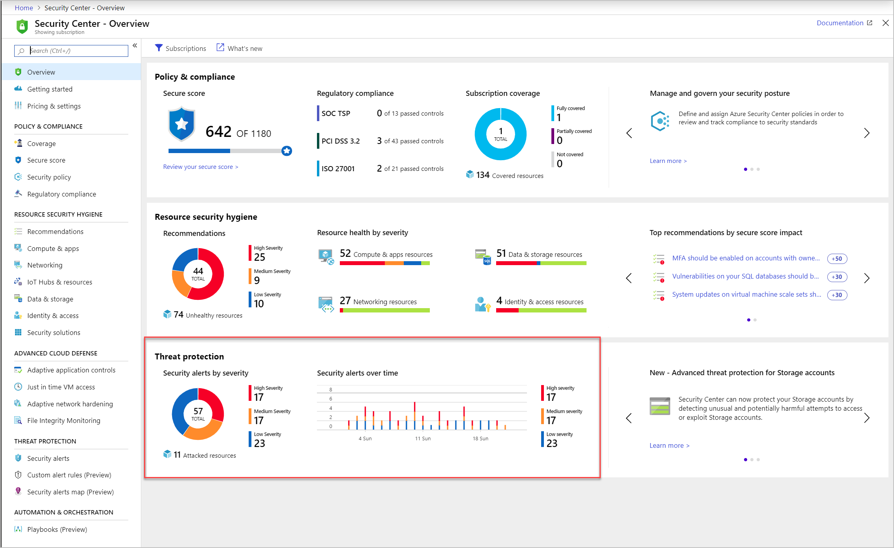

Azure Security Center automatically collects, analyzes, and integrates log data from several sources to identify credible threats to your workloads. Data from your Azure resources, the network, and connected partner solutions (like firewalls) is correlated and processed with machine learning and advanced security analytics to reduce false positives.

This aggregation allows Security Center to detect threats such as:

- Compromised VMs communicating with known malicious IP addresses.
- Advanced malware detected by Windows error reporting.
- Brute-force attacks against VMs.
- Security alerts from integrated partner security solutions, such as anti-malware or web application firewalls.

When a threat like this is detected, Security Center will generate a _security alert_.

## What is a security alert?

Alerts are the notifications that Security Center generates when it detects threats on your resources. Security Center prioritizes and lists the alerts, along with the information needed for you to investigate the problem quickly. Security Center also provides recommendations for how you can remediate an attack.

### Alert types and the Cyber Kill Chain

Azure Security Center provides a variety of alerts that align with the stages of the _cyber kill chain_. The cyber kill chain is a series of steps that trace the stages of a cyberattack from the early reconnaissance stages to the exfiltration of data. The kill chain was created by Lockheed Martin and is modeled off a military framework established to identify and engage enemy targets.

The kill chain consists of eight phases as shown in the below image. Different types of attacks are associated with each stage, and they target various subsystems. All the common attack vectors from brute force logins to viruses and worms trigger activity on the cyber kill chain.

1. **Reconnaissance:** The observation stage where attackers assess your network and services to identify possible targets and techniques to gain entry.
1. **Intrusion:** Attackers use knowledge gained in the reconnaissance phase to get access to a part of your network. This often involves exploring a flaw or security hole.
1. **Exploitation:** This phase involves exploiting vulnerabilities and inserting malicious code onto the system to get more access.
1. **Privilege Escalation:** Attackers often try to gain administrative access to compromised systems so they can get access to more critical data and move into other connected systems.
1. **Lateral Movement:** This is the act of moving laterally to connected servers and gain greater access to potential data.
1. **Obfuscation / Anti-forensics:** To successfully pull off a cyberattack, attackers need to cover their entry. They will often compromise data and clear audit logs to try to prevent detection by any security team.
1. **Denial of Service:** This phase involves disruption of normal access for users and systems to keep the attack from being monitored, tracked, or blocked.
1. **Exfiltration:** The final extraction stage: getting valuable data out of the compromised systems.

Security Center alerts attempts to detect and recognize known behaviors in each phase of the kill chain and provide the SecOps team an opportunity to stop a cyberattack in progress. Post breach, Security Center can provide the necessary details to be able to identify the exfiltration and close off compromised systems.

The alerts contain valuable information about what triggered the alert, the resources targeted, and the source of the attack. The information included in an alert varies based on the type of analytics used to detect the threat. Incidents might also contain additional contextual information that might be useful during the investigation of a threat. To address attacks during these stages, Security Center has categories of alerts:

- Virtual machine behavioral analysis
- Network analysis
- SQL database and SQL Data Warehouse analysis
- Contextual information

These alerts are triggered when either a threat or suspicious activity takes place.

## Viewing security alerts

You can view collected security alerts directly in Azure Security Center on the **Overview** page, through command-line tools, or using the REST API. The portal is the easiest way to view alerts - it displays a graph of your current alerts, colored by the severity level (high, medium, or low). Here's an example of a subscription with running resources being monitored.

Selecting the **Threat protection** tile presents more detailed information, as shown in the following image:

You can filter alerts based on the date, state, and severity. Filtering alerts might be useful for scenarios where you need to narrow the scope of the security alerts. For example, you might want to address security alerts that occurred in the last 24 hours if you’re investigating a potential breach in the system.

If you have a lot of alerts, you can select **Filter** on the **Security alerts** page. The **Filter** area opens on the side, and you can choose the date, state, and severity values you want to see.

