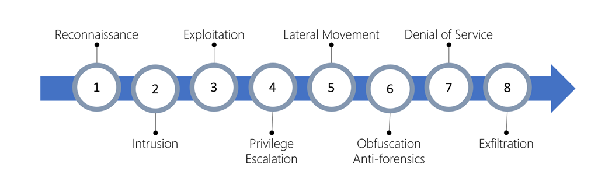

Microsoft Defender for Cloud automatically collects, analyzes, and integrates log data from several sources to identify credible threats to your workloads. Data from your Azure resources, the network, and connected partner solutions like firewalls is correlated and processed with machine learning and advanced security analytics to reduce false positives.

This aggregation allows Defender for Cloud to detect threats such as:

- Compromised virtual machines (VMs) communicating with known malicious IP addresses.
- Advanced malware detected by Windows error reporting.
- Brute-force attacks against VMs.
- Security alerts from integrated partner security solutions, such as anti-malware or web application firewalls.

When a threat like this is detected, Defender for Cloud will generate a *security alert*.

## What is a security alert?

Alerts are the notifications that Defender for Cloud generates when it detects threats on your resources. Defender for Cloud prioritizes and lists the alerts, along with the information needed for you to investigate the problem quickly. Defender for Cloud also provides recommendations for how you can remediate an attack.

### Alert types and the Cyber Kill Chain

Microsoft Defender for Cloud provides various alerts that align with the stages of the *cyber kill chain*. The cyber kill chain is a series of steps that trace a cyberattack from the early reconnaissance stages to the exfiltration of data. The kill chain was created by Lockheed Martin. It's modeled off a military framework established to identify and engage enemy targets.

The kill chain consists of eight phases as shown in the following image. Different types of attacks are associated with each stage, and they target various subsystems. All the common attack vectors from brute force logins to viruses and worms trigger activity on the cyber kill chain.

1. **Reconnaissance:** The observation stage, where attackers assess your network and services to identify possible targets and techniques to gain entry.
1. **Intrusion:** Attackers use knowledge gained in the reconnaissance phase to get access to a part of your network. This phase often involves exploring a flaw or security hole.
1. **Exploitation:** This phase involves exploiting vulnerabilities and inserting malicious code onto the system to get more access.
1. **Privilege Escalation:** Attackers often try to gain administrative access to compromised systems so they can get access to more critical data and move into other connected systems.
1. **Lateral Movement:** The process of moving laterally to connected servers to gain greater access to potential data.
1. **Obfuscation/Anti-forensics:** To successfully pull off a cyberattack, attackers need to cover their entry. They'll often compromise data and clear audit logs to try to prevent detection by any security team.
1. **Denial of Service:** This phase involves disruption of normal access for users and systems to keep the attack from being monitored, tracked, or blocked.
1. **Exfiltration:** The final extraction stage: getting valuable data out of the compromised systems.

A Defender for Cloud alert tries to detect and recognize known behaviors in each phase of the kill chain. Then, it provides the SecOps team an opportunity to stop a cyberattack in progress. Post breach, Defender for Cloud can provide the necessary details to be able to identify the exfiltration and close off compromised systems.

The alerts contain valuable information about what triggered the alert, the resources targeted, and the attack source. The information included in an alert varies based on the type of analytics used to detect the threat. Incidents might also contain more contextual information that might be useful during the investigation of a threat. To address attacks during these stages, Defender for Cloud has categories of alerts:

- Virtual machine behavioral analysis
- Network analysis
- SQL database and SQL Data Warehouse analysis
- Contextual information

These alerts are triggered when either a threat or suspicious activity takes place.

## Viewing security alerts

You can view collected security alerts directly in Microsoft Defender for Cloud on the **Security alerts** page, through command-line tools, or using the REST API. The portal is the easiest way to view alerts. It displays a graph of your current alerts, colored by the severity level (high, medium, or low). Here's an example of a subscription with running resources being monitored:

:::image type="content" source="../media/2-defender-for-cloud-security-alerts.png" alt-text="Screenshot that shows the security alerts pane in Defender for Cloud.":::

The alerts are also listed individually for more detailed information. You can filter alerts based on the date, state, and severity. Filtering alerts might be useful for scenarios where you need to narrow the scope of the security alerts. For example, you might want to look at security alerts that occurred in the last 24 hours if you’re investigating a potential breach in the system.

If you have many alerts, you can select **Add filter** on the **Security alerts** page. The **Filter** window displays, and you can select filters to display the values you want to see.

:::image type="content" source="../media/2-defender-for-cloud-add-filter.png" alt-text="Screenshot that shows the Filter window with filter options displayed.":::

You can also use the **Grouping** menu to sort alerts by title, resource, and subscription.

:::image type="content" source="../media/2-defender-for-cloud-alert-grouping.png" alt-text="Screenshot that shows the 'Grouping' drop-down menu.":::
