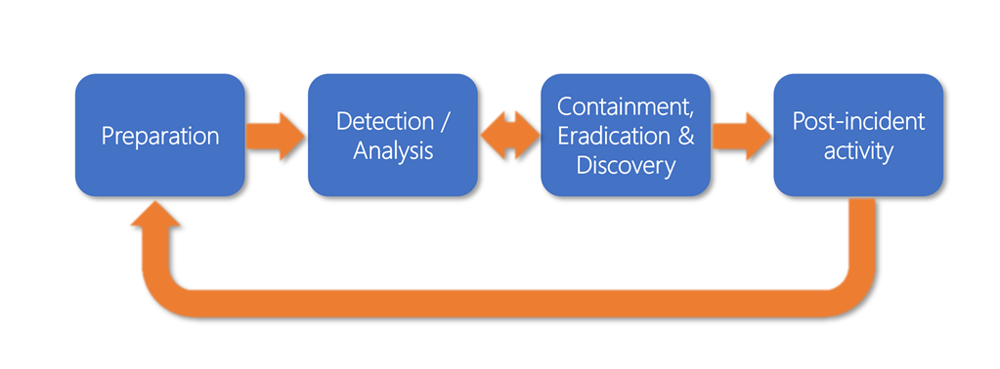

Cyberattacks and security breaches are severe threats to your business. Every organization should have a prepared *incident response plan*. This plan deals with security threats that impact their ability to provide service to customers, or jeopardize their ability to protect private/customer data.

## What is an incident response plan?

With an incident response plan (IRP), you can identify and minimize the damage and cost of a security attack. The plan also shows you how to fix the cause of an attack. A well-designed IRP provides step-by-step instructions for handling an incident. It ensures that the security team responds using an established set of procedures, that the right people are involved, and that proper communication channels are informed.

## Create an incident response plan

The National Institute of Standards and Technology (NIST) publishes a standard guide on how to handle security incidents. This document is a great tool to help an organization establish its response plan *before* a significant attack occurs. Keep in mind that every organization is different and that the types of data and services they're protecting will heavily influence the plan.

There are several steps involved:

1. Establish an incident response team
1. Practice the plan
1. Revise the plan

### Establish an incident response team

One of the essential steps of creating an IRP is to define a computer security incident response team (CSIRT). This team consists of members from several areas of the company, including:

- **Executive**: There should be a representative of the executive leadership team that can communicate with and update the board during and after the security incident.

- **IT**: The IT department should be involved in creating and executing any IRP.

- **Communications**: Different people in the company will need to be informed about the security incident. It also might become necessary to let customers or even the press know about significant data breaches. Members of the communications staff and PR team should be part of the response team to craft the communications.

- **Legal**: The legal department should be involved in the planning to ensure legal compliance and regulatory requirements for your data handling are met. They can also provide advice both during and after the incident has been addressed.

### Practice the plan

Once an incident response plan has been defined, the CSIRT should run fire drills to test the plan thoroughly. These drills will help to identify gaps and trouble areas so they can be addressed before a real security threat emerges. The team has to respond quickly under pressure, so a clear, well-understood plan is a requirement.

### Revise the plan

The incident response plan should be evaluated on a periodic basis to ensure it's still valid, identifies the correct parties to involve, and covers the primary threat areas defined for the company servers and data. In addition, each member of the CSIRT should periodically review the plan to ensure they understand their responsibilities during an incident and that when under pressure, they can respond efficiently.

## Phases of an incident response

As mentioned earlier, the NIST defines a computer security incident guide that companies can use to craft a response plan. As part of that guide, they describe four primary phases of a security response that need to be planned out.

The following figure shows these four phases defined by the NIST. The descriptions provided here are simple summaries; the overall document linked in this module's Summary section has more thorough descriptions of each phase and how you can plan a strategy.

- **Preparation**: This phase includes defining the incident response team, documenting the response plan, and scoping out tools and processes to help prevent incidents from occurring.

- **Detection and Analysis**: Security incidents come in many forms, and you can't plan for every possible contingency. However, there are common attack vectors that *are* well known, such as web-based and email-based attacks. You can easily plan for these vectors, and in many cases, the response plan will incorporate standard communications and analysis. Tools such as Microsoft Defender for Cloud can help immensely in this area by providing a standard dashboard to detect and analyze inbound threats.

- **Containment, Eradication & Recovery**: Containment involves keeping the threat from growing or impacting other systems. Once it's contained, the response team can begin the steps to remove the threat altogether and then recover the affected systems. This step often involves a back-and-forth movement to the prior detection phase to ensure that the attack vector is truly mitigated and not moved to another system.

- **Post-Incident activity**: The final phase involves a post evaluation of the attack performed, the steps taken in response, and the effectiveness of the team's response. This phase can lead to changes in the IRP and possible strengthening of the infrastructure to prevent future attacks of the same nature.
