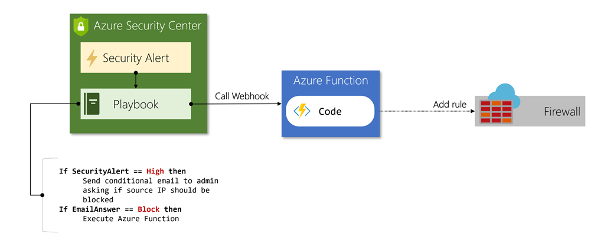

Often, the response for a specific security threat is well-known, and if performed quickly, can turn an outage or data disclosure into a minor annoyance. For example, when a denial-of-service attack is detected from an IP range, a typical response might be to block that IP range at the firewall.

Microsoft Defender for Cloud provides a feature called *Workflow Automation* to execute these sorts of responses when specific security alerts are detected.

## What is Workflow Automation in Microsoft Defender for Cloud?

A workflow automation is a collection of grouped procedures that the security response team can execute with a single click. These procedures are executed in Defender for Cloud when a specific alert is detected. These actions *aren't* automatically triggered; they require human interaction to run.

Workflow automations are built on **Azure Logic Apps**. You can easily customize the logic and workflow using the visual workflow designer. You can start with an existing Logic App or create a new Logic App. You can then use Defender for Cloud to trigger it when an alert is generated.

Some of the pre-built actions are:

- Create an automated incident report in another system, filling in fields from the active alert
- Email a distribution group with details about the active alert(s)
- Send a notification to a Teams or Slack channel

However, because Logic Apps can integrate Azure Functions and webhooks, the possible actions are endless. Imagine a case where a client is misusing your service, and it's generating an alert in Defender for Cloud. You can create a custom Azure Function to take the source IP address from the alert and create a rule in your firewall to block all inbound traffic from that address. A visual representation of this function might look something like this:

