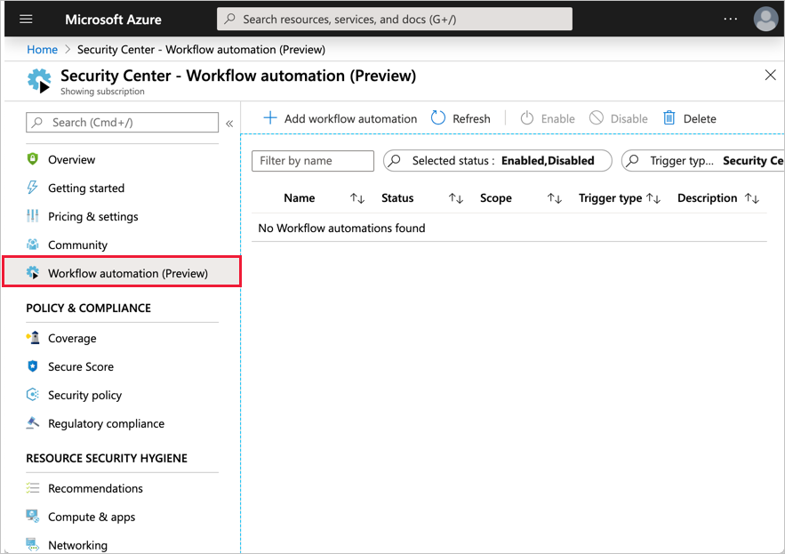
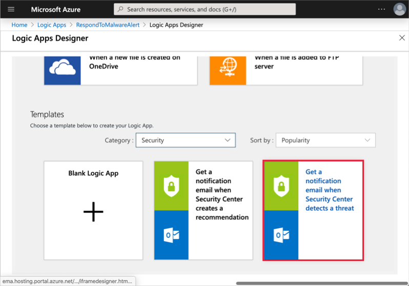
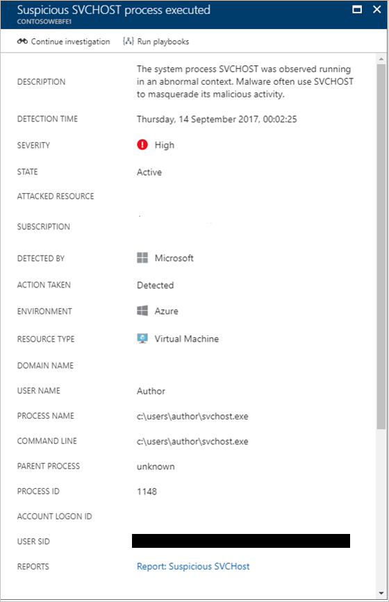
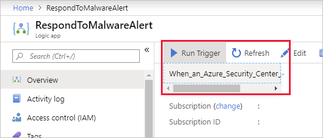

Security playbooks are created directly in the Security Center portal.

> [!IMPORTANT]
> You will need an Office 365 email account to use this specific set of instructions - if you don't have one, try changing the instructions below to use a different template, or create a Blank Logic App.

1. Sign into the [Azure portal](https://portal.azure.com?azure-portal=true) with the same account you used to activate the Azure Sandbox.

1. Navigate to **Security Center** using the search box, or through the tile on the main dashboard.

1. Under **Automation & Orchestration** in the Azure Security Center left panel, select **Playbooks (Preview).**

    

1. Select the **Add playbook** button to create a new Logic App to use as a playbook.

1. In the **Logic App** panel, enter the following information:
    - **Name**: _RespondToMalwareAlert_
    - **Subscription**: _Concierge Subscription_
    - **Resource group**: select _Use existing_ and pick <rgn>[Learn resource group]</rgn> from the drop-down list
    - **Location**: select any valid location near you - if it fails to create, try a different location
    - **Log Analytics**: select _Off_

1. Select **Create** to create the Logic app. This will return you to the Playbooks screen. It will take a few minutes to deploy the resources for the Logic App. You can monitor the deployment in the **Notifications** panel (bell icon) from the top menu.

1. Once it's deployed, select the **Refresh** button from the top toolbar to see the new playbook.

    

1. Select the **RespondToMalwareAlert** logic app from the list to edit it. The **Logic Apps Designer** will appear.

1. Select **Get a notification email when Security Center detects a threat** as shown below. You could also select **Blank Logic App** if you wanted to create some custom logic to run in response to an alert, or if you don't have an M365-based email account.

    

1. Select **Use this template** to create the app.

1. Provide credentials for Office 365 to connect your email account.

1. Select **Create** on the **Azure Security Center Alert** connection.

1. Specify a target email address to send the notification to.

1. You can use the **+ Next step** to create additional logic steps in the flow. In this case, we don't need anymore so select **Save** from the menu at the top.

## Run a security playbook from Azure Security Center

You normally run playbooks from the Security Center dashboard using an existing alert.

1. Navigate back to the Security Center dashboard. You can use the breadcrumb bar at the top to back up.

1. Under **Threat Detection**, select **Security incidents & alerts**.

1. Here, you would select an alert, and at the top of the details page, select the **Run playbooks** button.

    

In this case, in the Azure Sandbox, you likely don't have any alerts - so you can't execute the playbook this way. However, we can test it through the Logic Apps panel.

## Test a security playbook from Logic Apps

1. Select **Home** from the left-hand sidebar. You should see your Logic App as a recently created resource. If not, try searching for it from the top search bar - recall the name is **RespondToMalwareAlert**.

1. On the **Overview** panel, use the **Run Trigger** button to show the trigger and select it.

    

1. A new entry will show up under _Runs history_ in the Overview panel. You can select that entry to drill into details. For example, you can drill into the inputs and outputs of the run:

### Inputs

```json
{
    "method": "post",
    "path": "/Mail",
    "host": {
        "connection": {
            "name": "/subscriptions/abcd/resourceGroups/abcd/providers/Microsoft.Web/connections/office365"
        }
    },
    "body": {
        "Body": "Azure Security Center has discovered a potential security threat in your environment - Alert details below:\n\nAlert name: \n\nDescription: \n\nDetection time: \n\nAttacked resource: \n\nDetected by: \n\nAlert ID: ",
        "Importance": "High",
        "Subject": "Azure Security Center has discovered a potential security threat in your environment",
        "To": "john@doe.com"
    }
}
```

### Outputs

```json
{
    "statusCode": 200,
    "headers": {
        "Pragma": "no-cache",
        "x-ms-request-id": "615f4430-7433-4fd3-aa2d-000e8a1a0db9",
        "Strict-Transport-Security": "max-age=31536000; includeSubDomains",
        "X-Content-Type-Options": "nosniff",
        "X-Frame-Options": "DENY",
        "Timing-Allow-Origin": "*",
        "x-ms-apihub-cached-response": "true",
        "Cache-Control": "no-store, no-cache",
        "Date": "Fri, 10 Oct 2019 09:17:32 GMT",
        "Set-Cookie": "ARRAffinity=9c9c847b5bd6c73a56d4f1afae4aecaa7f5b746d703be6c728afc87b6c50d7e3;Path=/;HttpOnly;Domain=office365-wus.azconn-wus.p.azurewebsites.net",
        "Content-Length": "0",
        "Expires": "-1"
    }
}
```
