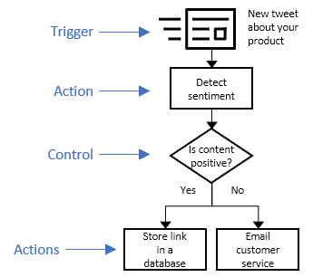
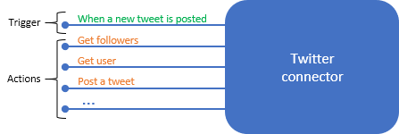
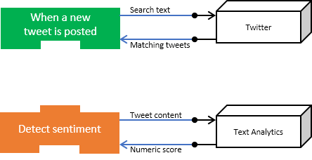
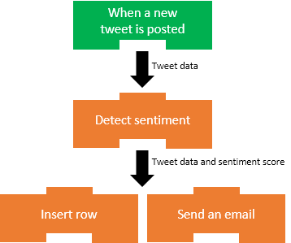
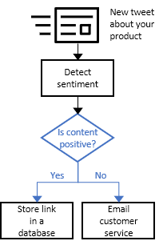
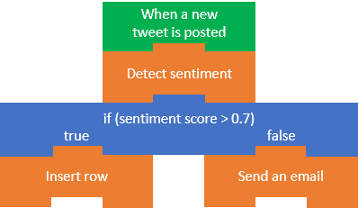

Implementing business processes is difficult because you need to make diverse services work together. Think about everything your company uses to store and process data: Salesforce, Office 365, Oracle, Twitter, YouTube, Dropbox, Google services, Azure Cognitive Services, and so on. How do you integrate all these products?

Azure Logic Apps gives you pre-built components to connect to hundreds of services. You put the pieces together in any combination you need. For example, in the shoe-company scenario we want to monitor social media reaction to our new product. We'll build a Logic App to integrate Twitter, Azure Cognitive Services, SQL Server, and Outlook email.

In this unit, we'll plan the sequence of steps needed to implement a business process. Then we'll map those steps to the pre-built components in Azure Logic Apps. Finally, we'll assemble the parts into an app using the Logic Apps Designer.

## Plan your business process

The first step to creating a Logic App is planning the steps of your business process. In the social-media monitoring scenario, the steps would be: detect tweets about the product, analyze the sentiment, store a link to positive tweets, and email customer service for negative tweets. It's common to use a flowchart to capture the steps of the process. The following illustration shows the flowchart for the social-media monitor app.

## Identify the type of each step in your process

The steps of a business process do different types of operations. Some respond to external events, some process or store data, and others make decisions based on the data. Logic Apps uses the terms *trigger*, *action*, and *control action* for these three categories. 

For example, in our social-media monitor scenario we *trigger* the process when a new tweet is posted, perform *actions* like detect the sentiment, and make a *control* decision based on the sentiment score. The following illustration shows the type of each step in the social-media monitor app.

## Map your steps to Logic Apps components

Let's be more formal about the definitions of the component types:

* A *trigger* is an event that occurs when a specific set of conditions is satisfied. Triggers activate automatically when the conditions are right. For example, when a timer expires or data becomes available. Every Logic App must start with a trigger. In our example, we'll trigger the app when a new tweet mentions our product.

* An *action* is an operation that executes one of the tasks in your business process. Actions run when a trigger activates or another action completes. Our social-media monitor app has three actions: detect sentiment, insert database row, and send email.

* *Control actions* are special built-in actions that let you add decisions and loops to your app. Our example will use a control action to branch based on the sentiment score.

A group of related triggers and actions are packaged inside a *connector*. Conceptually, you can think of a connector as a component that lets you access an external service. For example, the Twitter connector lets you send and receive tweets while the Office 365 Outlook connector allows you to manage your email, calendar, and contacts. The following illustration shows the Twitter connector with its operations divided into the two categories.

You job is to map each task in your flowchart to Logic Apps triggers and actions. The following illustration shows the connectors we'd use in the social-media app with the relevant triggers and actions highlighted.

## Define your app using the Logic Apps Designer

The Logic Apps Designer is a graphical tool for creating your workflows. It lets you pick from a gallery of connectors that contain the triggers and actions you can use in your app. You'll use the graphical Logic Apps Designer to arrange the trigger, actions, and control actions. The following screenshot shows the Designer with the completed application.

When you select the "Save" button, your app will be live and will run automatically whenever the trigger activates.

To summarize, the steps are:

1. Create a flowchart to describe your business process
1. Identify the type of each step (trigger, action, or control action)
1. Map each step to a corresponding Logic Apps component
1. Use the Logic Apps Designer to assemble the components into your app

---

## How to build Logic Apps from triggers and actions

Triggers and actions are the building blocks of Logic Apps. An app must begin with a trigger. After the trigger, you include as many actions as you need to implement the tasks in your business process. The following illustration shows the trigger and actions used in the social-media monitor app.

## How do triggers and actions work together?

Triggers and actions are essentially function calls to an underlying API operation. Each operation has inputs and outputs. For example, the "When a new tweet is posted" Twitter trigger takes in a search string and returns the tweets that contain that string. The "Detect sentiment" action takes a string as input and returns a floating-point number. The following illustration shows these two operations.

Logic Apps automatically places the return values into special variables that are available throughout the rest of the operations. These variables let you pass the results from one operation as input to the next operation. The following illustration shows the data flow for the first two operations in the social-media monitor app. Notice that the results from an operation are available in all of the following steps.

## What are control actions?

Most business processes need to do different actions based on the data being processed. For example, an expense report might be routed to a different manager based on the amount. In the social-media monitor app, we need to branch based on the sentiment score of the tweet. The following illustration shows the flowchart for the social-media monitor app with the control logic highlighted.

*Control actions* are special actions built-in to Logic Apps that provides these control constructs:

* *Condition* statements controlled by a Boolean expression
* *Switch* statements
* *For each* and *Until* loops
* Unconditional *Branch* instructions.

The following illustration shows the use of a *Condition* statement in the social-media monitoring application.

## How to create a Logic App for your business process

The first step is to analyze your business process. Ideally, you'll identify the tasks and create a flowchart to capture the required order of the tasks. The following illustration shows the flowchart for the social-media monitor process that we saw earlier.

