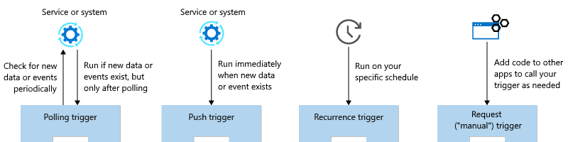
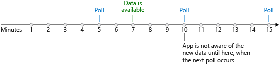
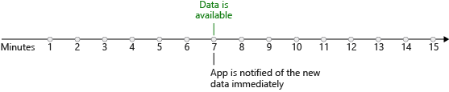
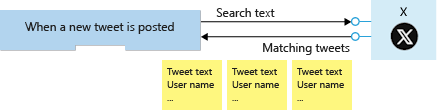
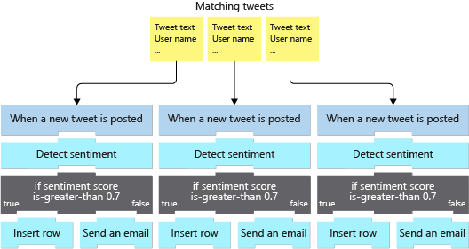

You use a trigger to launch your logic app. You need to find the best one and configure it to run your app correctly without wasting time or money. In the shoe-company scenario, we will use a Twitter trigger to launch our app when tweets containing our product name are available.

In this unit, we'll examine the types of triggers and the strengths and weaknesses of the two most common options. We'll see how to create a logic app using the Azure portal and how to add a trigger using the Logic Apps Designer.

## Trigger types

Think about the different conditions that businesses might use to launch their Logic Apps.

Most of the examples we've seen are in the *data becomes available* category. For example, a new tweet is posted, a new row is inserted into a database, a new email arrives, or a new file is uploaded to your cloud storage. This category doesn't cover all cases though.

Suppose you wanted to launch your logic app every Saturday at midnight? This trigger would be great for administrative tasks like running backups or archiving old data. Logic Apps provides a built-in *recurrence* trigger to help you do exactly this type of thing.

There's one more case to consider: suppose you wanted total control? Imagine you need to launch your logic app using code in your web or mobile applications? You can use the built-in *manual request* trigger to do this action.

This discussion shows that we have three broad categories of triggers: data, time, and manual. Data triggers use two different techniques to detect that new data is available: some use *polling* and some rely on the external service to *push* a notification. These two types of data triggers are so different, that we should think of them as separate categories. Altogether, we have four types of triggers, the following illustration shows a summary of the cases.

## What is a polling trigger?

A *polling trigger* periodically checks an external service for new data. For example, the trigger that looks for new posts in an RSS feed is implemented using polling.

When you create a polling trigger, you set the **Frequency** and an **Interval** to control how often the trigger will run. The frequency is the unit of measurement and has values like **Second**, **Minute**, and **Hour**. Interval is a number that represents how often to execute. For example, a polling trigger with a frequency of **Minute** and an interval of **5** would run every five minutes.

Polling triggers force you to make a choice between how much they cost and how quickly they respond to new data. There is often a delay between when new data becomes available and when it is detected by the app. The following illustration shows the issue.

In the worst case, the potential delay for detecting new data is equal to the polling interval. So why not use a smaller interval? To check for new data, the Logic Apps execution engine needs to run your app, which means you incur a cost. In general, the shorter the interval, the higher the cost but the quicker you respond to new data. The best polling interval for your logic app depends on your business process and its tolerance for delay.

## What is a push trigger?

A *push trigger* subscribes to an event offered by the external service to get notified immediately when data is available. For example, the trigger that detects when a message is added to an Azure Service Bus queue is a push trigger.

> [!NOTE]
> Push triggers are implemented using webhooks. The Logic Apps infrastructure generates a callback URL for you and registers it with the external service. This registration happens when you first create your app and again when you make changes to your app's configuration. Similarly, Logic Apps de-registers the callback for you as needed; for example, if you disable or delete your app.

The nice thing about push triggers is that they don't incur any costs polling for data when none is available. They also respond immediately when new data is ready. The following illustration shows this immediate response.

If push triggers respond more quickly and cost less than polling triggers, then why not use them all the time? The reason is that not every connector offers a push trigger. Sometimes the trigger author chose not to implement push and sometimes the external service didn't support push. Generally, you'll find a connector offers either push or polling triggers but not both. In the rare cases where both options are available, consider using the push trigger because it should be more efficient.

In this module, we're going to focus on polling triggers. These triggers are the most common and are perfect for the "route and process data" scenarios that we've been discussing.

## Trigger parameters and return values

You can think of trigger operations as function calls that have parameters and return values.

Trigger *parameters* let you configure the operation. The Twitter **When-a-new-tweet-is-posted** trigger has a parameter called **Search text** that it uses to select matching tweets for us. Some operations have a mix of required and optional parameters. The SQL Server **When an item is created** trigger has one required parameter named **Table name** and several optional parameters like **Order By** and **Select Query**.

Trigger *return values* are the results of the operation. The bitbucket connector has a **When a pull request is merged** trigger. The trigger returns an object containing things like the identity of the **Repository** and the **Actor** who approved the merge. Most triggers actually return a collection instead of a single object. The Twitter **When a new tweet is posted** trigger returns an array of **TweetModel** objects. Each object contains values like the **Tweet text**, **User name**, and **Followers count**. The following illustration shows a collection being returned from a trigger.

You can use a loop to process each item or you can ask the trigger to split the array up for you. The default behavior for most triggers, including the Twitter trigger, is to automatically split the array. The Logic Apps execution engine will create one instance of your logic app for each data item and the instances will run in parallel. The following illustration shows how each item in the returned array is sent to a different instance of the logic app.

## How to create a logic app in the Azure portal

You can use the Azure portal to create a logic app. You select the **Logic App** resource type and enter the standard resource properties **Name**, **Subscription**, **Resource group**, and **Location**. After deployment completes, you can navigate to the Logic Apps resource that you created.

The Logic Apps team has created several *templates* for common application types. For example, there are templates for apps like **Post to Slack if a new tweet matches with some hashtag** and **Get daily reminders emailed to you**.

When you first navigate to your newly deployed logic app, you'll find a getting-started page. This page can add a common trigger to your app or generate an entire app for you from one of the templates. If any of these templates matches what you're working on, they can save you some time in getting your app set up. To do all the work yourself, there's also a **Blank Logic App** template.

After you select a starting template, you'll automatically navigate to the Logic Apps Designer.

## How to add a trigger using the designer?

The Logic Apps Designer lets you pick from a gallery of connectors that contain the triggers and actions you can use in your app. The typical strategy is to use the search feature to locate the connector you are interested in. Then you look through the triggers supplied by the connector to find the one you want. In our case, we will use Twitter's **When-a-new-tweet-is-posted** trigger.

Once you've added the trigger, the designer gives you a GUI to set its properties. We'll set the **Search text**, **Frequency**, and **Interval** parameters. The following screenshot shows the social-media monitor logic app displayed in the designer; notice that it begins with the Twitter trigger.

