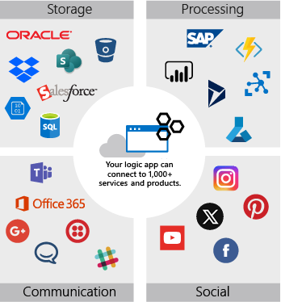
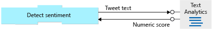
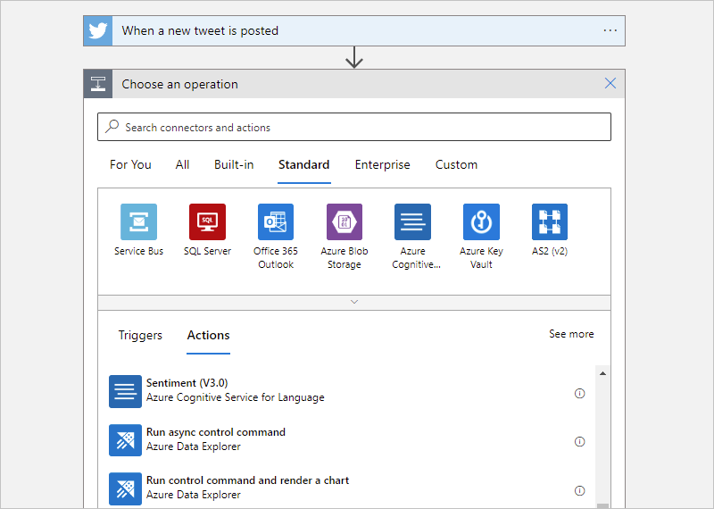
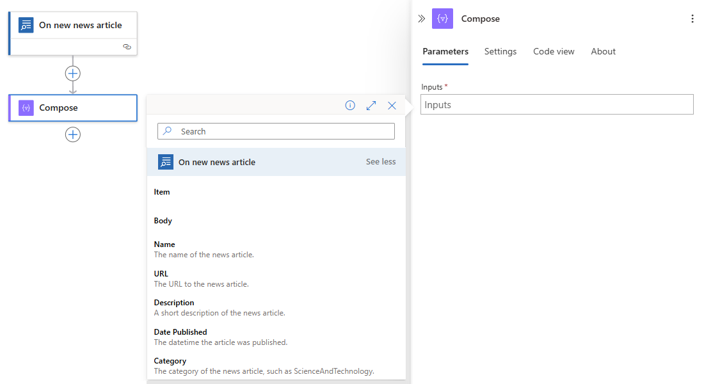

Recall that you build Logic Apps from triggers and actions. A trigger starts your app and then actions do the rest of the work. The social-media monitor uses actions to check if a tweet is positive or negative and then inserts a row into a database or sends an email.

In this unit, we'll do a quick survey of the types of actions. Then we'll discuss how to use actions in your app by passing parameters and processing returned values. Finally, we'll see how to use the Logic Apps Designer to add an action and configure its settings.

## Action types

The core goal of Logic Apps is to help you get services to work together. There are three aspects to this goal: accessing external services, manipulating the data you get back, and altering the control flow through your app. Logic Apps gives you actions to do all of these things. Let's look at each of the categories.

### Access external services

Actions that let you use services outside of your logic app are by far the most common type. In fact, these actions are so common, that they are what most people mean when they use the term *action*. They give you access to hundreds of products like Salesforce, Oracle, YouTube, Dropbox, Gmail, GitHub, Twilio, Facebook, Slack, and Jira. The following illustration shows a few of the available external actions.



When you use an action to connect to an external service, you typically supply connection and authorization values. It might be a username, a password, a connection string, or an account key. The details will be different for each service.

For example, to connect to Cognitive Services, you give the **Site URL** so your logic app knows where to send the request and your **Account Key** to prove you are authorized to access the service. Both of these values are available in your Cognitive Services account. You'll typically copy them into the settings for the **Detect-sentiment** action.

This type of action helps you send out data for processing or pull data into your app. But then what? How do you actually work with that data inside your app. That's what the next category of action is for.

### Manipulate data

*Data operation actions* let you work with the data that you pull into your logic app. There are operations to concatenate multiple values into a single string, parse JSON data, select particular values from an array, and so on.

Let's look at an example. If you've used Twitter for a while, you might be familiar with their URL pattern to link to a specific tweet:

```language-plaintext
https://twitter.com/[username]/status/[id]
```

This type of link could be useful in the social-media app. You might want to store it in your database so you can access the tweet again later. Or you might want to include it in an email notification so your coworkers can see the tweet in its original form.

The data you get from the Twitter trigger does not include this complete URL. However, it does contain the username in the **TweetedBy** field and the ID in the **TweetId** field. You can use the **Compose** data operation to put the pieces together into the URL. Conceptually, the operation would be:

```language-plaintext
Compose: "https://twitter.com/" + [TweetedBy] + "/status/" + [TweetId]
```

### Alter control flow

The *control action* feature of Logic Apps lets you add control constructs like conditional statements and loops to your app. The social-media monitor app will use a control action to branch based on whether the tweet sentiment is positive or negative. We'll see how this works and discuss all the control actions later in this module.

## Action parameters and return values

You can think of actions as function calls that have parameters and return values.

Action *parameters* let you pass values to the operation. The Cognitive Services **Detect-sentiment** action has a parameter called **Text** that represents the string you want to analyze. It also has an optional parameter named **Language** that lets you provide a hint about the language of the **Text**.

Action *return values* are the results of the operation. The **Detect sentiment** action returns a numeric score between 0 and 1. Scores close to 1 indicate positive sentiment, while scores close to 0 indicate negative sentiment. The following illustration summarizes the data flow for the **Detect sentiment** action as used by the social-media monitor app.



## Static vs. dynamic parameters

Some of the parameters you send to an action will be the same every time. For example, you might only be interested in tweets in English so you would always pass "en" as the **Language** parameter to the **Detect sentiment** action. There's nothing tricky about this type of static parameter. You hard-code the value when you configure the action and that value is used every time the action runs.

Other parameters will be different every time you execute an action. The **Text** parameter in the **Detect sentiment** action is a good example of this. When you pass in the text of the tweet, it will be different for every run. How do you get access to this dynamic value?

Recall that the tweet we're processing was the return value of the **When a new tweet is posted** trigger. This tweet data is packaged inside an object with several fields containing the details of the tweet. Logic Apps automatically makes this object available throughout the rest of the app. The Logic Apps Designer gives you a simple GUI to select the fields you're interested in.

## Add and configure an action using the designer

The Logic Apps Designer gives you a GUI to add and configure actions. You can add new actions to the end of your app or insert an action between existing steps.

The first step is to select the **Add an action** option at the point in your app where you want the new action to appear. This launches the "choose an action" UI. The following screenshot shows how to add a new action using the Logic Apps Designer.



Once you add an action, you use the designer to set configuration parameters. Again, the designer provides a GUI for you to enter the values. Static content can be added manually. For dynamic content, the designer can pop up a selection GUI that shows you data that was returned by previous steps. You choose the field you need and the designer automatically populates that entry in your action. The following screenshot shows the dynamic tweet data from the social-media monitor app displayed in the designer.



The designer makes it easy to add dynamic content. You don't need to remember the names of the parameters and return values and you don't have to worry about the details of the syntax.
