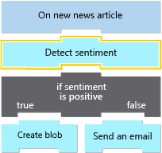

In this exercise, we're going to continue work on our social media monitoring app. We'll analyze whether the tweets about our product are positive or negative. We'll use the **Sentiment** action, which provides a numeric score that represents the tweet's sentiment. The following diagram shows a conceptual view of the workflow and highlights the part that we'll work on.



<a name='get-key-and-endpoint-for-azure-ai-services'></a>

## Get key and endpoint for Azure AI services

The Azure AI Language API provides natural language processing for text and includes capabilities such as sentiment analysis, key phrase extraction, language detection, and entity linking. We'll use this API for sentiment analysis and run a script to programmatically complete the following tasks:

- Set up an Azure AI services account in the sandbox environment, making the account free for use in this module.

- Register the Text Analytics service.

- Return an account key and an endpoint URL for the Azure AI services. For this exercise, we need these values to make calls and get back sentiment scores.

1. In Azure Cloud Shell to the right, run the following `curl` command to copy the **setup-textanalytics.sh** script from GitHub:

   ```azurecli
   curl https://raw.githubusercontent.com/MicrosoftDocs/mslearn-route-and-process-data-logic-apps/master/setup-textanalytics.sh > setup-textanalytics.sh
   ```

1. Run the following command to execute the script. This command will take a couple of minutes.

   ```azurecli
   bash setup-textanalytics.sh
   ```

1. Wait for the script to complete. When it finishes, Cloud Shell displays values for the following properties.

   - **Cognitive Services account key**

   - **Cognitive Services account endpoint**

1. Save the values that appear in Cloud Shell somewhere safe. We need them in this exercise when we update our app in the Azure portal.

## Add the Sentiment action

Now, we'll add the **Sentiment** action to our workflow using the Azure portal.

1. In the [Azure portal](https://portal.azure.com/learn.docs.microsoft.com?azure-portal=true), return to the workflow designer. On the logic app resource menu, under **Development Tools**, select **Logic app designer**.

1. Under the Twitter trigger, select **New step**.

1. In the **Choose an operation** search box, enter **Cognitive Services**.

1. Select the **Azure Cognitive Services for Language** connector.

1. In the **Actions** section, select **Sentiment**.

   The connection profile box appears so that you can provide informtion for your connection to your Azure AI services account.

1. Provide the following connection information:

   | Property | Required | Value | Description |
   |----------|----------|-------|-------------|
   | **Connection name** | Yes | CognitiveServicesConnection | The name to provide your connection |
   | **Authentication Type** | Yes | Api Key | The authentication to use for access to your Azure AI services account |
   | **Account Key** | Yes | <*your-previously-saved-API-key*> | The key to use for accessing your Azure AI services account |
   | **Site URL** | No | <*your-saved-endpoint-address*> | The URL address for your Azure AI services account endpoint |
   |||||
   
1. When you're done, select **Create**.

   The **Sentiment** action and properties now appear.

## Set up the Sentiment action

Next, we'll set up the **Sentiment** action's properties to pass in the tweet text from the Twitter trigger.

1. In the **Sentiment** action, select the **documents-id** field. Provide a unique ID to assign your document.

1. Next, select the **documents-text** field.

   The dynamic content list appears for you to select outputs from the prededing trigger or any actions.

1. From the dynamic content list, under **When a new tweet is posted**, select **Tweet text**.

   *Substitution*: If you're using the RSS trigger named **When a feed item is published**, select **FeedSummary**.

1. Save your workflow.

   This step pushes your changes to your deployed logic app. Tweets containing your product name will be processed by Azure AI services and will be given a numeric score. Recall that a score close to 1 is positive sentiment, while a score near 0 is negative. 

## Review the results

In this section, you'll learn how to monitor your logic app workflow's execution, and view the data flowing through each step. This capability is useful to know about because you can confirm whether your app is working correctly.

1. On the logic app resource menu, select **Overview**.

1. On the **Oveview** pane toolbar, select **Refresh** every minute until the **Runs history** section shows at least one completed run.

   > [!NOTE]
   > 
   > Each item in the **Runs history** list represents a separate tweet that contained the search text that you provided to your trigger.

1. After at least one completed run appears, select the run.

   A page named **Logic app run** opens to show the status for each step in the workflow and the time taken to run each step. From this view, you can also review the data that flowed through each step.

1. To view the action's inputs and outputs, select the **Sentiment** action.

    The action shape expands to show the **INPUTS** and **OUTPUTS** sections.

1. In the **OUTPUTS** section, find the tweet text and the score, which is assigned by the Azure AI services engine.
