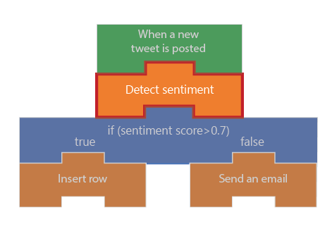

In this exercise, we're going to continue work on our social-media monitor app. Here, we'll analyze whether the tweets about our product are positive or negative. We'll create a Detect Sentiment action which will provide us a numeric *Score* that represents the sentiment of the tweet. The following illustration shows a conceptual view of the app with the part that we'll work on highlighted.

## Generate Text Analytics API key

The Azure Text Analytics API provides natural language processing of text. It lets you do sentiment analysis, key phrase extraction, language detection, and entity linking. We'll be using it for sentiment analysis. You need a subscription in order to use the API, so the first thing we need to do is create a free trial. Then we'll grab the the api key we'll use in our Logic App.

1. In a new browser tab, navigate to **https://azure.microsoft.com/en-us/try/cognitive-services/**.

1. Select the **Language APIs** tab.

1. Select **Get API Key** in the Text Analytics section.

1. In the Guest section, select **Get started**.

1. Select the checkbox that states that you agree that the free trial is governed by the Microsoft Online Subscription Agreement.

1. Select your **Country / Region**.

1. Select the **I accept** checkbox.

1. Click **Next**.

1. Sign-in with your preferred account.

1. In the **Your APIs** section, locate your Text Analytics api key and endpoint address.

1. Save your api key and endpoint address in a text document. We'll use them in the next section.

## Create a Detect Sentiment action

Here, we'll add a Detect Sentiment action to our app and set it to connect to our Text Analytics subscription.

1. Return to the Logic App designer by selecting **Logic app designer** under the Development Tools section of the left navigation bar.

1. Under the Twitter trigger, click **New step**.

1. In the **Search connectors and actions** search box, type "Text analytics".

1. Select the **Text Analytics** connector.

1. In the Actions section, select **Detect Sentiment**.

1. In the Connection Name field, type **CognitiveServicesConnection**.

1. Paste your saved api key in the **Account Key** field and your saved endpoint address in the **Site URL** field.

1. Click **Create**.

## Configure Detect Sentiment

Next, we'll configure our app to pass the tweet text to the Text Analytics service.

1. Select the **Text** field in the Detect Sentiment action.

1. In the Dynamic content popup, select **Original tweet text**.

1. Click **Save** in the Logic App designer.

## Examine results of Detect Sentiment

Your app is now live. Tweets containing your product name will be processed by the Text Analytics service and you'll be given a numeric score. Recall that a score close to 1 is positive sentiment while a score near 0 is negative. In this section, you'll see how to monitor the executions of your app and view the data flowing through each steps. This is a great technique to know about since it helps you verify your app is working correctly.

1. In the left navigation bar, select **Overview**.

1. Click **Refresh** once a minute until you see a row item in the **Runs history** table.
    > [!NOTE]
    > Each item in the **Runs history** table represents a separate tweet that contained the name of the product you entered in the **Search text** of your trigger.

1. Once you see a row item appear, select the item.

1. Select the Detect Sentiment action.

1. Locate the text of the tweet and the score that was given to it by the Cognitive Services engine.