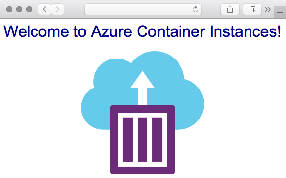

Here, you create a container in Azure and expose it to the Internet with a fully qualified domain name (FQDN).

[!include[](../../../includes/azure-sandbox-activate.md)]

## Why use Azure Container Instances?

Azure Container Instances is useful for scenarios that can operate in isolated containers, including simple applications, task automation, and build jobs. Here are some of the benefits:

- **Fast startup**: Launch containers in seconds.
- **Per second billing**: Incur costs only while the container is running.
- **Hypervisor-level security**: Isolate your application as completely as it would be in a VM.
- **Custom sizes**: Specify exact values for CPU cores and memory.
- **Persistent storage**: Mount Azure Files shares directly to a container to retrieve and persist state.
- **Linux and Windows**: Schedule both Windows and Linux containers using the same API.

For scenarios where you need full container orchestration, including service discovery across multiple containers, automatic scaling, and coordinated application upgrades, we recommend Azure Kubernetes Service (AKS).

## Create a container

You create a container by providing a name, a Docker image, and an Azure resource group to the `az container create` command. You can optionally expose the container to the Internet by specifying a DNS name label. In this example, you deploy a container that hosts a small web app. You can also select the location to place the image - you'll use the **East US** region, but you can change it to a location close to you from the following list.

<!-- TODO: fix region list so it's not hardcoded here -->
The free sandbox allows you to create resources in a subset of Azure's global regions. Select a region from the following list when creating any resources:

:::row:::
    :::column:::
        - westus2
        - southcentralus
        - centralus
        - eastus
        - westeurope
        - southeastasia
        - centralindia
    :::column-end:::
:::row-end:::

1. You provide a DNS name to expose your container to the Internet. Your DNS name must be unique. For learning purposes, run this command from Cloud Shell to create a Bash variable that holds a unique name.

    ```bash
    DNS_NAME_LABEL=aci-demo-$RANDOM
    ```

1. Run the following `az container create` command to start a container instance.

    ```azurecli
    az container create \
      --resource-group <rgn>[sandbox resource group name]</rgn> \
      --name mycontainer \
      --image microsoft/aci-helloworld \
      --ports 80 \
      --dns-name-label $DNS_NAME_LABEL \
      --location eastus
    ```

    `$DNS_NAME_LABEL` specifies your DNS name. The image name, **microsoft/aci-helloworld**, refers to a Docker image hosted on Docker Hub that runs a basic Node.js web application.

1. When the `az container create` command completes, run `az container show` to check its status.

    ```azurecli
    az container show \
      --resource-group <rgn>[sandbox resource group name]</rgn> \
      --name mycontainer \
      --query "{FQDN:ipAddress.fqdn,ProvisioningState:provisioningState}" \
      --out table
    ```

    You see your container's fully qualified domain name (FQDN) and its provisioning state. Here's an example.

    ```output
    FQDN                                    ProvisioningState
    --------------------------------------  -------------------
    aci-demo.eastus.azurecontainer.io       Succeeded
    ````

    If your container is in the **Creating** state, wait a few moments and run the command again until you see the **Succeeded** state.

1. From a browser, navigate to your container's FQDN to see it running. You see this.

    

## Summary

Here, you created an Azure container instance to run a web server and application. You also accessed this application using the FQDN of the container instance.