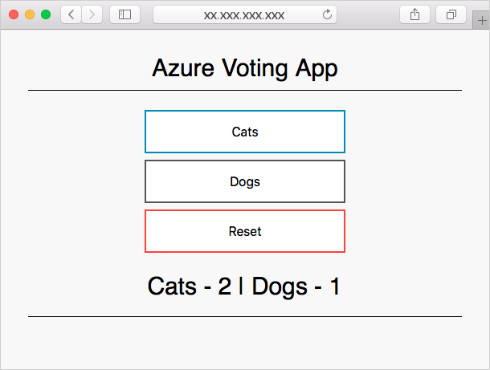

Environment variables in your container instances allow you to provide dynamic configuration of the application or script run by the container. You can use the Azure CLI, PowerShell, or the Azure portal to set variables when you create the container. Secured environment variables are used to prevent sensitive information from being displayed in container output.

Here, you will create an Azure Cosmos DB instance and use environment variables to pass the connection information to an Azure container instance. An application in the container uses the variables to write and read data from Cosmos DB. You will create both an environment variable and a secured environment variable.

## Deploy Azure Cosmos DB

Create the Azure Cosmos DB instance with the `az cosmosdb create` command. This example will also place the Azure Cosmos DB endpoint address in a variable named *COSMOS_DB_ENDPOINT*. You'll need to supply a unique name for `[cosmos-db-name]`.

This command can take a few minutes to complete:

```azurecli
COSMOS_DB_ENDPOINT=$(az cosmosdb create --resource-group <rgn>[sandbox resource group name]</rgn> --name [cosmos-db-name] --query documentEndpoint --output tsv)
```

Next, get the Azure Cosmos DB connection key with the `az cosmosdb list-keys` command and store it in a variable named *COSMOS_DB_MASTERKEY*. Don't forget to replace `[cosmos-db-name]` again:

```azurecli
COSMOS_DB_MASTERKEY=$(az cosmosdb list-keys --resource-group <rgn>[sandbox resource group name]</rgn> --name [cosmos-db-name] --query primaryMasterKey --output tsv)
```

## Deploy a container instance

Create an Azure container instance using the `az container create` command. Take note that two environment variables are created, `COSMOS_DB_ENDPOINT` and `COSMOS_DB_MASTERKEY`. These variables hold the values needed to connect to the Azure Cosmos DB instance:

```azurecli
az container create \
    --resource-group <rgn>[sandbox resource group name]</rgn> \
    --name aci-demo \
    --image microsoft/azure-vote-front:cosmosdb \
    --ip-address Public \
    --location eastus \
    --environment-variables COSMOS_DB_ENDPOINT=$COSMOS_DB_ENDPOINT \
    COSMOS_DB_MASTERKEY=$COSMOS_DB_MASTERKEY
```

Once the container has been created, get the IP address with the `az container show` command:

```azurecli
az container show \
    --resource-group <rgn>[sandbox resource group name]</rgn> \
    --name aci-demo \
    --query ipAddress.ip \
    --output tsv
```

Open a browser and navigate to the IP address of the container. 

> [!IMPORTANT]
> Sometimes containers take a minute or two to fully start up and be able to receive connections. If there's no response when you navigate to the IP address in your browser,  wait a few moments and refresh the page.

 Once the app is available, you should see the following application. When casting a vote, the vote is stored in the Azure Cosmos DB instance.



## Secured environment variables

In the previous exercise, a container was created with connection information for Azure Cosmos DB stored in two environment variables. By default, environment variables are displayed in the Azure portal and command-line tools in plain text.

For example, if you get information about the container created in the previous exercise with the `az container show` command, the environment variables are accessible in plain text:

```azurecli
az container show --resource-group <rgn>[sandbox resource group name]</rgn> --name aci-demo --query containers[0].environmentVariables
```

Example output:

```json
[
  {
    "name": "COSMOS_DB_ENDPOINT",
    "secureValue": null,
    "value": "https://aci-cosmos.documents.azure.com:443/"
  },
  {
    "name": "COSMOS_DB_MASTERKEY",
    "secureValue": null,
    "value": "Xm5BwdLlCllBvrR26V00000000S2uOusuglhzwkE7dOPMBQ3oA30n3rKd8PKA13700000000095ynys863Ghgw=="
  }
]
```

Secure environment variables prevent clear text output. To use secure environment variables, replace the `--environment-variables` argument with the `--secure-environment-variables` argument.

Run the following example to create a container named *aci-demo-secure* that utilizes secured environment variables:

```azurecli
az container create \
    --resource-group <rgn>[sandbox resource group name]</rgn> \
    --name aci-demo-secure \
    --image microsoft/azure-vote-front:cosmosdb \
    --ip-address Public \
    --location eastus \
    --secure-environment-variables COSMOS_DB_ENDPOINT=$COSMOS_ENDPOINT \
    COSMOS_DB_MASTERKEY=$COSMOS_KEY
```

Now, when the container is returned with the `az container show` command, the environment variables are not displayed:

```azurecli
az container show \
    --resource-group <rgn>[sandbox resource group name]</rgn> \
    --name aci-demo-secure \
    --query containers[0].environmentVariables
```

Example output:

```json
[
  {
    "name": "COSMOS_DB_ENDPOINT",
    "secureValue": null,
    "value": null
  },
  {
    "name": "COSMOS_DB_MASTERKEY",
    "secureValue": null,
    "value": null
  }
]
```