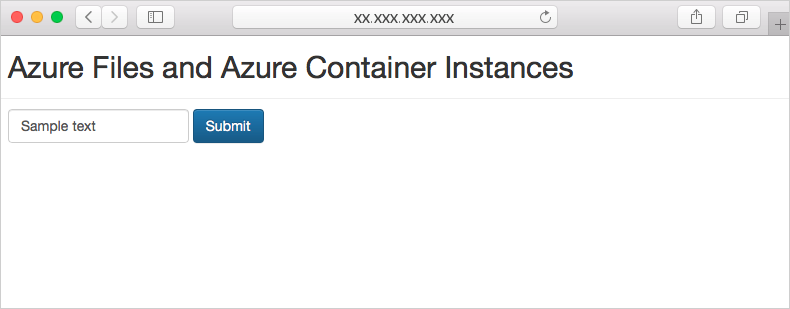

By default, Azure Container Instances is stateless. If the container crashes or stops, all of its state is lost. To persist state beyond the lifetime of the container, you must mount a volume from an external store.

Here, you will mount an Azure file share to an Azure container instance for data storage and retrieval.

## Create an Azure file share

Run the following script to create a storage account. The storage account name must be globally unique, so the script adds a random value to the base string:

```azurecli
ACI_PERS_STORAGE_ACCOUNT_NAME=mystorageaccount$RANDOM

az storage account create \
    --resource-group <rgn>[sandbox resource group name]</rgn> \
    --name $ACI_PERS_STORAGE_ACCOUNT_NAME \
    --sku Standard_LRS \
    --location eastus
```

Run the following command to place the storage account connection string into an environment variable named *AZURE_STORAGE_CONNECTION_STRING*. This environment variable is understood by the Azure CLI and can be used in storage-related operations:

```azurecli
export AZURE_STORAGE_CONNECTION_STRING=$(az storage account show-connection-string --resource-group <rgn>[sandbox resource group name]</rgn> --name $ACI_PERS_STORAGE_ACCOUNT_NAME --output tsv)
```

Create a file share in the storage account by running the `az storage share create` command. The following example creates a share with the name *aci-share-demo*:

```azurecli
az storage share create --name aci-share-demo
```

## Get storage credentials

To mount an Azure file share as a volume in Azure Container Instances, you need three values: the storage account name, the share name, and the storage account access key.

If you used the script above, the storage account name was created with a random value at the end. To query the final string (including the random portion), use the following commands:

```azurecli
STORAGE_ACCOUNT=$(az storage account list --resource-group <rgn>[sandbox resource group name]</rgn> --query "[?contains(name,'$ACI_PERS_STORAGE_ACCOUNT_NAME')].[name]" --output tsv)
echo $STORAGE_ACCOUNT
```

The share name is already known (aci-share-demo), so all that remains is the storage account key, which can be found using the following command:

```azurecli
STORAGE_KEY=$(az storage account keys list --resource-group <rgn>[sandbox resource group name]</rgn> --account-name $STORAGE_ACCOUNT --query "[0].value" --output tsv)
echo $STORAGE_KEY
```

## Deploy container and mount volume

To mount an Azure file share as a volume in a container, specify the share and volume mount point when you create the container:

```azurecli
az container create \
    --resource-group <rgn>[sandbox resource group name]</rgn> \
    --name aci-demo-files \
    --image microsoft/aci-hellofiles \
    --location eastus \
    --ports 80 \
    --ip-address Public \
    --azure-file-volume-account-name $ACI_PERS_STORAGE_ACCOUNT_NAME \
    --azure-file-volume-account-key $STORAGE_KEY \
    --azure-file-volume-share-name aci-share-demo \
    --azure-file-volume-mount-path /aci/logs/
```

Once the container has been created, get the public IP address:

```azurecli
az container show \
    --resource-group <rgn>[sandbox resource group name]</rgn> \
    --name aci-demo-files \
    --query ipAddress.ip \
    --output tsv
```

Open a browser and navigate to the container's IP address. You will be presented with a simple form. Enter some text and click **Submit**. This action will create a file in the Azure Files share containing the entered text.



To validate, you can navigate to the file share in the Azure portal and download the file.

Get the filename

```azurecli
az storage file list -s aci-share-demo -o table
```

Download the file to the cloud shell. Make sure to replace the `<filename>` below.

```azurecli
az storage file download -s aci-share-demo -p <filename>
```

Show the contents of the file.

```azurecli
cat <filename>
```

If the files and data stored in the Azure Files share were of any value, this share could be remounted on a new container instance to provide stateful data.