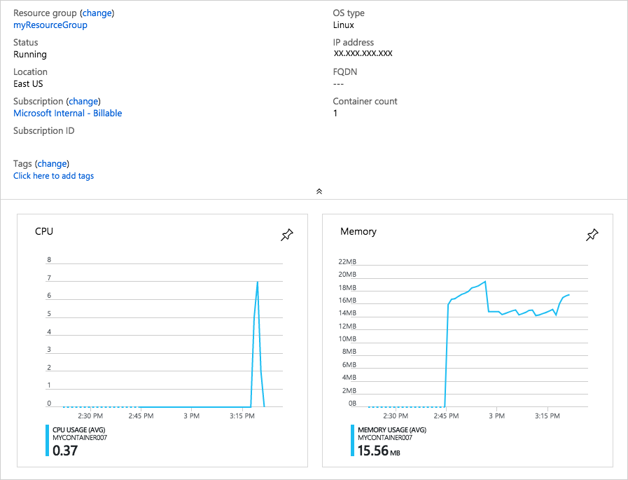

To help you understand basic ways to troubleshoot container instances, here you'll perform some basic operations such as:

* Pulling container logs
* Viewing container events
* Attaching to a container instance

## Create a container

Run the following `az container create` command to create a basic container.

```azurecli
az container create \
  --resource-group <rgn>[sandbox resource group name]</rgn> \
  --name mycontainer \
  --image microsoft/sample-aks-helloworld \
  --ports 80 \
  --ip-address Public \
  --location eastus
```

The **microsoft/sample-aks-helloworld** image runs a web server that displays a basic web page.

## Get logs from your container instance

Run the following `az container logs` command to see the output from the container's running application.

```azurecli
az container logs \
  --resource-group <rgn>[sandbox resource group name]</rgn> \
  --name mycontainer
```

You see output that resembles the following.

```output
Checking for script in /app/prestart.sh
Running script /app/prestart.sh
Running inside /app/prestart.sh, you could add migrations to this file, e.g.:

#! /usr/bin/env bash

# Let the DB start
sleep 10;
# Run migrations
alembic upgrade head
```

## Get container events

The `az container attach` command provides diagnostic information during container startup. Once the container has started, it also writes standard output and standard error streams to your local terminal.

Run `az container attach` to attach to your container.

```azurecli
az container attach \
  --resource-group <rgn>[sandbox resource group name]</rgn> \
  --name mycontainer
```

You see output that resembles the following.

```output
Container 'mycontainer' is in state 'Running'...
(count: 1) (last timestamp: 2018-09-21 23:48:14+00:00) pulling image "microsoft/sample-aks-helloworld"
(count: 1) (last timestamp: 2018-09-21 23:49:09+00:00) Successfully pulled image "microsoft/sample-aks-helloworld"
(count: 1) (last timestamp: 2018-09-21 23:49:12+00:00) Created container
(count: 1) (last timestamp: 2018-09-21 23:49:13+00:00) Started container

Start streaming logs:
Checking for script in /app/prestart.sh
Running script /app/prestart.sh
```

> [!TIP]
> Enter <kbd>Ctrl+C</kbd> to disconnect from your attached container.

## Execute a command in your container

As you diagnose and troubleshoot issues, you may need to run commands directly on your running container.

1. To see this in action, run the following `az container exec` command to start an interactive session on your container.

    ```azurecli
    az container exec \
      --resource-group <rgn>[sandbox resource group name]</rgn> \
      --name mycontainer \
      --exec-command /bin/sh
    ```

    At this point, you are effectively working inside of the container.

1. Run the `ls` command to display the contents of the working directory.

    ```output
    # ls
    __pycache__  main.py  prestart.sh  static  templates  uwsgi.ini
    ```

1. You can explore the system further if you wish. When you're done, run the `exit` command to stop the interactive session.

## Monitor CPU and memory usage on your container

Here you'll see how to monitor CPU and memory usage on your container.

1. Run the following `az container show` command to get the ID of your Azure container instance and store the ID in a Bash variable.

    ```azurecli
    CONTAINER_ID=$(az container show \
      --resource-group <rgn>[sandbox resource group name]</rgn> \
      --name mycontainer \
      --query id \
      --output tsv)
    ```

1. Run the `az monitor metrics list` command to retrieve CPU usage information.

    ```azurecli
    az monitor metrics list \
      --resource $CONTAINER_ID \
      --metric CPUUsage \
      --output table
    ```

    Note the `--metric` argument. Here, **CPUUsage** specifies to retrieve CPU usage.

    You see output similar to this.

    ```output
    Timestamp            Name              Average
    -------------------  ------------  -----------
    2018-08-20 21:39:00  CPU Usage
    2018-08-20 21:40:00  CPU Usage
    2018-08-20 21:41:00  CPU Usage
    2018-08-20 21:42:00  CPU Usage
    2018-08-20 21:43:00  CPU Usage      0.375
    2018-08-20 21:44:00  CPU Usage      0.875
    2018-08-20 21:45:00  CPU Usage      1
    2018-08-20 21:46:00  CPU Usage      3.625
    2018-08-20 21:47:00  CPU Usage      1.5
    2018-08-20 21:48:00  CPU Usage      2.75
    2018-08-20 21:49:00  CPU Usage      1.625
    2018-08-20 21:50:00  CPU Usage      0.625
    2018-08-20 21:51:00  CPU Usage      0.5
    2018-08-20 21:52:00  CPU Usage      0.5
    2018-08-20 21:53:00  CPU Usage      0.5
    ```

1. Run this `az monitor metrics list` command to retrieve memory usage information.

    ```azurecli
    az monitor metrics list \
      --resource $CONTAINER_ID \
      --metric MemoryUsage \
      --output table
    ```

    Here, you specify **MemoryUsage** for the `--metric` argument to retrieve memory usage information.

    You see output similar to this.

    ```output
    Timestamp            Name              Average
    -------------------  ------------  -----------
    2018-08-20 21:43:00  Memory Usage
    2018-08-20 21:44:00  Memory Usage  0.0
    2018-08-20 21:45:00  Memory Usage  15917056.0
    2018-08-20 21:46:00  Memory Usage  16744448.0
    2018-08-20 21:47:00  Memory Usage  16842752.0
    2018-08-20 21:48:00  Memory Usage  17190912.0
    2018-08-20 21:49:00  Memory Usage  17506304.0
    2018-08-20 21:50:00  Memory Usage  17702912.0
    2018-08-20 21:51:00  Memory Usage  17965056.0
    2018-08-20 21:52:00  Memory Usage  18509824.0
    2018-08-20 21:53:00  Memory Usage  18649088.0
    2018-08-20 21:54:00  Memory Usage  18845696.0
    2018-08-20 21:55:00  Memory Usage  19181568.0
    ```

CPU and memory information is also available through the Azure portal. To see a visual representation of CPU and memory usage information, navigate to the Azure portal overview page for your container instance.



[!include[](../../../includes/azure-sandbox-cleanup.md)]
