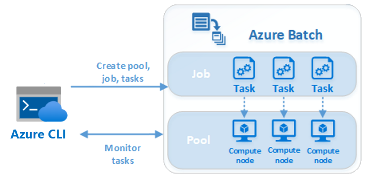

Azure Batch uses parallel tasks to split a job across compute nodes.

As the solution architect for the nonprofit, you want to understand how to design an Azure Batch job and how to enable parallel processing so that these capabilities can be used for the OCR scenario.

Here, you'll learn the key elements of a Batch parallel task.

## Using Azure Batch with Azure CLI

You decide to create the solution to help the nonprofit with their mission using Azure Batch and the CLI, so you can get a quick framework in place and incrementally improve it without spending time scaffolding all the foundational code you'd otherwise need to get started. It's true that other methods of creating Azure Batch solutions like .NET and Node.js offer richer and more granular control of Batch and other Azure APIs, but none of those methods can match the agility and immediate feedback you get by issuing commands in the CLI and observing their results.

## A sample parallel task

To get to grips with Azure Batch and the CLI, you decide on a simple proof-of-concept to demonstrate the different nodes working together in parallel. You'll loop several times in the CLI, add a numbered task per iteration of the loop, and later download and look at the metadata each task generates. This metadata shows the Azure Batch service scheduling tasks as they're created onto different nodes in sequential fashion, so that they all execute their work in parallel.

This kind of proof-of-concept actually underlies many real-world applications of Azure Batch. For example, in the OCR scenario, tasks would also install software like Imagemagick in order to convert the uploaded water-purification images to the TIF format, and would then install Tesseract to perform the conversion work. These tasks would be partitioned in such a way that each worker node would perform a portion of the OCR work in parallel with the others in order to complete faster.

Even this proof of concept will demonstrate important components of Azure Batch working in concert together. You'll create a pool, you'll create worker nodes, you'll create a job, and you'll create tasks, all using the Azure CLI to issue commands and get immediate feedback.

## Advantages of using Azure Batch

Azure Batch is especially well-suited to running large-scale parallel and high-performance computing (HPC) batch jobs. The service handles everything for you, and manages and schedules all the nodes and applications required to run your scenarios. It's also a free service, so you only pay for the underlying compute, storage, and networking resources that you use.
