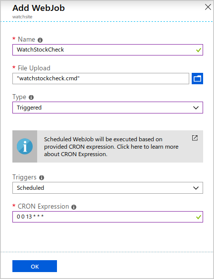
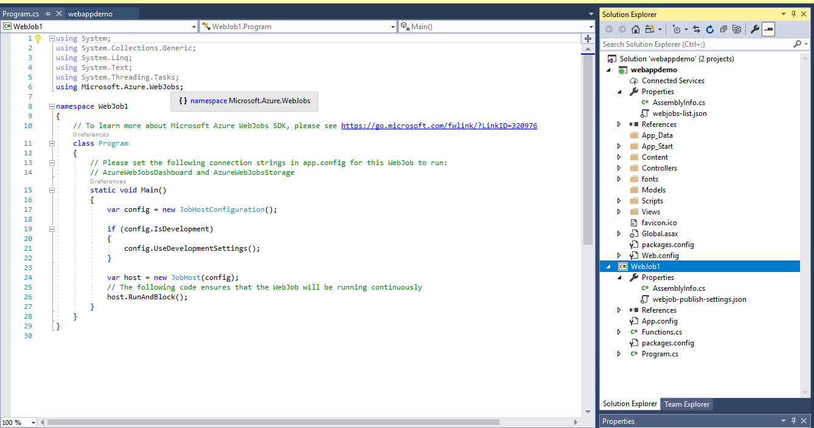

Companies often need to run some procedure in the background, to automate a task without negatively affecting the performance of a web app.

As the Senior Web Developer responsible for the watch dealer’s web site you need to understand how Azure facilitates background tasks that support web applications.

Here, you will learn about WebJobs and how they can help with background tasks.

## What are WebJobs?

WebJobs are a feature of Azure App Service that lets you run arbitrary programs or scripts using the same App Service Plan resources as a web app. WebJobs can be used to run any script or console application that can be run on a Windows computer, with some functionality limitations.

You could use a WebJob, for example, to automatically update stock numbers in a products database so that they match your physical stock. Maybe you want to generate thumbnails from a set of high-resolution images. While these tasks execute, you don't want users of the web app to notice any degradation in performance.

To run a WebJob, you’ll need an existing Azure App Service web app, web API, or mobile app. You can run multiple WebJobs in a single App Service plan along with multiple apps or APIs.

Your WebJobs can be written as scripts of several different kinds including Windows batch files, PowerShell scripts, or Bash shell scripts. You can upload such scripts and executables directly to the web app in the Azure portal:

Alternatively, you can write WebJobs using a framework such as Python or Node.js. In this application, however, you'll build a WebJob as a compiled console application by using Visual Studio. This approach enables you to use the WebJobs tools in Visual Studio to ease development. Visual Studio will automatically package and deploy the WebJob along with the web app.

Web Jobs written as part of a Visual Studio project can be deployed:

- By using a source control tool like **git**.
- By using FTP.
- By using Visual Studio.
- By using a continuous build tool like Azure DevOps Services.

## Types of WebJobs

There are two types of WebJobs, which execute at different times:

- **Continuous.** A continuous WebJob starts when you deploy it and will continue to run in an endless loop. If you want to use a continuous WebJob, you must write your code to implement this loop. You could use this kind of WebJob, for example, to poll a message queue for new items and process their contents. Because the WebJob is continuous, your process can start quickly after the message appears.
- **Triggered.** A triggered WebJob only starts when scheduled or manually triggered. You could use this kind of WebJob, for example, to create daily summaries of messages in a queue.

## WebJobs versus Azure Functions

Azure Functions is a service that you can use to run code in Azure without provisioning any servers or other infrastructure. Because a Function can run on a schedule or continuously, you can use them instead of WebJobs to execute background tasks. You can think of Azure Functions as the logical successor to WebJobs for most workloads. In fact, Azure Functions is built on the WebJobs SDK.

For most automated tasks, build Functions because they are more flexible than WebJobs. For example, you can develop and test Functions entirely in the browser and Functions can automatically scale in response to demand.

However, code deployed as a WebJob can be developed and maintained alongside the code for the website it is associated with. A website with its WebJobs can be easily packaged, deployed, and managed together, as a single solution. By contrast, Azure Functions are separate from the App Service and must be managed separately.

One other reason to build a WebJob is that you get greater control over the behavior of the `JobHost` object. You'll learn more about this object later in this module.
