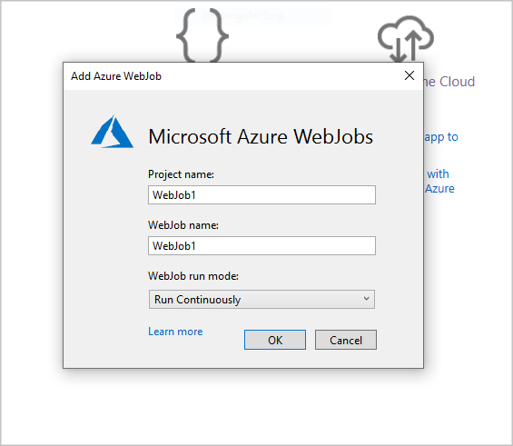
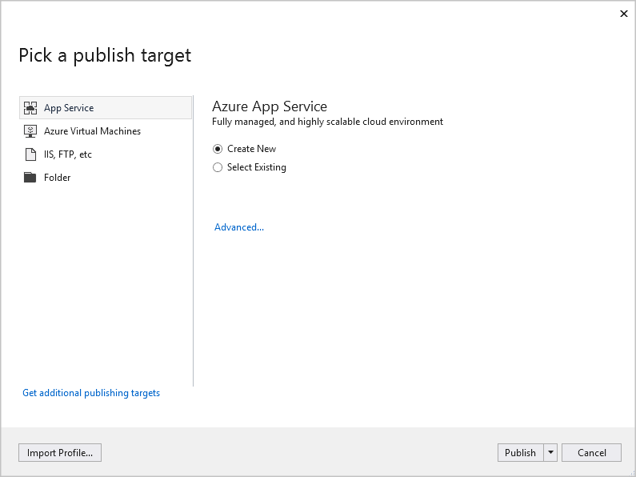
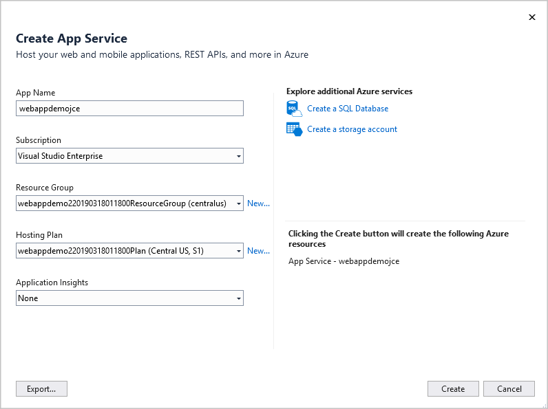

Developers can use a template in Visual Studio to start creating a WebJob.

As the senior web developer responsible for the watch dealer’s website, you have decided to deploy the extra functionality requested by your development manager as a WebJob. You will use Visual Studio to create the project. You'll configure the project to deploy automatically as a WebJob when the web site is deployed.

Here, you'll learn about the structure of a WebJob project in Visual Studio, and how to publish the project.

## How to add a WebJob project

> [!NOTE]
> In this module, we'll concentrate on building a WebJob by using the .NET framework. The WebJob will form part of an ASP.NET web app project and we will build it by using Visual Studio.

The container for WebJobs functionality is a Console Application project. You can add such console applications to an existing Web Apps solution.

To quickly create a WebJob that is deployed alongside an App Service web app, you can use the WebJobs project template. Add this template to an existing web app project by right-clicking the name of the web app project. Select **Add**, and then select **New Azure WebJob Project**.



Note the **Project Name**, **WebJob Name**, and the **Run Mode** in the **Add Azure WebJob** dialog. Use the **Run Mode** dropdown to choose whether the WebJob should run continuously, or in response to a trigger ("On demand").

## Structure of a WebJob project

Because a WebJob project is a console application, it includes a **Program.cs** file, which contains a `Main()` method that is the entry point for the application. In the `Main()` method, the application initiates and configures a `JobHost` object. `JobHost` is the object that communicates with Azure once the WebJob is deployed.

You should tell your WebJob how to connect to Azure for storage and access to databases. You can place connection strings in the **App.config** file. Code the actions that your WebJob executes in the **Functions.cs** file.

The project template creates a **webjobs-List.json** file in the Web App solution.

```json
"$schema": "http://schemastore.org/schemas/json/webjobs-list.json",
"WebJobs": [
  {
    "filePath": "../WebJob1/WebJob1.csproj"
  }
]
```

The JSON file contains a `filePath` entry that points to the WebJob project.

## Schedule a triggered WebJob

If you want your WebJob to run on a schedule, you can configure that schedule by using a CRON expression in a file called **settings.json**.

CRON is a scheduler that is often used to run automated jobs in UNIX-like operating systems. A CRON expression is a schedule for those jobs. WebJobs run in Azure, but CRON expressions are ideal to define their schedules. Here are some examples:

| CRON Expression | Description |
| --- | --- |
| 0 0 12 * * ? | Run at 12 noon every day |
| 0 15 10 * * ? | Run at 10:15 am every day |
| 0 15 10 ? * MON-FRI | Run at 10:15 am every weekday |
| 0 15 10 ? * 6L | Run at 10:15 on the last Friday of every month |

To set the schedule for your triggered WebJob, add the **settings.json** file to your WebJob project. Place the CRON expression in a property named `schedule`.

```json
{
    "schedule": "0 0 12 * * ?"
}
```

## How to publish the project

When you use Visual Studio's **Publish** functionality to deploy the web app to App Service, Visual Studio deploys the WebJob along with the application. You can also deploy the WebJob separately from the web app by right-clicking the project in **Solution Explorer**, and then selecting **Publish as Azure WebJob**.

Right-click the name of the web app, and select **Publish** to start the publishing wizard, and publish the complete solution. Visual Studio shows the wizard page, where you can choose a publishing target. You must publish to App Service for WebJobs to be deployed.



On the next page, choose either to create a new App Service, or select an existing one.

Next, select your **App Name**, **Subscription**, **Resource Group**, and **Hosting Plan**.



Select **Create**, and the files will then be published to Azure along with your WebJob.

In the next exercise, you'll create a WebJob project in Visual Studio.
