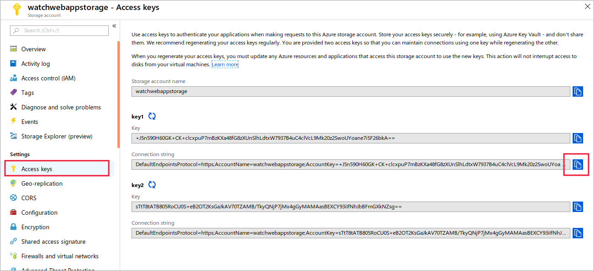

If you're using the .NET Framework to build a WebJob, the WebJobs SDK will make several programming tasks easier and quicker.

As the senior web developer responsible for the watch dealer's website, you have already deployed continuous WebJobs that regularly poll a message queue. You now need to look at how the WebJobs SDK can be used to create new messages, without using the infinite loop.

Here, you will learn about the `JobHost` object, triggers, bindings, and other tools in the WebJobs SDK.

## WebJobs SDK

The WebJobs SDK is a .NET library that can help simplify many programming tasks common to WebJobs. It's not required to use the SDK in your WebJob, but it can be helpful and should reduce development time and costs.

The WebJobs SDK has many built-in features for working with Azure Storage and Service Bus, scheduling tasks, and handling errors.

In Visual Studio, when you add an WebJob project to an existing web app, the template automatically adds the WebJobs SDK to the new project for you, including these NuGet packages:

- `Microsoft.Azure.WebJobs`
- `Microsoft.Azure.WebJobs.Extensions`

The template also adds some code to the console application's `Main()` method, and a new code file called **Functions.cs**. You'll learn about these features of the template later in this unit.

## WebJob connection strings

A WebJob that interacts with Azure, usually needs two connection strings:

- **A Storage Account connection string.** For example, if the WebJob executes when a Blob is added to a storage account, the WebJob needs to know how to connect to that storage account.
- **A WebJobs dashboard connection string.** The WebJobs dashboard displays information about a WebJob such as its current status and the results of previous executions. Each WebJob stores this information in a separate storage account, and you must configure the connection string to that account as well.

Add these connection strings to the **app.config** file in the WebJob project:

```xml
<connectionStrings>
    <add name="AzureWebJobsDashboard" connectionString="<Connection to the dashboard storage account>" />
    <add name="AzureWebJobsStorage" connectionString="<Connection to the monitored storage account>" />
  </connectionStrings>
```

You can find these connection strings in the Azure portal. Look on the **Overview** page for each storage account.



## WebJob Host

In each WebJob that uses the SDK, there is a `JobHost` object. This object will listen for trigger events and call functions. The WebJob project template adds code to the 'Main()' function in the **Program.cs** file that configures the `JobHost`.

```c#
static void Main(string[] args)
{
    var builder = new HostBuilder();
    builder.ConfigureWebJobs(b =>
            {
                b.AddAzureStorageCoreServices();
            });
    var host = builder.Build();
    using (host)
    {
        host.Run();
    }
}
```

The code creates a `HostBuilder` object, which you use to configure the WebJob. In this case, the extensions for Azure Storage services are added. The code calls the `Build()` method to create a WebJob host, and then calls the `Run()` method on that host.

## How to code a function

In a WebJob, a function is a procedure that executes in response to a trigger event. Write this procedure to match a certain signature, so that the WebJob host recognizes it as a function to call when an event occurs. Common trigger events that you can respond to include:

- A new Blob appears in a storage account.
- A new item appears in a storage account queue.
- An entity is added to an Azure Cosmos DB database.
- An event occurs in a WebHook.
- The schedule in the **settings.json** file triggers the WebJob.

A function has this form:

```c#
public static void ProcessQueueMessage([QueueTrigger("queue")] string message, ILogger logger)
{
    logger.LogInformation(message);
}
```

Each function is a public, static method that returns no value. You can use any name for the function, but make sure you use a trigger attribute on the first parameter. The previous example uses the `QueueTrigger` attribute, because the function fires when an item appears in an Azure Store queue. This function only logs the message in the item, but your code could do whatever you like.

If you want to respond when a Blob is added to a storage account, use a function like this code:

```c#
[FunctionName("BlobTriggerCSharp")]
public static void Run([BlobTrigger("watchescontainer/{name}")] Stream watchInstructions, string name, ILogger log)
{
    log.LogInformation($"A new blob was added.\n Name:{name} \n Size: {watchInstructions.Length}");
}
```

In this code, the `{name}` token creates a binding expression. You'll learn about bindings later in this unit.

Here's another, more complicated function, that triggers when data is added to an Azure Cosmos DB database:

```c#
[FunctionName("CosmosTrigger")]
public static void Run([CosmosDBTrigger(
    databaseName: "ToDoItems",
    collectionName: "Items",
    ConnectionStringSetting = "CosmosDBConnection",
    LeaseCollectionName = "leases",
    CreateLeaseCollectionIfNotExists = true)]IReadOnlyList<Document> documents,
    TraceWriter log)
{
    if (documents != null && documents.Count > 0)
    {
        log.Info($"Documents modified: {documents.Count}");
        log.Info($"First document Id: {documents[0].Id}");
    }
}
```

In this example, the `CosmosDBTrigger` attribute sets a connection string, and informs the function what database and collection to monitor.

## Bindings

Use bindings to avoid hardcoding input and output details in your functions. For example, if the name of your Azure Cosmos DB database might change, use a binding to set that detail declaratively. A binding to a source of data is an *input* binding. A binding for sending data is an *output* binding.

To use bindings, create a new file named **functions.json** in the WebJob project. Here's an example that uses queue for input and a storage table for output:

```json
{
  "bindings": [
    {
      "type": "queueTrigger",
      "direction": "in",
      "name": "order",
      "queueName": "new-watches",
      "connection": "WATCHES_STORAGE_ACCT_APP_SETTING"
    },
    {
      "type": "table",
      "direction": "out",
      "name": "$return",
      "tableName": "Watches",
      "connection": "WATCHES_TABLE_STORAGE_ACCT_APP_SETTING"
    }
  ]
}
```

In the next unit, you'll use the WebJobs SDK in your WebJob project.
