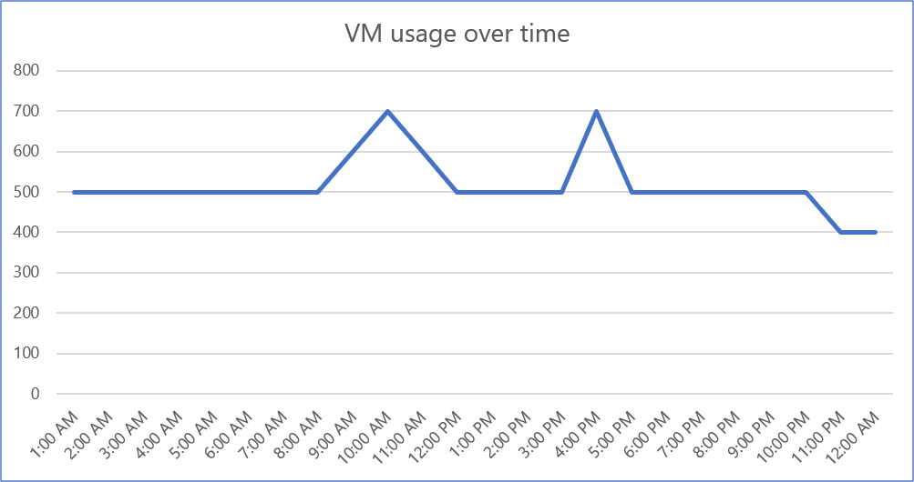
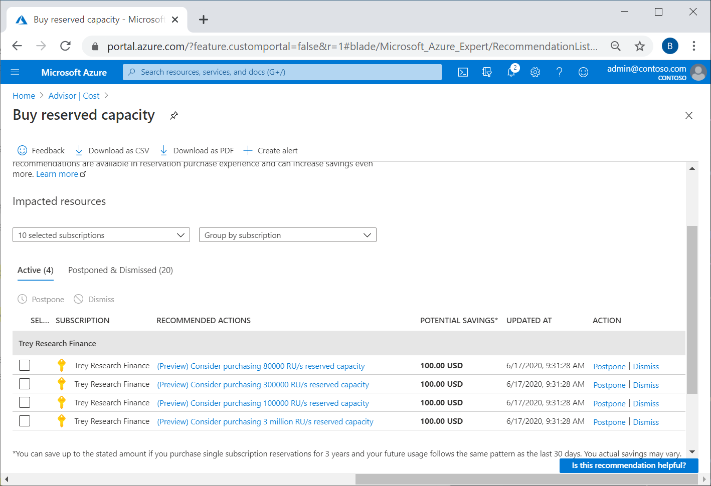

Before discussing the tools available to help you decide what to purchase, it's important to understand what reservations are and how they work. Reservations provide a billing discount only and don't affect the runtime state of your resources. No extra work is needed on your end once you purchase the reservation to start getting the cost savings benefit. After you purchase a reservation, the discount automatically applies to matching resources – no resource tagging or restarting is needed. At the end of your reservation term, the reservation expires and the discount stops applying unless you renew the reservation.

Assessing your consistent base VM usage before you purchase a reservation is key to maximizing your benefit. All reservations, except Azure Databricks, are applied on an hourly basis. This is important to know because if you purchase more reserved quantity than what you use on a consistent hourly basis, then your reservation will be underutilized. Unused reserved capacity doesn't carry over from one hour to the next and leads to waste.

There are multiple methods to determine what to purchase. This unit discusses the tools available that help you determine the best Azure Reservations purchases for your workloads.

## Use reservation purchase recommendations

Azure automatically analyzes your base VM usage on your behalf to provide you with Azure Reservation purchase recommendations. The recommendations are an array of logical purchase options you can make for your organization and provide a great starting point in your decision making process. Azure provides recommendations for purchases by analyzing your hourly usage data over the last 7, 30, and 60 days.

Azure Reservation recommendations identify suggested purchase SKUs / quantities and also calculate your expected costs if you were to act upon the recommendation provided. Azure then compares the calculation with your actual pay-as-you-go costs for every hour over the duration of the recommendation reservation period. Calculations are made for an array of different purchase quantities and the quantity that maximizes your cost savings is what's recommended.

The image above shows the usage for your organization’s workload. You use 500 VMs most of the time, but sometimes usage spikes to 700 VMs. The Azure recommendation engine uses this data and calculates your savings for both the 500 and 700 VM quantities. Since the 700 VM usage is sporadic, it will lead to lesser savings compared to the 500 quantity so the Azure recommendation is provided for the quantity of 500.

You can also get the [reservation recommendations using API](https://docs.microsoft.com/rest/api/consumption/reservationrecommendations/list).

## View reservation recommendations in the Azure portal

Reservation purchase recommendations are calculated by the recommendations engine and are shown in Azure Advisor. They're also shown in the reservation purchase experience in the [Azure portal](https://portal.azure.com/#blade/Microsoft_Azure_Reservations/CreateBlade/referrer/docs).

**To view purchase recommendations in Advisor**: In the Azure portal, navigate to Advisor, and select **Cost** to see reservation recommendations. Here's an example showing purchase recommendations for Cosmos DB.

**To view reservation recommendations in the Reservation experience**: In the Azure portal, navigate to Reservations and then select **Add**.

Select the Azure service for which you want to purchase a reservation.

The **Recommended** tab shows reservation recommendations. You can change the scope, subscription, term, and look-back period to see different recommendations.

You can also select a recommendation to see the usage data behind the recommendation and how your recommendation will change with different quantities.

## Use the Reservation Coverage report in the Cost Management Power BI app

Enterprise Agreement and Microsoft Customer Agreement customers can use the VM RI Coverage reports for VMs and purchase recommendations. This is a great tool to use to determine the different instance size groups that are currently used by your organization. It also allows you to see a breakdown of the total usage alongside the usage that's already covered by reserved instances if you have purchased Reservations in the past.

1. Get the [Cost Management App](https://appsource.microsoft.com/product/power-bi/costmanagement.azurecostmanagementapp).
2. Open to the VM RI Coverage report and set either Shared or Single scope, depending on which scope you want to purchase at.
3. View the coverage and recommendations for a region, instance size family, and size level. Make sure you select the following drill-down filter before you interact with the visuals.

To view details, select the drill-down filter.

Once you've finished your analysis and determined both the type of reservation you want to purchase and the capacity included in your commitment, you're ready to continue to the next unit and make a purchase in the Azure portal.
