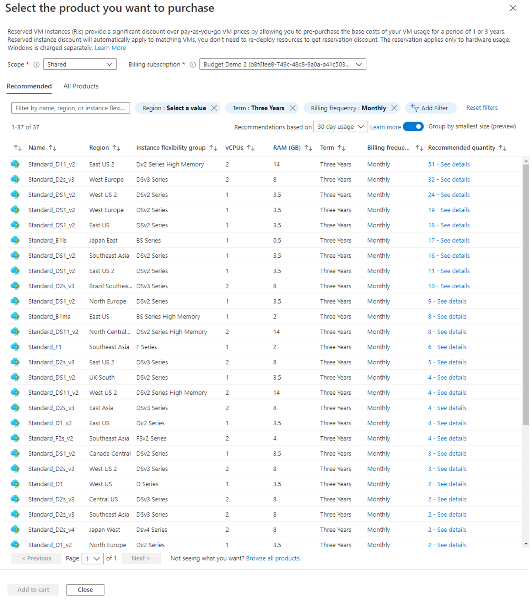

In this section we cover who can buy a reservation, how reservations are scoped, how to purchase, and who gets notifications for purchases. 

## Who can buy a reservation?

To buy a plan, you must have a subscription owner role in:

- Enterprise Agreement (Azure offers MS-AZR-0017P or MS-AZR-0148P)
- Pay-As-You-Go subscription (Azure offers MS-AZR-0003P or MS-AZR-0023P)
- Microsoft Customer Agreement subscription.

Cloud solution providers can use the Azure portal or [Partner Center](https://docs.microsoft.com/partner-center/azure-reservations) to purchase Azure Reservations.

Enterprise Agreement (EA) customers can limit purchases to EA admins by disabling the **Add Reserved Instances** option in the EA portal. EA admins must be a subscription owner for at least one EA subscription to purchase a reservation. The option is useful for enterprises that want a centralized team to purchase reservations for different cost centers. EA admins must be subscription owner on at least one EA subscription to purchase a reservation.

A reservation discount only applies to resources associated with subscriptions purchased through Enterprise, Cloud Solution Provider (CSP), Microsoft Customer Agreement, and individual plans with pay-as-you-go rates.

## Scope reservations

You have three options to scope a reservation, depending on your needs:

- Shared scope - Applies the reservation discount to matching resources in eligible subscriptions that are in the billing context.
  - For Enterprise Agreement customers, the billing context is the enrollment.
  - For Microsoft Customer Agreement customers, the billing scope is the billing profile.
  - For individual subscriptions with pay-as-you-go rates, the billing scope is all eligible subscriptions created by the account administrator.
- Single subscription scope - Applies the reservation discount to the matching resources in the selected subscription.
- Single resource group scope - Applies the reservation discount to the matching resources in the selected resource group only.

## Purchase a reservation

To buy an instance:

1. Sign in to the [Azure portal](https://portal.azure.com/).
1. Select **All services** &gt; **Reservations**.
1. Select **Add** to purchase a new reservation and then select the service that you want to purchase reservations for.
1. Review the recommendation results, including the VM price and estimated savings.
  
1. On the Products tab, you can change the reservation name and quantity. Notice the total reservation cost. By default, the reservation is optimized for instance size flexibility for VM sizes and region. If you want to change the setting to capacity priority for a single subscription, select the **Advanced settings** gear symbol.
1. Select **Next: Review + Buy**.
1. Review the reservation purchase information and then select **Buy now**.

You can also make reservation purchases programmatically using any of the following methods:

- REST API: https://docs.microsoft.com/rest/api/reserved-vm-instances/reservationorder
- Azure PowerShell: https://docs.microsoft.com/powershell/module/azurerm.reservations
- Azure CLI: https://docs.microsoft.com/cli/azure/reservations/reservation-order

### View payments made

You can view payments that were made using APIs, usage data, and in cost analysis. For reservations paid for monthly, the frequency value is shown as  **recurring**  in usage data and Reservation Charges API. For reservations paid up front, the value is shown as **onetime**.

Cost analysis shows monthly purchases in the default view. Apply the **purchase** filter to **Charge type** and **recurring** for **Frequency**  to see all purchases with monthly payments. To view only reservations, apply a filter for **Reservation**.

After you've made a reservation purchase, you can manage it in several ways outlined in the next unit.
