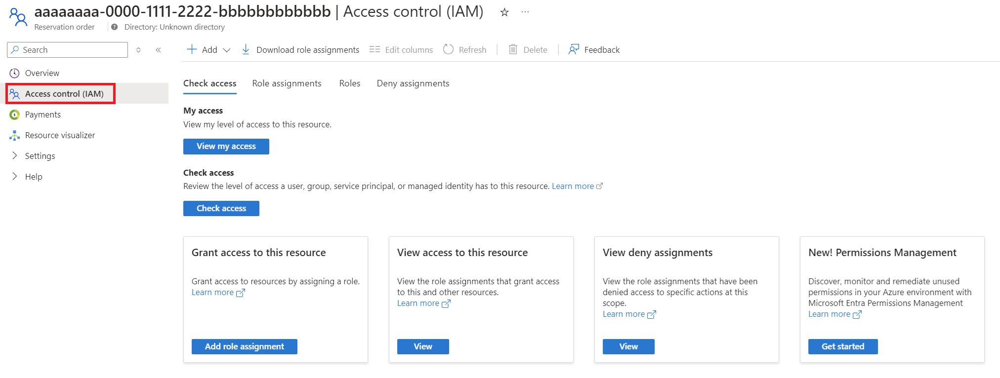

After you buy a reservation, you can view it in Azure portal. You automatically have change permissions for the reservation so you can change the reservation scope, split or merge it, and refund and exchange it. Limits apply.

## View reservations after purchase

To view reservation purchases:

1. Sign in to the [Azure portal](https://portal.azure.com/).
2. Select **All Services** > **Reservations** to list the reservations that you have access to.

You can also manage reservation purchases programmatically. For more information, see [Get reservations and utilization using APIs, PowerShell, CLI](https://docs.microsoft.com/azure/cost-management-billing/reservations/view-reservations#get-reservations-and-utilization-using-apis-powershell-cli).

## Assign permissions

When a reservation is purchased, only the person who bought the reservation and the account administrator have permission to it. No one else can view or manage it unless they're given needed permission. Reservations don’t inherit permissions from Azure subscriptions.

The reservation is a child object to the *Reservation Order*. When granting someone permissions, it's best to grant permissions to the reservation order. Access on the order allows the user to make commercial transactions such as an exchange or refund.

You can delegate access management for a reservation in the Azure portal using the **Reservation order** with **Access control (IAM)**.

## Change the reservation scope

You can update the reservation scope from a shared scope to a single subscription or resource group or vice-versa after the purchase. To update the reservation scope select the reservation. Then select **Settings** > **Configuration** and change the scope.

If you change from the shared to the single scope, you can only select subscriptions where you're the owner. You can select only subscriptions with the same billing context as the reservation.

## Split or merge existing reservations

After you buy more than one resource instance within a reservation, you might want to assign instances in the reservation to different subscriptions. By default, all instances have one scope - either single subscription or shared.

Although not commonly done, splitting a reservation allows you to distribute instances for granular scope management. You can simplify subscription allocation by using the shared scope. For cost management or budgeting purposes, you can allocate quantities to specific subscriptions.

You can split a reservation into two with PowerShell, CLI, or through the API. For more information, see [Split a single reservation into two reservations](https://docs.microsoft.com/azure/cost-management-billing/reservations/manage-reserved-vm-instance#split-a-single-reservation-into-two-reservations).