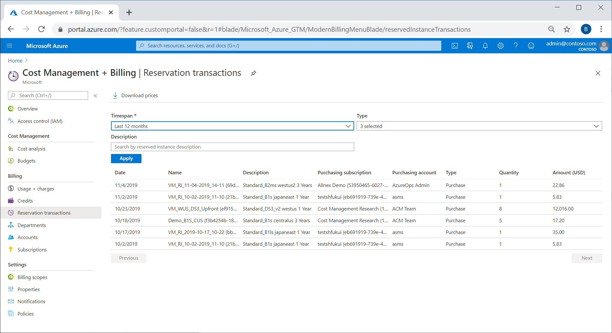

Billing admins can view payments that were made using APIs, usage data, and in Cost Management.

## Reservation transactions in Cost Management

Enterprise Agreement and Microsoft Customer Agreement billing administrators can view reservation purchases in **Cost Management + Billing**.

1. Sign in to the [Azure portal](https://portal.azure.com/).
1. Navigate to **Cost Management + Billing**.
1. Select **Reservation transactions**.

You can also get reservation transactions using the [Transactions API](https://docs.microsoft.com/rest/api/consumption/reservationtransactions/list).

## Reservation transactions using Power BI

Enterprise Agreement and Microsoft Customer Agreement customers can use the Power BI Cost Management App to get reservation transactions.

1. Get the [Cost Management App](https://appsource.microsoft.com/product/power-bi/costmanagement.azurecostmanagementapp).
1. Go to **RI Purchases** report to see all purchases and refunds. Exchanges appear as a refund and another purchase.

## Reservation transactions in usage data

Enterprise Agreement and Microsoft Customer Agreement customers can get the purchase information from the usage details data.

1. In the Azure portal, go to **Cost management + Billing**.
1. Select the billing account, select **Usage + charges**, and then select **Download** to get the usage details CSV file.
1. Filter for **Charge Type** = **Purchase**.
1. Select all records where **Publisher** = **Azure**.

You can also get usage details data [using APIs](https://docs.microsoft.com/azure/cost-management-billing/reservations/understand-reserved-instance-usage-ea#get-azure-consumption-and-reservation-usage-data-using-api).
