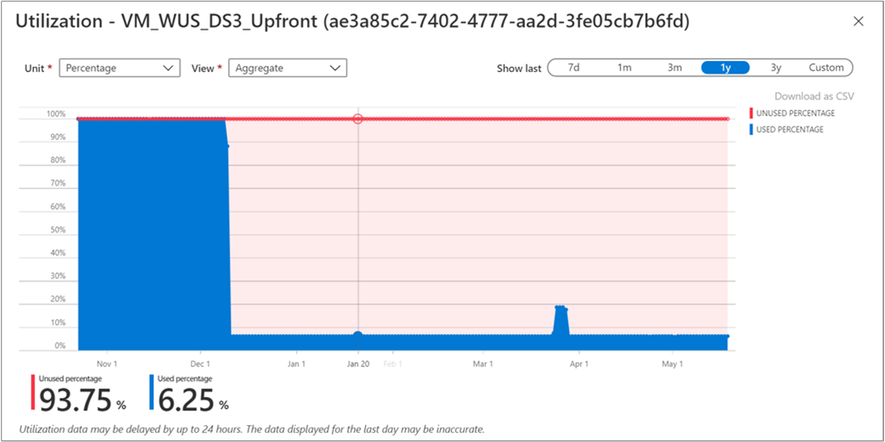
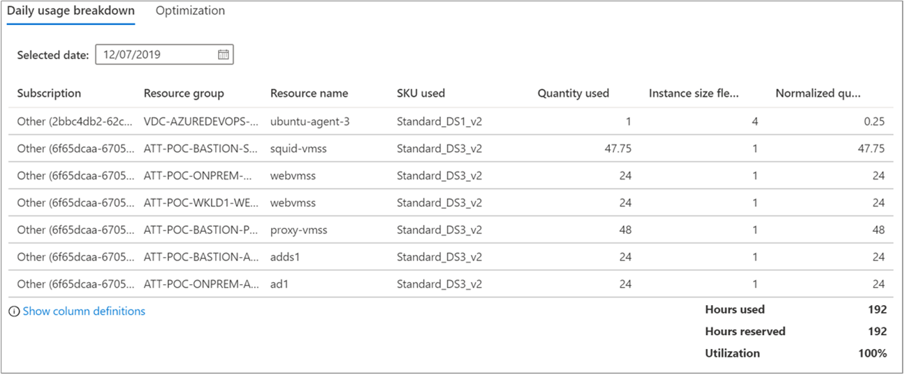

After you purchase a reservation, you should monitor its use to ensure you're fully using it. This unit explains how to find reservations with low utilization and how to optimize their use.

## View your reservation utilization

One way of viewing reservation usage is in the Azure portal. To maximize savings, try to get the reservation to 100% utilization wherever possible.

1. Sign in to the [Azure portal](https://portal.azure.com/).
1. Select **All services** &gt; **[Reservations](https://portal.azure.com/#blade/Microsoft_Azure_Reservations/ReservationsBrowseBlade)** and note the **Utilization (%)** for a reservation.  
  
1. Select the reservation utilization percentage to see utilization details.  
  
1. Select a point on the chart to see the usage breakdown by resource in the view.  
  

You can get the same data that we covered in the preceding sections using APIs.

- Use the Reservation Summaries API to get reservation utilization percentage data at https://docs.microsoft.com/rest/api/consumption/reservationssummaries.
- Use Reservation Details API to determine which resources got a reservation discount and for what quantity at https://docs.microsoft.com/rest/api/consumption/reservationsdetails/list.

## Make optimizations with exchanges or scope changes

If you find that your organization's reservations are being underused, you have several ways to act.

**Change your resources**

- Where possible, you can resize existing resources that don’t get a reservation discount to sizes that match the under-utilized reservation.

**Change the reservation**

- If your reservation is scoped to a single subscription or resource group, then it’s possible that another subscription or resource group has matching resources that can benefit from the reservation. Consider one of the following two actions:
  - Change the reservation scope to Shared scope, or:
  - Split the reservation into smaller chunks and assign them individually to scopes that have utilization for matching resources.
- Consider exchanging the unused quantity for another recommended size. For more information, see [Cancellations and exchanges](https://docs.microsoft.com/azure/cost-management-billing/reservations/manage-reserved-vm-instance#cancel-exchange-or-refund-reservations).
  Azure reservations come with excellent flexibility. You can exchange a reservation for another reservation of the same type. For example, exchange a **D series East US** reservation to purchase an **E series reservation in West US**.