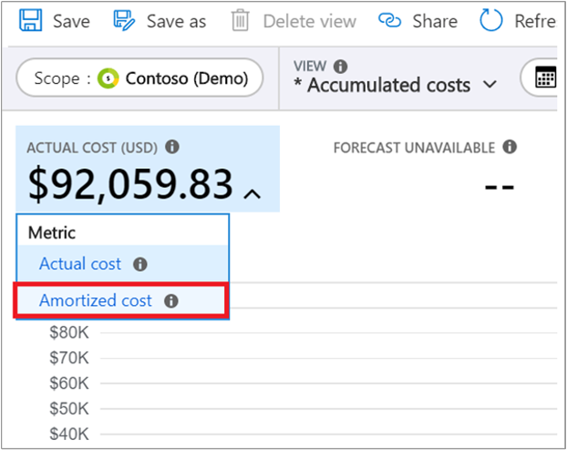
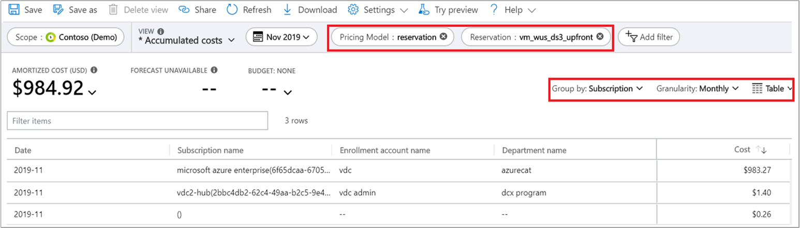
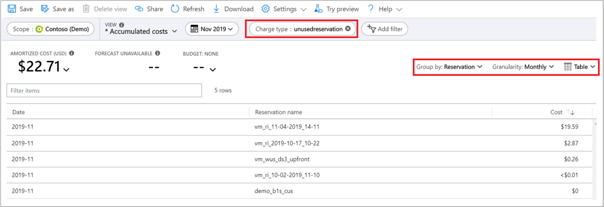

This unit covers some of the key reports that you might want to create or use after you buy a reservation to analyze and perform reporting.

It's important to understand two concepts: actual cost data and amortized cost data.

- Actual cost data shows the resource usage costs as 0$ when reservation is applied to the usage. This data also has reservation transactions in it. For example, if a resource’s on-demand cost is 1$ per hour and a reservation applies to it, the cost will show as 0$ in the actual cost data.
- Amortized data provides the effective cost of a resource when a reservation applies to it. For example, if resource’s on-demand cost is 1$ per hour and a reservation provides 50% discount to the resource, then the effective cost will show as .5$ per hour in the amortized data.

You can review reservation savings in Power BI. Amortized cost data is only available to Enterprise Agreement and Microsoft Customer Agreement customers.

## Charge back data

The following sections describe different ways to prepare for reservation chargeback.

### Charge back with cost analysis

Cost analysis shows charges as they appear on your bill. The charges are shown as actual costs or amortized over the course of your reservation period.

1. In the Azure portal, navigate to cost analysis for your scope. For example, **Cost Management + Billing** > **Cost Management** > **Cost analysis**.
1. Change the view from **Actual cost** to **Amortized cost**.  
    
1. Apply the following filters:
    - Select **Reservation** for **Pricing Model**.
    - Select **Reservation name** for **Reservation**.
1. Select filters and views as shown below. The view shows the monetary value of the reservation consumption by a subscription, resource group, or resource. You can use the view to charge back for reservation use.  
    

## Create a chargeback report from usage details data

You can create a charge back report to charge internal cost centers at using the amortized data. In amortized data, the cost of a reservation is the consumption value based on the discounted price for the instances covered by reservations. Amortized cost data provides the monetary value of a reservation's utilization for:

- Resources, such as a VM
- Resource group
- Tags
- Subscription

To view amortized data, navigate to Cost Management + Billing > Exports and select the **Amortized Data** in the dimension.
You can also get the amortized data [using APIs](https://docs.microsoft.com/azure/cost-management-billing/reservations/understand-reserved-instance-usage-ea#get-azure-consumption-and-reservation-usage-data-using-api).

### Chargeback with Power BI

Enterprise Agreement and Microsoft Customer Agreement customers can view the RI Chargeback report in the Power BI Cost Management App. Review the reservation transactions, subscription names, and resource groups to help identify teams using resources.

1. Get the [Cost Management App](https://appsource.microsoft.com/product/power-bi/costmanagement.azurecostmanagementapp).
2. Review the RI Chargeback report.

## Unused reservation cost

The unused reservation view in cost analysis shows the monetary value of underutilized reservations. Use the report to view reservation waste so you can prioritize fixing it.

1. In cost analysis, change the view from actual cost to amortized cost.
1. Set up your cost analysis view with the following selections:
    - Set **Charge type** to **unusedreservation**.
    - Set **Group by** to **Reservation**.
    - Set **Granularity** to **Monthly**.
    - Set the chart type to **Table**.

The same unused reservation information is in usage details data. To view it, get amortized data and then apply a filter on ChargeType = **unusedreservation** to get the reservation waste.

The same data is available in [Cost Management App](https://appsource.microsoft.com/product/power-bi/costmanagement.azurecostmanagementapp).