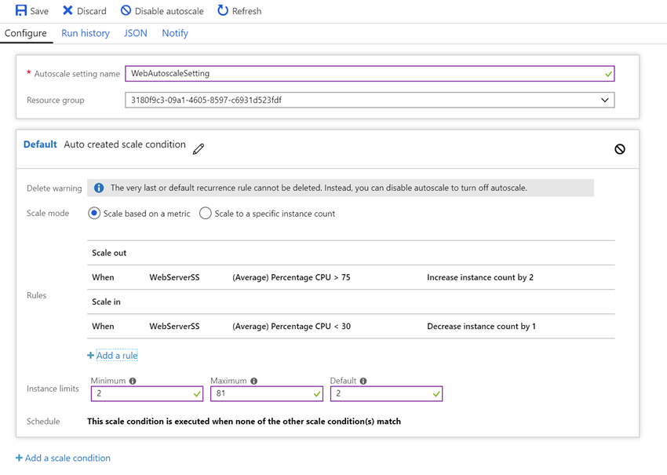

In this exercise, you will use the Azure portal to create a virtual machine scale set with rules for autoscaling.

## Create a virtual machine scale set

1. In the [Azure portal](https://portal.azure.com/learn.docs.microsoft.com?azure-portal=true), click **Create a resource**.

1. In the search box, type **scale set** and press <kbd>ENTER</kbd>. On the **Results** blade, click **Virtual machine scale set**, and on the **Virtual machine scale set** blade, click **Create**.

1. On the **Create virtual machine scale set** blade, enter the following values.
    - Use _WebServerSS_ for the **Name**.
    - Leave _Windows Server 2016 Datacenter_ for the **Operating system disk image**.
    - Use _Concierge Subscription_ for the **Subscription**.
    - Select **<rgn>[sandbox resource group name]</rgn>** for the **Resource group**.
    - Pick a location from the following list:
        [!include]

    - Set a valid **Username** and **Password**. (Note these for later use)
    - Set the **Instance count** to _2_.
    - Set the **Instance size** to _D2s_v3_.
    - Leave **Autoscale** as _Disabled_.
    - Select **Load balancer**.
    - Enter _WebServerPubIP_ for the **Public IP address name**.
    - Use your initials + date + time for the **Domain name label** so it's unique.
    - For **Virtual network** select **Create new**. Name it **SSVNet** and click **Create** to create the VNet.

1. Click **Create** to deploy the scale set.

1. Wait for the scale set to be created.

## Create and apply autoscale rules

1. Click **Resource Groups** in the left sidebar.

1. Select the **<rgn>[sandbox resource group name]</rgn>** resource group.

1. On the **<rgn>[sandbox resource group name]</rgn>** blade, click the **WebServerSS** object to open the scale set.

1. On the **WebServerSS** blade, under **Settings**, click **Instances**. Note the two virtual machine instances running within the scale set.

1. On the **WebServerSS** blade, click **Scaling**.

1. On the **WebServerSS - Scaling** blade, click **Enable autoscale**.

1. On configuration screen, set the name to **WebAutoscaleSetting**.

1. In the default condition, locate the **Instance limits**, set the following values.

    |Setting|Value|
    |---|---|
    |Minimum|2|
    |Maximum|8|
    |Default|2|

1. Click **Add a rule**.

1. On the **Scale rule** blade, enter the following information to create a rule to scale out an extra two virtual machines when average CPU usage is more than 75% over a five-minute period, and then click **Add**.

    |Setting|Value|
    |---|---|
    |Time aggregation|Average|
    |Metric name|Percentage CPU|
    |Time grain statistic|Average|
    |Operator|Greater than|
    |Threshold|75|
    |Duration (in minutes)|5|
    |Operation|Increase count by|
    |Instance count|2|
    |Cool down (minutes)|5|

1. Add another rule, this time, enter the following information to create a rule to scale in one server at a time when average CPU usage is below 30% over a five-minute period, and then click **Add**.

    |Setting|Value|
    |---|---|
    |Time aggregation|Average|
    |Metric name|Percentage CPU|
    |Time grain statistic|Average|
    |Operator|Less than|
    |Threshold|30|
    |Duration (in minutes)|5|
    |Operation|Decrease count by|
    |Instance count|1|
    |Cool down (minutes)|5|

1. Your rules should look something like this:

    

1. Click **Save**.

## Generate load to demonstrate autoscaling

Now you will use the SysInternals **CPUStress.exe** tool to generate load on the virtual machines in the scale set and demonstrate automatic scaling out.

We will run this on our VM - you do not need to have Windows for this, however you _do_ need a Remote Desktop Client. Microsoft has one for macOS and Windows, and various distributions of Linux include a client as well.

1. To determine the public IP address to connect to, browse to the **<rgn>[sandbox resource group name]</rgn>** resource group. On the **<rgn>[sandbox resource group name]</rgn>** blade, click the **WebServerSSlb** object.

1. On the **WebServerSSlb** blade, click **Frontend IP configuration** and make a note of the public IP address shown. Close the **LoadBalancerFrontEnd** blade.

1. To determine the port number to connect to, on the **WebServerSSlb** blade, click **Inbound NAT rules**. Note down the custom port number in the Service column for each virtual machine.

1. On your local computer, start the **Remote Desktop Connection**. In the **Computer** box, type the public IP address of the load balancer, followed by a colon and then the port number value for Instance 0 (for example, 40.67.191.221:50000), and then click **Connect**.

1. In the **Windows Security** dialog box, click **More choices**, and then click **Use a different account**. In the **User name** and **Password** boxes, type enter the credentials you specified above when you created the scale set.

1. In the **Remote Desktop Connection** dialog box, click **Yes**.

1. In the virtual machine remote desktop, open Internet Explorer, and in the **Set up Internet Explorer** dialog box, click **OK**.

1. In **Internet Explorer**, in the address bar, type **http://download.sysinternals.com/files/CPUSTRES.zip** and press <kbd>ENTER</kbd>. In the **Internet Explorer** dialog box, click **Add**. In the **Trusted Sites** dialog box, click **Add** and then click **Close**.

1. If the download prompt does not appear automatically, you may need to enter the URL again and press <kbd>ENTER</kbd>. In the **Internet Explorer** dialog box, click **Save**. Once the download is complete, click **Open folder**.

1. In the **Downloads** folder, double-click **CPUSTRES**, and then double-click the **CPUSTRES** application. In the **Compressed (zipped) folders** dialog box, click **Run**.

1. In the **CPU Stress** window, under **Thread 1**, in the **Activity** drop-down, select **Maximum**. Under **Thread 2**, click the **Active** checkbox, and in the **Activity** drop-down, click the down arrorw inside the drop-down and select **Maximum**. These settings take effect immediately.

1. Click the Windows Start button, then click **Task Manager**. In Task Manager, click **More details**, and confirm that the CPU is over 75%.

1. **Repeat** the installation and launch of **CPUSTRES** on the other virtual machine in the scale set, and then wait for five minutes.

1. In the Azure portal, browse to the **<rgn>[sandbox resource group name]</rgn>** resource group. On the **<rgn>[sandbox resource group name]</rgn>** blade, click the **WebServerSS** object. On the **WebServerSS** blade, click **Instances**. Note how many virtual machine instances are displayed within the scale set and the status.

Here, you created a virtual machine scale set with two virtual machines. You then created rules to automatically scale out and scale in the scale set, and you added the rules to an autoscale profile.
