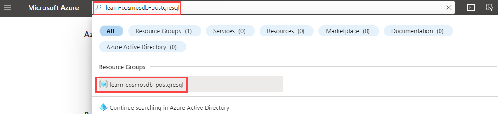
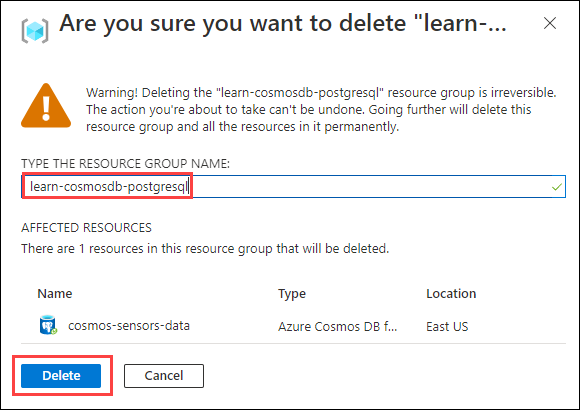

Wide World Importers' sensor data initially started in a single-node Azure Cosmos DB for PostgreSQL database. As the business expanded its warehouse and delivery fleet, Wide World Imports needed to scale its data to perform efficiently. You assisted them in upgrading from a single-node, non-distributed cluster to a multi-node, distributed cluster with the following steps:

- Identified data usage and storage concerns
- Scaled the nodes to spread out data storage and prepare for parallel query processing
- Distributed tables and data across the nodes in an Azure Cosmos DB for PostgreSQL cluster

When Wide World Importers started their sensors project, Azure Cosmos DB for PostgreSQL was there to support them in a single-node configuration. As more devices came online and the amount of data increased, queries ran slower. By upgrading from a single-node, non-distributed database to a multi-node, distributed relational database, Wide World Importer's sensor tracking can be queried more efficiently at scale. By keeping the reference data in duplicate with the distributed data, they can take advantage of the relational integrity while reaping the benefits of parallel processing of the query across multiple nodes. The Wide World Importers' sensors environment is set up for growth with the support of Azure Cosmos DB for PostgreSQL.

## Clean-up

Delete the `learn-cosmosdb-postgresql` resource group created for the exercises in this module.

1. Navigate to the Azure portal.
2. In the search bar at the top, search for `learn-cosmosdb-postgresql`. Select the entry under **Resource Groups**.
    
3. On the `learn-cosmosdb-postgresql` resource group's Overview blade, select **Delete resource group**.
4. Enter `learn-cosmosdb-postgresql` in the resource group name textbox. Then, select **Delete**.
    

## References

To learn more information about the topics covered in this module, see:

- [Table types for Azure Cosmos DB for PostgreSQL](/azure/cosmos-db/postgresql/concepts-nodes#table-types)
- [Classify application workloads in Azure Cosmos DB for PostgreSQL](/azure/cosmos-db/postgresql/quickstart-build-scalable-apps-classify)
- [Model high-throughput transactional apps](/azure/cosmos-db/postgresql/quickstart-build-scalable-apps-model-high-throughput#common-filter-as-shard-key)
- [Choose shard count](/azure/cosmos-db/postgresql/howto-shard-count)
- [Citus 11.1 shards your Postgres without interruption](https://www.citusdata.com/blog/2022/09/19/citus-11-1-shards-postgres-tables-without-interruption/)
