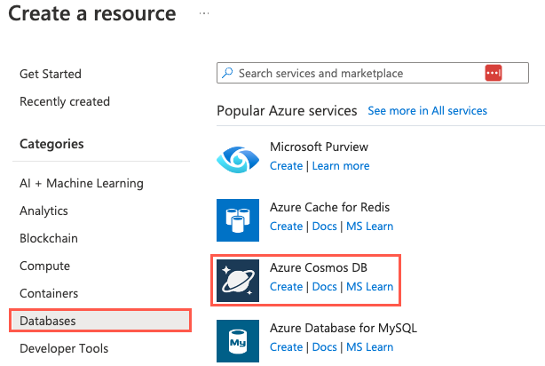
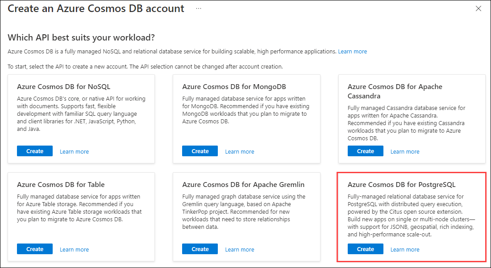
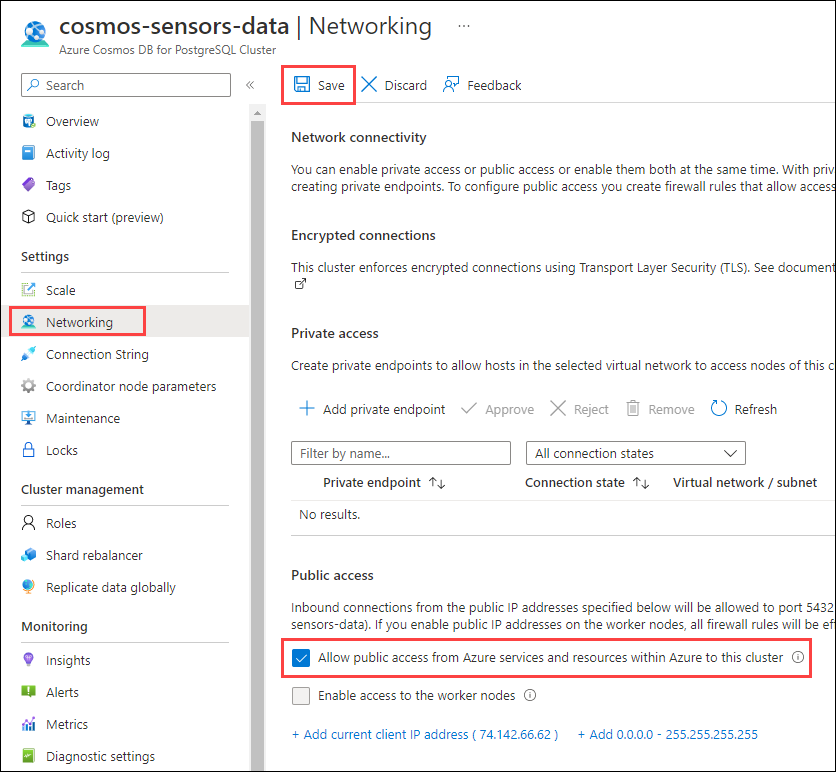
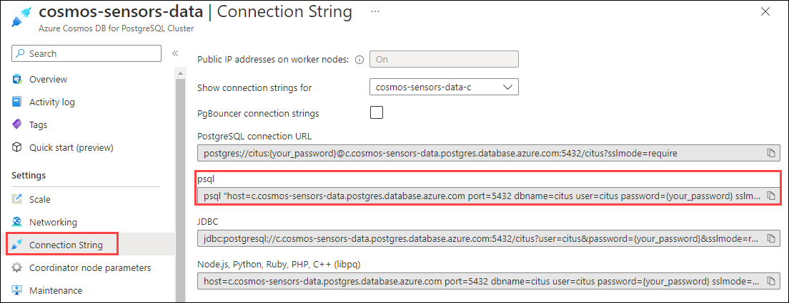
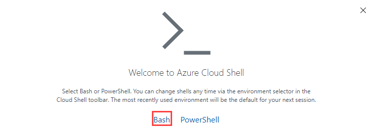
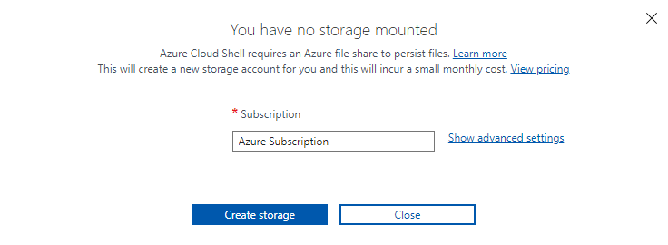

In this exercise, you create the tables and seed the data for the sensors database. This single-node database has these characteristics:

- `device_types` has a `device_type_id` field and a `name` field. `device_type_id` is its primary key.
- `devices` has three fields - `device_id`, `device_type_id`, and `name`. The `device_id` field is the primary key. There's a foreign key relationship on the `device_type_id` field that references the `device_type_id` field on the `device_types` table.
- `events` has three fields - `event_id`, `device_id`, and `payload`. The `event_id` is its primary key. There's a foreign key relation on the `device_id` that references the `device_id` field on the `devices` table.

![Diagram of the relationships between device types, devices, and events. The device_types table has two fields - device_type_id and name. device_type_id is its primary key. The devices table has three fields - device_id, device_type_id, and name. device_id is its primary key. The devices table has a foreign key relationship on device_type_id that references the device_type_id field on the device_types table. The events table has three fields - event_id, device_id, and payload. event_id is its primary key. The events table has a foreign key relationship on its device_id that references the device_id field on the devices table.](../media/normalized-database-erd.png)

## Create an Azure Cosmos DB for PostgreSQL account

> [!IMPORTANT]
>
> Planning for future growth when initially selecting the size of your single-node cluster can help avoid downtime when the need to scale arises.
>
> Horizontally scaling to a multi-node cluster can be accomplished with zero downtime, but this capability depends upon the configuration of the coordinator node. The minimum compute and storage sizes for the coordinator node in a multi-node cluster are 4 vCores with 16 GiB RAM and 512 GiB storage, respectively. You can create a single-node database with compute and storage settings smaller than this minimum requirement. Scaling a single-node cluster when the coordinator compute size is less than 4 vCores with 16 GiB RAM, and the storage size is less than 512 GiB requires the coordinator compute and storage to be scaled, resulting in a restart of the server and a short period of downtime.

In this unit, you go through the process of minimal downtime. There are also notes on what to expect if Wide World Importers started with minimal resources.

Create an Azure Cosmos DB for PostgreSQL database that has the following specifications:

- One node that has four vCores, 16 GiB of RAM, and 512 GiB of storage.

1. Open a web browser and go to the [Azure portal](https://portal.azure.com/).

1. Next, select **Create a resource** > **Databases** > **Azure Cosmos DB**. You can also use the search box to find the resource. Select **Create**.

    

1. On the screen labeled **Which API best suits your workload?**, select **Create** within the **Azure Cosmos DB for PostgreSQL** tile.

    

    The portal displays an Azure Cosmos DB for PostgreSQL configuration screen.

1. On the **Basics** tab, enter the following information. (Note the server name and password for later use.)

    | Parameter       | Value |
    | --------------- | ----- |
    | **Project details** |       |
    | Subscription    | Select your subscription.  |
    | Resource group  | Select **Create new** and name your resource group `learn-cosmosdb-postgresql`. |
    | **Cluster details** |       |
    | Cluster name    | _Enter a globally unique name_, such as `cosmos-sensors-data`. |
    | Location        | Leave the default, or use a region that is close to you. |
    | Scale           | You'll set this value in the next step. |
    | PostgreSQL version | Leave the default version (14) selected. |
    | **Administrator account** | |
    | Admin username  | This value is set to `citus` and can't be edited. |
    | Password        | Enter and confirm a strong password. |

    

1. For **Scale**, select **Configure**. Set the Scale settings to the following values, then select **Save**:

    - Node count: **Single node**
    - Node compute: **4 vCores, 16 GiB RAM**
    - Node storage: **512 GiB**
    - No high availability

1. Select the **Review + create** button. On the review screen, select **Create** to provision your Azure Cosmos DB for PostgreSQL cluster. If the **Configure IP address in firewall rules** message appears, select **Create cluster without firewall rules**.

    ![Screenshot of a modal titled 'Configure IP address in firewall rules'. The warning message shows 'You need to configure at least one IP address in Public access (allowed IPs) to enable access to this cluster. If you continue without configuring the IP address then you must configure the IP address later to allow access to this cluster.' There are two buttons - labeled 'Create cluster without firewall rules' and 'Return to add firewall rules'. The 'Create cluster without firewall rules' button is highlighted.](../media/configure-ip-rules-warning.png)

## Enable network access

After the Azure Cosmos DB for PostgreSQL account is created, you need to enable the resource to be accessible to other resources so that you can access the server via `psql` in Azure Cloud Shell.

1. After the account is created, select **Go to resource** to go to the Azure Cosmos DB for PostgreSQL account.
1. In the left menu under **Settings**, select **Networking**.
1. On the **Networking** pane, select the **Allow public access from Azure services and resources within Azure to this cluster** checkbox.

    
1. Select **Save**.

## Connect to the database by using psql in the Azure Cloud Shell

After the Azure Cosmos DB for PostgreSQL cluster is created and the network access rules saved, you can connect to it via Azure Cloud Shell.

1. On the navigation menu, under **Settings**, select **Connection String**. Copy the connection string labeled **psql**.

    

1. Open [Azure Cloud Shell](https://shell.azure.com/) via the navigation bar at the top of the portal.

    

1. If prompted, select **Bash**.

    

1. If prompted, select the subscription you used for your Azure Cosmos DB for PostgreSQL account. Then select **Create storage**.

    

1. Now, use the psql command-line utility to connect to Azure Cosmos DB for PostgreSQL. Copy the connection string from Step 1, and paste it into the Cloud Shell. Update the `password` part of the connection string to use the password chosen when creating the Azure Cosmos DB for PostgreSQL cluster. Then, run the command.

## Create tables

After the account is created, then tables can be added. Use `psql` in Azure Cloud Shell to interact with the database.

The following code creates the `device_types`, `devices`, and `events` tables with their traditional primary key relationships:

```sql
CREATE TABLE device_types 
(
    device_type_id serial,
    device_type text,
    PRIMARY KEY(device_type_id)    
);

CREATE TABLE devices
(
    device_id serial,
    device_type_id int,
    name text,
    PRIMARY KEY (device_id),
    FOREIGN KEY (device_type_id) REFERENCES device_types (device_type_id)
);

CREATE TABLE events
(
    event_id bigserial,
    device_id int,
    payload jsonb,
    created_at timestamp,
    PRIMARY KEY(event_id),
    FOREIGN KEY (device_id) REFERENCES devices(device_id)    
);
```

Confirm that the tables were created by running the following command:

```sql
\dt
```

The output looks like this:

```text
           List of relations
 Schema |     Name     | Type  | Owner 
--------+--------------+-------+-------
 public | device_types | table | citus
 public | devices      | table | citus
 public | events       | table | citus
(3 rows)
```

### Create a GIN index for the JSONB

You can create a Generalized Inverted iNdex (GIN) to query JSONB by using fine-grained queries. This level of detail can help the query performance when you query the sensor values on the `events` table. Use the following query to create a GIN on the `payload` field:

```sql
CREATE INDEX events_payload_idx ON events USING GIN (payload);
```

Confirm that the index appears in the **Indexes** list:

```sql
\d events
```

You should see something like the following example output in the Indexes section:

```text
"events_payload_idx" gin (payload)
```

### Confirm that the tables aren't yet distributed

The `citus_tables` view shows any tables that are distributed. To ensure that these newly created tables aren't yet distributed, run the following query:

```sql
SELECT * FROM citus_tables;
```

The results should show zero rows. None of these tables are distributed.

## Load the data

As you're creating a demo environment to show the Wide World Importers tech leads how to handle the migration of their data, you can set up your environment with simulated data. Keep in mind that the chilly chocolates are best kept at between 55 degrees and 60 degrees Fahrenheit and with 60 percent to 70 percent humidity.

Because of foreign key relationships, the tables are loaded in the following order:

1. `device_types`
1. `devices`
1. `events`

Next, create functions that create fake data.

1. There are two device types. Use the following command to populate the `device_types` table:

    ```sql
    INSERT INTO device_types (device_type_id,device_type) VALUES (1,'delivery truck'),(2,'warehouse');
    ```

1. Create a stored procedure to generate fake device data. Use the following SQL statements:

    ```sql
    CREATE OR REPLACE PROCEDURE create_devices(batch_size int)    
    LANGUAGE plpgsql
    AS
    $$
    DECLARE        
        selected_device_type_id int;
        selected_name text;        
    BEGIN
        FOR j IN 1..batch_size LOOP            
            -- between 1 and 2
            selected_device_type_id := (SELECT ceil(random()+.5));
            
            INSERT INTO devices (device_type_id,name)
                SELECT selected_device_type_id,
                    CONCAT('device-', substr(md5(random()::text), 0, 6));
        END LOOP;
    END;
    $$;
    ```

1. Generate some devices and force 42 to be a delivery truck sensor with the following commands:

    ```sql
    CALL create_devices(1000);
    UPDATE devices SET device_type_id = 1 WHERE device_id = 42;
    ```

1. Run the following SQL statements to create a stored procedure to insert a sensor reading with generated simulated readings:

    ```sql
    CREATE OR REPLACE PROCEDURE generate_reading(selected_device_id int)
    LANGUAGE plpgsql
    AS
    $$
    DECLARE
        selected_device_type_id int;
        selected_payload jsonb;
        random_temp decimal;
        random_humidity decimal;
        min_temp decimal;
        max_temp decimal;
        min_humidity int;
        max_humidity int;
    BEGIN
        min_temp:= 55.00;
        max_temp:= 60.00;
        min_humidity:= 60;
        max_humidity:= 70;

        selected_device_type_id := (SELECT device_type_id FROM devices WHERE device_id = selected_device_id);
        -- 1 = delivery truck; 2 = warehouse
        IF selected_device_type_id = 1 THEN
            random_temp := (random() * (max_temp - min_temp +1)+min_temp);
            IF selected_device_id = 42 THEN
                random_humidity := (random() * (90 - 65 +1) + 65);
            ELSE
                random_humidity := (random() * (max_humidity - min_humidity +1) + min_humidity);
            END IF;
            selected_payload := (json_build_object('temperature',random_temp,'humidity',random_humidity))::jsonb;
        ELSE
            random_temp := (random() * (max_temp - min_temp +1)+min_temp);
            selected_payload := (json_build_object('temperature',random_temp))::jsonb;
        END IF;
        
        INSERT INTO events (device_id,payload,created_at)
            SELECT selected_device_id,
                selected_payload, NOW()::timestamp;
    END;
    $$;
    ```

1. Run the following SQL statements to create a stored procedure to generate sensor data:

    ```sql
    CREATE OR REPLACE PROCEDURE create_events(batch_size int)
    LANGUAGE plpgsql
    AS
    $$
    DECLARE
        selected_device_id int;        
    BEGIN        
        -- Generates a batch of readings with random device ids
        FOR j IN 1..batch_size LOOP
            -- Retrieve a random device, skewing to device_id 42
            IF j % 3 = 0 THEN
                selected_device_id := 42;
            ELSE                
                selected_device_id := (SELECT * FROM
                (SELECT device_id FROM devices TABLESAMPLE BERNOULLI(1)) AS s
                ORDER BY RANDOM() LIMIT 1);
            END IF;
            CALL generate_reading(selected_device_id);
        END LOOP;
    END;
    $$;
    ```

1. Generate sensor data with the following command:

    ```sql
    CALL create_events(10000);
    ```

1. Execute the following commands to verify data was loaded into the `device_types`, `devices`, and `payment_events` tables by using the `COPY` command:

    ```sql
    SELECT COUNT(*) FROM device_types;
    SELECT COUNT(*) FROM devices;
    SELECT COUNT(*) FROM events;
    ```

    The output looks like this example:

    ```text
     count 
    -------
         2
    (1 row)
    
     count 
    -------
      1000
    (1 row)
    
     count 
    -------
     10000
    (1 row)
    ```

## Query the data

You want to look at the events for the devices to make sure they're keeping chilly chocolates in the right temperature and humidity values. The ideal environment for the chilly chocolates is between 55 degrees and 60 degrees Fahrenheit and humidity in the range of 60 percent to 70 percent. Run the following query to look for problems:

```sql
SELECT * FROM events 
WHERE (payload ->> 'humidity')::decimal NOT BETWEEN 60 AND 70
OR (payload ->> 'temperature')::decimal NOT BETWEEN 55 AND 60;
```

This query returns records in a paginated form. You can use the spacebar or down arrow to move forward a page. You can use Enter to move forward a row. After you understand how the data is structured, press `q` to exit the paginated results and return to the Citus prompt.

Some devices are running out of acceptable ranges. Are there any devices that are more problematic than others? Try this query:

```sql
SELECT COUNT(event_id), device_id FROM events 
WHERE (payload ->> 'humidity')::decimal NOT BETWEEN 60 AND 70
OR (payload ->> 'temperature')::decimal NOT BETWEEN 55 AND 60
GROUP BY device_id
ORDER BY COUNT(event_id) DESC;
```

The results show many devices in the single digits. However, `device_id` 42 has issues in the thousands. It's running out of the required ranges. Are these problems specific to temperature or humidity?

Use the following query to get more insight:

```sql
SELECT COUNT((CASE WHEN (payload ->> 'humidity')::decimal < 60 THEN 1 ELSE NULL END)) AS LowHumidity,  
COUNT((CASE WHEN (payload ->> 'humidity')::decimal > 70 THEN 1 ELSE NULL END)) AS HighHumidity,
COUNT((CASE WHEN (payload ->> 'temperature')::decimal < 55 THEN 1 ELSE NULL END)) AS LowTemperature,
COUNT((CASE WHEN (payload ->> 'temperature')::decimal > 60 THEN 1 ELSE NULL END)) AS HighTemperature,
COUNT((CASE WHEN (payload ->> 'humidity')::decimal BETWEEN 60 AND 70 THEN 1 ELSE NULL END)) AS RegularHumidity,  
COUNT((CASE WHEN (payload ->> 'temperature')::decimal BETWEEN 55 AND 60 THEN 1 ELSE NULL END)) AS RegularTemperature
FROM events 
WHERE device_id=42;
```

In the generated sample, the results look like this example:

```text
 lowhumidity | highhumidity | lowtemperature | hightemperature | regularhumidity | regulartemperature 
-------------+--------------+----------------+-----------------+-----------------+--------------------
           0 |         2739 |              0 |             601 |             599 |               2737
```

The output looks like the chilly chocolates near device 42 are on their way to becoming melted chocolates. Wide World Importers need to handle the situation near device 42.

Suppose that there was a growth in the number of sensors. Add another 50,000 records by using the following command:

```sql
CALL create_events(50000);
```

Now rerun the query to inspect device 42's problems. What do the results look like?

They might look like this example:

```text
 lowhumidity | highhumidity | lowtemperature | hightemperature | regularhumidity | regulartemperature 
-------------+--------------+----------------+-----------------+-----------------+--------------------
           0 |        16242 |              0 |            3419 |            3796 |              16619
(1 row)
```

You can continue to use `create_events()` to generate more sample sensor data as needed.

For this exercise, when you're finished with psql, exit by using the following command:

```sql
\q
```

Now that you have a single node of an Azure Cosmos DB for PostgreSQL cluster loaded with data, you can develop a plan to help Wide World Importers scale from a single-node database to a multi-node cluster.
