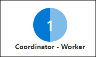
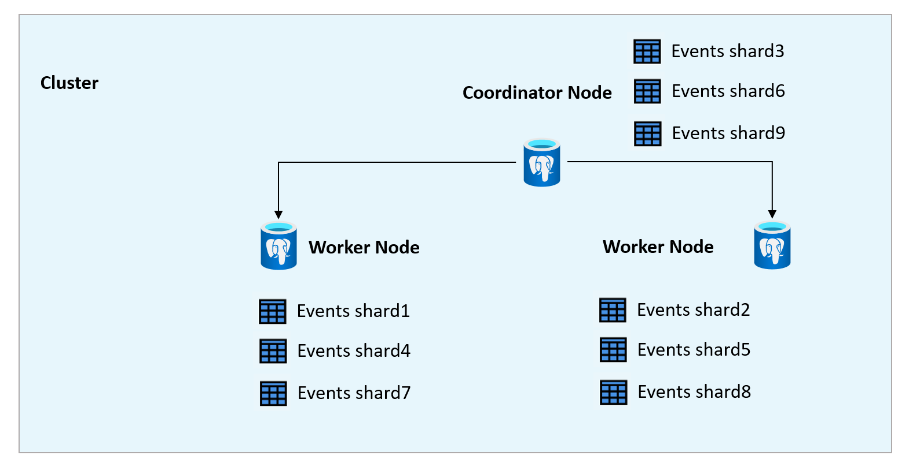

Before distributing the data, it is important to understand the change of the architecture when going from a single-node cluster of Azure Cosmos DB for PostgreSQL to a multi-node cluster. Those changes also impact how queries are handled.

## The architecture of the single-node cluster

Azure Cosmos DB for PostgreSQL is powered by [the Citus extension for PostgreSQL](https://github.com/citusdata/citus). When working with Citus, there are two node types - coordinator and worker nodes. The **coordinator node** manages the table metadata, hosts some tables, and plans queries. The **worker nodes** store the distributed data and process queries. Both types of nodes are plain PostgreSQL databases with the Citus extension.

When working in a single-node cluster of Azure Cosmos DB for PostgreSQL, the single node hosts both the coordinator node and a worker node in the illustration in the Azure portal.



A single node is a plain Postgres database with the Citus extension. In applications when your workload fits in 64 vCores, 256GB RAM, and 2TB storage, you can use a single-node Azure Cosmos DB for PostgreSQL cluster. This size is common for:

- Small production databases
- Test environments
- Development environments

## Distributed architecture

As the amount of data grows, it may make sense to go to a distributed configuration. In a distributed configuration, the data is distributed based on a column's value and stored in a **shard** - a partial table - based on the hash value of that column's value. By default, Azure Cosmos DB for PostgreSQL distributes data across 32 shards.

> **Note**: The number of shards is configurable. If you find that 32 shards aren't enough for your query needs, see [shard count guidance](/azure/cosmos-db/postgresql/howto-shard-count).

Wide World Importers is tracking their warehouse and delivery truck environments for their products like chilly chocolates, which need to be stored at 50-60 degrees Fahrenheit and 60-70% humidity. The device readings were initially stored on a single, non-distributed table named `events`. As Wide World Importers adds more delivery trucks to deliver more chilly chocolates, their data grows into the hundreds of thousands and millions of records. With large amounts of data, the queries for specific devices took longer, as those queries scan the entire events table to find a specific device's set of records. A large amount of data is causing a slower analysis of device readings, making it slower to identify the devices that are causing melted chocolates.

With the queries performing slower, the Wide World Importers developers evaluated the queries to see if they could benefit from distributing the data. They found that the queries frequently included the `device_id`.

Since Wide World Importers runs many queries looking at specific devices, they decided to distribute their data based on the device. What does this look like?

Sample of non-distributed `events` table at over 5 million records:

| event_id | device_id | payload | created_at |
|----|----|----|----|
| 5541217 |        89 | {"temperature": 56.9507238933763} | 2022-12-21 13:31:00.014786|
| 5541218 |        36 | {"temperature": 57.0784606921039} | 2022-12-21 13:31:00.014786 |
| 5541219 |        42 | {"humidity": 80.4112452620533, "temperature": 57.6623053982886} | 2022-12-21 13:31:00.014786 |
| 5541220 |        95 | {"humidity": 65.4122356592755, "temperature": 60.5373228545526} | 2022-12-21 13:31:00.014786 |
| 5541221 |        928 | {"humidity": 69.5125912966787, "temperature": 57.6141389616301} | 2022-12-21 13:31:00.014786 |

When the `events` table is distributed by the device, the shards may look like the following tables.

Sample shard for device 42:

| event_id | device_id | payload | created_at |
|----|----|----|----|
| 5540219 |        42 | {"humidity": 75.1853680994096, "temperature": 60.4662330757257} | 2022-12-21 13:31:00.014786 |
|  5541219 |        42 | {"humidity": 80.4112452620533, "temperature": 57.6623053982886} | 2022-12-21 13:31:00.014786 |
|  5542219 |        42 | {"humidity": 80.120044601186, "temperature": 56.05293606975}    | 2022-12-21 13:31:00.014786 |
|  5543219 |        42 | {"humidity": 73.468156190009, "temperature": 58.9314001663564}  | 2022-12-21 13:31:00.014786 |
|  5536219 |        42 | {"humidity": 76.7346173316635, "temperature": 57.1195321851961} | 2022-12-21 13:30:00.013265 |

Sample shard for device 928:

| event_id | device_id | payload | created_at |
|----|----|----|----|
|  5542800 |       928 | {"humidity": 65.9905863221551, "temperature": 58.7388115586555} | 2022-12-21 13:31:00.014786 |
|  5542200 |       928 | {"humidity": 62.3529067042772, "temperature": 60.8162886484928} | 2022-12-21 13:31:00.014786 |
| 5543102 |       928 | {"humidity": 68.0382586004742, "temperature": 60.1289109654387} | 2022-12-21 13:31:00.014786 |
| 5544107 |       928 | {"humidity": 68.6607868897564, "temperature": 56.5935687642908} | 2022-12-21 13:31:00.014786 |
| 5537103 |       928 | {"humidity": 66.0234045588083, "temperature": 55.1323718123326} | 2022-12-21 13:30:00.013265 |

These shards are hosted on and queried by worker nodes. In the case of going from a single-node cluster to a multi-node cluster, the coordinator can also host and query shards. The coordinator tracks the shard placements on the nodes in metadata tables. The `citus_shards` view can help you determine which shards are placed on which nodes. Where are these shards stored?

```sql
SELECT table_name, shardid, shard_name, nodename, shard_size 
FROM citus_shards 
WHERE table_name='events'::regclass;
```

The output will look like this:

| table_name | shardid | shard_name   |                          nodename                          | shard_size |
|------------|---------|----------------|------------------------------------------------------------|------------|
| events     |  102058 | events_102058 | private-c.cosmos-sensors-data.postgres.database.azure.com  |   18857984 |
| events     |  102059 | events_102059 | private-w1.cosmos-sensors-data.postgres.database.azure.com |   20987904 |
| events     |  102060 | events_102060 | private-w0.cosmos-sensors-data.postgres.database.azure.com |   21159936 |
 events     |  102061 | events_102061 | private-c.cosmos-sensors-data.postgres.database.azure.com  |   14647296 |

To see how many shards are distributed across the nodes, you can run this query:

```sql
SELECT table_name, nodename, COUNT(shardid), SUM(shard_size) 
FROM citus_shards 
GROUP BY table_name, nodename;
```

The output will look similar to this:

| table_name  |                     nodename  | count |    sum   |
| --------------|------------------------------------------------------------|-------|-----------|
| events       | private-c.cosmos-sensors-data.postgres.database.azure.com  |    10 | 180183040 |
| events       | private-w0.cosmos-sensors-data.postgres.database.azure.com |    11 | 216293376 |
| events       | private-w1.cosmos-sensors-data.postgres.database.azure.com |    11 | 206503936 |

The coordinator handles planning the queries and engages only the necessary nodes with the required shards. If the coordinator can't determine which shards need to be queried, it will engage all nodes to query all shards.

When data is distributed, this is how a query is processed:

1. The query comes into the coordinator node.
2. The coordinator node evaluates the query and determines which shards have the data relevant to the query.
3. The coordinator engages the nodes that host the shards relevant to the query.
4. The nodes process the query in parallel and return their results to the coordinator.
5. The coordinator returns the results.

In a single-node configuration, the responsibilities of the worker node and coordinator node are shared on a single node. The data can be distributed on a single node. The performance of the queries relies on that singular node. If you're going with a distributed environment, you can use a distributed configuration on a single node for development environments and test environments. Depending on your resource requirements, you can run your production environment in a single-node or a multi-node configuration. As the amount of data grows, consider using a multi-node configuration to take advantage of parallel query processing and distributed storage.

As data grows larger and queries run slower, the single node can get overloaded and show degraded performance. This is a reason to upgrade to a multi-node cluster.

## The architecture of the multiple-node cluster

When moving to a multiple-node configuration for the Azure Cosmos DB for PostgreSQL cluster, the coordinator node and the worker nodes are separated.


The coordinator node handles planning query execution as well as storing the metadata and some tables. Each worker node contains shards of distributed tables. Each worker node processes its part of a query in parallel in a multi-node configuration rather than the serial processing in a single-node non-distributed environment. If the data is distributed in a logical manner that aligns with users' query patterns, the queries can perform quicker with parallel processing.

For Wide World Importers' sensors data, the data can be sharded across multiple nodes. Since this is starting from a single-node configuration, the coordinator node will host shards.



## Sample queries processing in a distributed configuration

When distributing data, look at the queries and distribute the data in a way that makes sense for its use. This doesn't always align with relational instincts. To make it more efficient, the `events` table is distributed by `device_id` and not the relational primary key of `event_id`. The `device_id` distribution column is selected because the queries on `events` are commonly filtered on the `device_id`.

The first query to consider is querying the `events` for all readings outside of the required operating range. This is the query:

```sql
SELECT device_id, COUNT((CASE WHEN (payload ->> 'humidity')::decimal < 60 THEN 1 ELSE NULL END)) AS LowHumidity,  
    COUNT((CASE WHEN (payload ->> 'humidity')::decimal > 70 THEN 1 ELSE NULL END)) AS HighHumidity,
    COUNT((CASE WHEN (payload ->> 'temperature')::decimal < 55 THEN 1 ELSE NULL END)) AS LowTemperature,
    COUNT((CASE WHEN (payload ->> 'temperature')::decimal > 60 THEN 1 ELSE NULL END)) AS HighTemperature,
    COUNT((CASE WHEN (payload ->> 'humidity')::decimal BETWEEN 60 AND 70 THEN 1 ELSE NULL END)) AS RegularHumidity,  
    COUNT((CASE WHEN (payload ->> 'temperature')::decimal BETWEEN 55 AND 60 THEN 1 ELSE NULL END)) AS RegularTemperature
    FROM events
    GROUP BY device_id;
```

Since this query doesn't call out a specific device, the coordinator will engage all worker nodes to query all shards to find matching records.

You can query the coordinator for the query plan with the `EXPLAIN` keyword. The query plan will show how many shards are engaged through the count of tasks in the query plan header. This is the query plan header for the query above:

```text
---------------------------------------------------------------------------
----------------------------------------------
 Custom Scan (Citus Adaptive)  (cost=0.00..0.00 rows=100000 width=52)
   Task Count: 32
```

How does shard placement impact query processing? This is what query processing looks like for events for all devices.

![Animation showing query processing for the outliers query. The query is in a box. An animated arrow goes from the query box to the coordinator node. The coordinator node pulses to indicate activity. Then, arrows animate from the coordinator to 2 worker nodes. The worker nodes and the coordinator node pulse to indicate activity. Then, an arrow goes from the engaged worker nodes back to the coordinator node. The coordinator node pulses for more activity, then an arrow appears going from the coordinator node back to the query.](../media/query-nodes-all-devices.gif)

As was previously discovered, device 42 has a problem. When a specific device is identified, run queries filtered for that device. When you run the following query, the coordinator will engage only the node that has the shard for device 42.

```sql
SELECT * FROM events 
WHERE device_id = 42 
AND ((payload ->> 'humidity')::decimal NOT BETWEEN 60 AND 70
OR (payload ->> 'temperature')::decimal NOT BETWEEN 55 AND 60)
ORDER BY created_at DESC;
```

The query plan header looks like this:

```text
                   QUERY PLAN                                                                                          
                                                
-----------------------------------------------------------------------------------------------------------------------
-----------------------------------------------------------------------------------------------------------------------
------------------------------------------------
 Custom Scan (Citus Adaptive)  (cost=0.00..0.00 rows=0 width=0)
   Task Count: 1
```

The query plan header indicates 1 task, which means only one shard will need to be queried. Only the worker node with that shard will process the query. No other worker nodes are engaged.

This is what the query processing looks like for events for a specific device.

![Animation showing query processing for the query 'SELECT * FROM events WHERE device_id=42;' The query is in a box. An animated arrow goes from the query box to the coordinator node. The coordinator node pulses to indicate activity. Then, an arrow animates from the coordinator to 1 worker node. A second worker node sits with no connections. The worker node with the arrow coming in pulses to indicate activity. Then, an arrow goes from the engaged worker node back to the coordinator node. The coordinator node pulses for more activity, then an arrow appears going from the coordinator node back to the query.](../media/query-worker-specific-device.gif)

While you can run this distributed environment on a single node, it makes more sense to take advantage of storage distribution and parallel processing with a multi-node cluster. Now, you can take the first step in upgrading to a distributed environment by scaling your Azure Cosmos DB for PostgreSQL cluster from a single node to a multi-node cluster.

>**Note**: Adding nodes doesn't distribute data to the new nodes. You'll see this in the next exercise.
