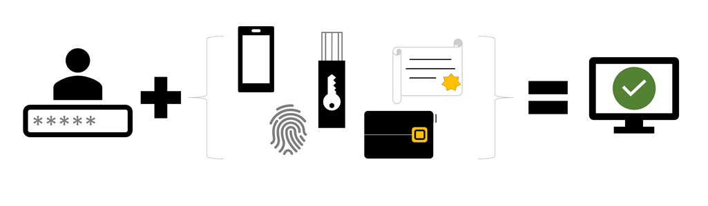

Protecting your cloud assets is one of the primary goals for security group. One of the primary ways unauthorized users get access to systems is by obtaining a valid username/password combination. Azure can help mitigate this with several features of Azure Active Directory including:

* **Password complexity rules**. This will force users to generate hard(er)-to-guess passwords.

* **Password expiration rules**. You can force users to change their passwords on a periodic basis (and avoid using previous-used passwords).

* **Self-service password reset (SSPR)**. This allows users to self-serve and reset their password if they have forgotten it without involving an IT department.

* **Azure AD Identity Protection**. To help protect your organization's identities, you can configure risk-based policies that automatically respond to risky behaviors. These policies can either automatically block the behaviors or initiate remediation, including requiring password changes.

* **Azure AD password protection**. You can block commonly used and compromised passwords via a globally banned-password list.

* **Azure AD smart lockout**. Smart lockout helps lock out malicious hackers who are trying to guess your users’ passwords or use brute-force methods to get in. It recognizes sign-ins coming from valid users and treats them differently than the ones of malicious hackers and other unknown sources.

* **Azure AD Application Proxy**. You can provision security-enhanced remote access to on-premises web applications.

* **Single sign-on (SSO)** access to your applications. This includes thousands of pre-integrated SaaS apps.

* **Azure AD Connect**. Create and manage a single identity for each user across your hybrid enterprise, keeping users, groups, and devices in sync.

These are all great options which deter someone _guessing_ or brute-forcing a password. However, sometimes passwords are obtained through social engineering, or poor physical security practices (like putting your password on a sticky note under your keyboard!). In these cases, the above features won't stop an intrusion. Instead, security administrators will want to turn to **Azure AD Multi-Factor Authentication (MFA)**.

## What is Azure AD MFA?

Azure AD Multi-Factor Authentication (MFA) supplies added security for your identities by requiring two or more elements for full authentication.

These elements fall into three categories:

* **Something you know** - which might be a password or the answer to a security question.
* **Something you possess** - which might be a mobile app that receives a notification or a token-generating device.
* **Something you are** - which typically is a biometric property, such as a fingerprint or face scan used on many mobile devices.

Using Azure AD MFA increases identity security by limiting the impact of credential exposure. To fully authenticate, a malicious hacker who has a user's password would also need their phone or their fingerprint. Authentication with only a single factor is insufficient, and without authentication from Azure AD MFA, a malicious hacker is unable to use those credentials to authenticate. You should enable Azure AD MFA wherever possible, because it adds enormous benefits to security.

Azure AD MFA is the Microsoft two-step verification solution. Azure AD MFA helps safeguard access to data and applications while meeting user demand for a simple sign-in process. It delivers strong authentication via a range of verification methods, including phone call, text message, or mobile app verification. The security of Azure AD MFA lies in its layered approach. Compromising multiple authentication factors presents a significant challenge for malicious hackers. Even if a malicious hacker manages to learn the user's password, it is useless without also possessing the trusted device. If the user loses the device, a person who finds it won't be able to use it without the user's password.

## How to get Multi-Factor Authentication?

Multi-Factor Authentication comes as part of the following offerings:

* **Azure Active Directory Premium** or **Microsoft 365 Business** - Both of these offerings support Azure AD Multi-Factor Authentication using [security defaults](/azure/active-directory/fundamentals/concept-fundamentals-security-defaults) to require multi-factor authentication.

* **Azure AD Free** or standalone **Microsoft 365** licenses - Use [security defaults](/azure/active-directory/fundamentals/concept-fundamentals-security-defaults) that require multi-factor authentication for your users and administrators.

* **Azure Active Directory Global Administrators** - A subset of Azure AD Multi-Factor Authentication capabilities are available as a means to protect global administrator accounts.