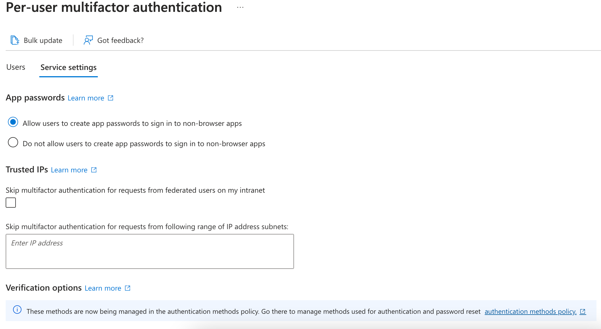
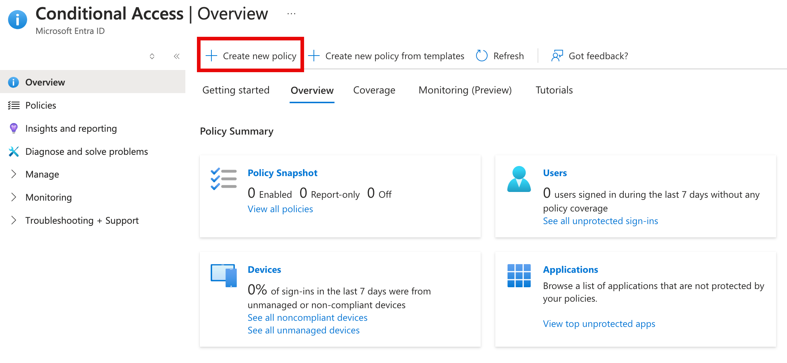
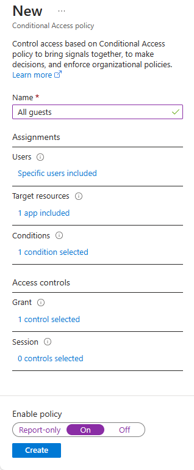

## Configure Azure AD MFA for applications

Let's walk through the basic steps necessary to configure and enable Azure AD Multi-Factor Authentication using Conditional policies. **Keep in mind that a real deployment requires significant thought and planning**. Make sure you review the documentation links at the end of this module before you enable MFA for your environments.

> [!IMPORTANT]
> Azure AD Premium is need for this exercise. You can use a [30-day free trial](https://azure.microsoft.com/trial/get-started-active-directory/) to try this feature out, or just read through the instructions below to understand the flow.

## Configure Multi-Factor Authentication options

1. Sign in to the [Azure portal](https://portal.azure.com/) using a Global administrator account.
1. Navigate to the Azure Active Directory dashboard using the **Azure Active Directory** option in the sidebar.
1. Select **MFA** under the **Security** group. Here you will find options for Multi-Factor authentication.

    

1. Select the **Additional cloud-based MFA settings** link under **Configure**. A new browser page will open, where you can see all the MFA options for Azure.

    

    This is where you would select the supported authentication methods, in the screen above, all of them are selected.

    You can also enable or disable _app passwords_ here, which allow users to create unique account passwords for apps that don't support multi-factor authentication. This feature lets the user authenticate with their Azure AD identity using a different password specific to that app.

## Setup conditional access rules for MFA

Next let's examine how to set up Conditional Access policy rules that would enforce MFA for guest users accessing specific apps on your network.

1. Switch back to the Azure portal and select **Azure Active Directory > Security > Conditional access**.

1. Select **New policy** from the top menu.

    

1. Name your policy, for example "All guests"

1. Select **Users and groups** to open the panel.
    - Select **Select users and groups**
    - Check the **All guest and external users** checkbox to apply this to all guests
    - Select **Done** to close the panel.

1. Select **Cloud apps or actions**.
    - Select **Select apps** and press the **Select** group
    - Choose an app where you want to enable Azure AD MFA such as **Visual Studio App Center**
    - Select **Select** and then **Done** to close the panel.

1. Review the **Conditions** section.
    - Select **Locations** and then configure it for **Any location**.

1. Under Access Controls select **Grant** and make sure that **Grant access** is selected, select the **Require multi-factor authentication** check box - this is what enforces MFA.
1. Select **Select** to close the window.

1. Set **Enable policy** to **On**.

1. Select **Create** to create the policy.

    

MFA is now enabled for your selected application(s). The next time a guest tries to sign into that app they will be prompted to register for MFA.

## Configure Azure AD MFA for passwords

Finally, let's look at how to configure MFA for user accounts. This is another way to get to the multi-factor auth settings.

1. Navigate back to the **Azure Active Directory** dashboard in the Azure portal.

1. Select **Users**.
1. At the top of the **Users** pane, select **Multi-Factor Authentication**.

    

1. You can enable or disable MFA on a user basis by selecting a user and then using the quick steps on the right side.

    

Finally, select **service settings**. This displays the same global MFA options we saw earlier. Let's explore these in a bit more detail.
