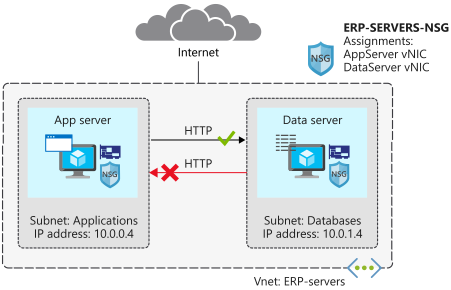

As the solution architect for the manufacturing company, you now want to start moving the ERP application and database servers to Azure. As a first step, you're going to test out your network security plan, using two of your servers.

In this unit, you'll configure a network security group and security rules to restrict network traffic to specific servers. You want your application server to be able to connect to your database server over HTTP. You don't want the database server to be able to use HTTP to connect to the application server.



[!include[](../../../includes/azure-exercise-subscription-prerequisite.md)]

## Create a virtual network and network security group

First, you'll create a resource group, the virtual network, and subnets for your server resources. You'll then create a network security group.

1. Open the [Azure Cloud Shell](https://shell.azure.com/?azure-portal=true) in your browser, and log in to the directory with access to the subscription you want to create resources in.

1. Run the following command in the Cloud Shell to create a variable to store your resource group name, and a resource group for your resources. Replace `<resource group name>` with a name for your resource group, and `<location>` with the Azure region you'd like to deploy your resources in.

    ```azurecli
    rg=<resource group name>

    az group create --name $rg --location <location>

1. Run the following command in Azure Cloud Shell to create the **ERP-servers** virtual network and the **Applications** subnet.

    ```azurecli
    az network vnet create \
        --resource-group $rg \
        --name ERP-servers \
        --address-prefix 10.0.0.0/16 \
        --subnet-name Applications \
        --subnet-prefix 10.0.0.0/24
    ```

1. Run the following command in Cloud Shell to create the **Databases** subnet.

    ```azurecli
    az network vnet subnet create \
        --resource-group $rg \
        --vnet-name ERP-servers \
        --address-prefix 10.0.1.0/24 \
        --name Databases
    ```

1. Run the following command in Cloud Shell to create the **ERP-SERVERS-NSG** network security group. 

    ```azurecli
    az network nsg create \
        --resource-group $rg \
        --name ERP-SERVERS-NSG
    ```

## Create virtual machines running Ubuntu

Next, you create two virtual machines called **AppServer** and **DataServer**. You deploy **AppServer** to the **Applications** subnet, and **DataServer** to the **Databases** subnet. Add the virtual machine network interfaces to the **ERP-SERVERS-NSG** network security group. Then use these virtual machines to test your network security group.

1. Run the following command in Cloud Shell to build the **AppServer** virtual machine. Define a `<password>` for the admin account.

    ```azurecli
    wget -N https://raw.githubusercontent.com/MicrosoftDocs/mslearn-secure-and-isolate-with-nsg-and-service-endpoints/master/cloud-init.yml && \
    az vm create \
        --resource-group $rg \
        --name AppServer \
        --vnet-name ERP-servers \
        --subnet Applications \
        --nsg ERP-SERVERS-NSG \
        --image UbuntuLTS \
        --size Standard_B1ls
        --admin-username azureuser \
        --custom-data cloud-init.yml \
        --no-wait \
        --admin-password <password>
    ```

1. Run the following command in Cloud Shell to build the **DataServer** virtual machine. Define a `<password>` for the admin account.

    ```azurecli
    az vm create \
        --resource-group $rg \
        --name DataServer \
        --vnet-name ERP-servers \
        --subnet Databases \
        --nsg ERP-SERVERS-NSG \
        --size Standard_B1ls
        --image UbuntuLTS \
        --admin-username azureuser \
        --custom-data cloud-init.yml \
        --admin-password <password>
    ```

1. It can take several minutes for the virtual machines to be in a running state. To confirm that the virtual machines are running, run the following command in Cloud Shell.

    ```azurecli
    az vm list \
        --resource-group $rg \
        --show-details \
        --query "[*].{Name:name, Provisioned:provisioningState, Power:powerState}" \
        --output table
    ```

   When virtual machine creation is complete, you should see the following output.

    ```output
    Name        Provisioned    Power
    ----------  -------------  ----------
    AppServer   Succeeded      VM running
    DataServer  Succeeded      VM running
    ```

## Check default connectivity

Now, you'll try to open a Secure Shell (SSH) session to each of your virtual machines. Remember, so far you've deployed a network security group with default rules.

1. To connect to your virtual machines, use SSH directly from Cloud Shell. To do this, you need the public IP addresses that have been assigned to your virtual machines. Run the following command in Cloud Shell to list the IP addresses that you'll use to connect to the virtual machines.

    ```azurecli
    az vm list \
        --resource-group $rg \
        --show-details \
        --query "[*].{Name:name, PrivateIP:privateIps, PublicIP:publicIps}" \
        --output table
    ```

1. To make it easier to connect to your virtual machines during the rest of this exercise, assign the public IP addresses to variables. Run the following command in Cloud Shell to save the public IP address of **AppServer** and **DataServer** to a variable.

   ```bash
   APPSERVERIP="$(az vm list-ip-addresses \
                    --resource-group $rg \
                    --name AppServer \
                    --query "[].virtualMachine.network.publicIpAddresses[*].ipAddress" \
                    --output tsv)"

   DATASERVERIP="$(az vm list-ip-addresses \
                    --resource-group $rg \
                    --name DataServer \
                    --query "[].virtualMachine.network.publicIpAddresses[*].ipAddress" \
                    --output tsv)"
   ```

1. Run the following command in Cloud Shell to check whether you can connect to your **AppServer** virtual machine.

    ```bash
    ssh azureuser@$APPSERVERIP -o ConnectTimeout=5
    ```

   You'll get a `Connection timed out` message.

1. Run the following command in Cloud Shell to check whether you can connect to your **DataServer** virtual machine.

    ```bash
    ssh azureuser@$DATASERVERIP -o ConnectTimeout=5
    ```

   You'll get the same connection failure message.

Remember that the default rules deny all inbound traffic into a virtual network, unless this traffic is coming from another virtual network. The **Deny All Inbound** rule blocked the inbound SSH connections you just attempted.

**Inbound**

| Name               | Priority | Source IP       | Destination IP  | Access |
| ------------------ | -------- | --------------- | --------------- | ------ |
| Allow VNet Inbound | 65000    | VIRTUAL_NETWORK | VIRTUAL_NETWORK | Allow  |
| Deny All Inbound   | 65500    | *               | *               | Deny   |

## Create a security rule for SSH

As you've now experienced, the default rules in your **ERP-SERVERS-NSG** network security group include a **Deny All Inbound** rule. You'll now add a rule so that you can use SSH to connect to **AppServer** and **DataServer**.

1. Run the following command in Cloud Shell to create a new inbound security rule to enable SSH access.

    ```azurecli
    az network nsg rule create \
        --resource-group $rg \
        --nsg-name ERP-SERVERS-NSG \
        --name AllowSSHRule \
        --direction Inbound \
        --priority 100 \
        --source-address-prefixes '*' \
        --source-port-ranges '*' \
        --destination-address-prefixes '*' \
        --destination-port-ranges 22 \
        --access Allow \
        --protocol Tcp \
        --description "Allow inbound SSH"
    ```

1. Run the following command in Cloud Shell to check whether you can now connect to your **AppServer** virtual machine.

    ```bash
    ssh azureuser@$APPSERVERIP -o ConnectTimeout=5
    ```

    The network security group rule might take a minute or two to take effect. If you receive a connection failure message, try again.

1. You should now be able to connect. After the `Are you sure you want to continue connecting (yes/no)?` message, type `yes`.

1. Enter the password you used when you created the virtual machine.

1. Type `exit` to close the **AppServer** session.

1. Run the following command in Cloud Shell to check whether you can now connect to your **DataServer** virtual machine.

    ```bash
    ssh azureuser@$DATASERVERIP -o ConnectTimeout=5
    ```

1. You should now be able to connect. After the `Are you sure you want to continue connecting (yes/no)?` message, type `yes`.

1. Enter the password you used when you created the virtual machine.

1. Type `exit` to close the **DataServer** session.

## Create a security rule to prevent web access

Now add a rule so that **AppServer** can communicate with **DataServer** over HTTP, but **DataServer** can't communicate with **AppServer** over HTTP. These are the internal IP addresses for these servers:

| Server name | IP address |
| ---- | ---- |
| AppServer | 10.0.0.4 |
| DataServer | 10.0.1.4 |

1. Run the following command in Cloud Shell to create a new inbound security rule to deny HTTP access over port 80.

    ```azurecli
    az network nsg rule create \
        --resource-group $rg \
        --nsg-name ERP-SERVERS-NSG \
        --name httpRule \
        --direction Inbound \
        --priority 150 \
        --source-address-prefixes 10.0.1.4 \
        --source-port-ranges '*' \
        --destination-address-prefixes 10.0.0.4 \
        --destination-port-ranges 80 \
        --access Deny \
        --protocol Tcp \
        --description "Deny from DataServer to AppServer on port 80"
    ```

## Test HTTP connectivity between virtual machines

Here, you check if your new rule works. **AppServer** should be able to communicate with **DataServer** over HTTP. **DataServer** shouldn't be able to communicate with **AppServer** over HTTP.

1. Run the following command in Cloud Shell to connect to your **AppServer** virtual machine, and check if **AppServer** can communicate with **DataServer** over HTTP.

    ```bash
    ssh -t azureuser@$APPSERVERIP 'wget http://10.0.1.4; exit; bash'
    ```

1. Enter the password you used when you created the virtual machine.

1. The response should include a `200 OK` message.

1. Run the following command in Cloud Shell to connect to your **DataServer** virtual machine, and check if **DataServer** can communicate with **AppServer** over HTTP.

    ```bash
    ssh -t azureuser@$DATASERVERIP 'wget http://10.0.0.4; exit; bash'
    ```

1. Enter the password you used when you created the virtual machine.

1. This shouldn't succeed, because you've blocked access over port 80. After several minutes, you should get a `Connection timed out` message. Press Ctrl+C to stop the command prior to the timeout.

## Deploy an application security group

Next, create an application security group for database servers, so that all servers in this group can be assigned the same settings. You're planning to deploy more database servers, and want to prevent these servers from accessing application servers over HTTP. By assigning sources in the application security group, you don't need to manually maintain a list of IP addresses in the network security group. Instead, you assign the network interfaces of the virtual machines you want to manage to the application security group.


1. Run the following command in Cloud Shell to create a new application security group called **ERP-DB-SERVERS-ASG**.

    ```azurecli
    az network asg create \
        --resource-group $rg \
        --name ERP-DB-SERVERS-ASG
    ```

1. Run the following command in Cloud Shell to associate **DataServer** with the application security group.

    ```azurecli
    az network nic ip-config update \
        --resource-group $rg \
        --application-security-groups ERP-DB-SERVERS-ASG \
        --name ipconfigDataServer \
        --nic-name DataServerVMNic \
        --vnet-name ERP-servers \
        --subnet Databases
    ```

1. Run the following command in Cloud Shell to update the HTTP rule in the **ERP-SERVERS-NSG** network security group. It should reference the **ERP-DB-Servers** application security group.

    ```azurecli
    az network nsg rule update \
        --resource-group $rg \
        --nsg-name ERP-SERVERS-NSG \
        --name httpRule \
        --direction Inbound \
        --priority 150 \
        --source-address-prefixes "" \
        --source-port-ranges '*' \
        --source-asgs ERP-DB-SERVERS-ASG \
        --destination-address-prefixes 10.0.0.4 \
        --destination-port-ranges 80 \
        --access Deny \
        --protocol Tcp \
        --description "Deny from DataServer to AppServer on port 80 using application security group"
    ```

## Test the updated HTTP security rule

1. Run the following command in Cloud Shell to connect to your **AppServer** virtual machine, and check if **AppServer** can communicate with **DataServer** over HTTP.

    ```bash
    ssh -t azureuser@$APPSERVERIP 'wget http://10.0.1.4; exit; bash'
    ```

1. Enter the password you used when you created the virtual machine.

1. As before, the response should include a `200 OK` message. The application security group settings can take a minute or two to take effect. If you don't initially receive the `200 OK` message, wait a minute and try again.

1. Run the following command in Cloud Shell to connect to your **DataServer** virtual machine, and check if **DataServer** can communicate with **AppServer** over HTTP.

    ```bash
    ssh -t azureuser@$DATASERVERIP 'wget http://10.0.0.4; exit; bash'
    ```

1. Enter the password you used when you created the virtual machine.

1. As before, this shouldn't succeed, because you've blocked access over port 80. After several minutes, you should get a `Connection timed out` message. Press Ctrl+C to stop the command prior to the timeout.

You've now confirmed that your network security group rule works using an application security group, in the same way as when you used a source IP address. If we were to add additional data servers, we can easily ensure they have the proper network security by adding the new servers to the **ERP-DB-SERVERS-ASG**.
