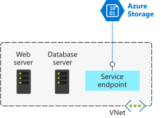
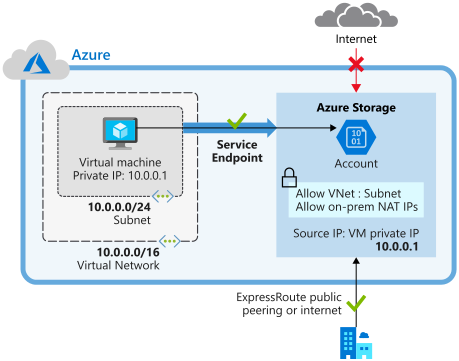

You've migrated your existing app and database servers for your ERP system to Azure as VMs. Now, to reduce your costs and administrative requirements, you're considering using some Azure platform as a service (PaaS) services. Storage services will hold certain large file assets, such as engineering diagrams. These engineering diagrams have proprietary information in them, and must remain secure from unauthorized access. These files must only be accessible from specific systems.

In this unit, you'll look at how to use virtual network service endpoints for securing supported Azure services.

## Virtual network service endpoints

Use virtual network service endpoints to extend your private address space in Azure by providing a direct connection to your Azure services. Service endpoints let you secure your Azure resources to only your virtual network. Service traffic will remain on the Azure backbone, and doesn't go out to the internet.

By default, Azure services are all designed for direct internet access. All Azure resources have public IP addresses, including PaaS services, such as Azure SQL Database and Azure Storage. Because these services are exposed to the internet, anyone can potentially access your Azure services.

Service endpoints can connect certain PaaS services directly to your private address space in Azure, so they act like they’re on the same virtual network. Use your private address space to access the PaaS services directly. Adding service endpoints doesn't remove the public endpoint. It simply provides a redirection of traffic.

Azure service endpoints are available for many services, such as:

- Azure Storage
- Azure SQL Database
- Azure Cosmos DB
- Azure Key Vault
- Azure Service Bus
- Azure Data Lake

For a service like SQL Database, which can't be accessed until you add IP addresses to its firewall, service endpoints should still be considered. Using a service endpoint for SQL Database restricts access to specific virtual networks, providing greater isolation and reducing the attack surface.

## How service endpoints work

To enable a service endpoint, you must do the following two things:

1. Turn off public access to the service.
1. Add the service endpoint to a virtual network.

When you enable a service endpoint, you restrict the flow of traffic, and enable your Azure VMs to access the service directly from your private address space. Devices cannot access the service from a public network. On a deployed VM vNIC, if you look at **Effective routes**, you'll notice the service endpoint as the **Next Hop Type**.

This is an example route table, before enabling a service endpoint:

| SOURCE  | STATE   | ADDRESS PREFIXES | NEXT HOP TYPE |
|---------|---------|------------------|---------------|
| Default | Active  | 10.1.1.0/24      | VNet          |
| Default | Active  | 0.0.0.0./0       | Internet      |
| Default | Active  | 10.0.0.0/8       | None          |
| Default | Active  | 100.64.0.0./10   | None          |
| Default | Active  | 192.168.0.0/16   | None          |

And here's an example route table after you've added two service endpoints to the virtual network:

| SOURCE  | STATE  | ADDRESS PREFIXES         | NEXT HOP TYPE                 |
|---------|--------|--------------------------|-------------------------------|
| Default | Active | 10.1.1.0/24              | VNet                          |
| Default | Active | 0.0.0.0./0               | Internet                      |
| Default | Active | 10.0.0.0/8               | None                          |
| Default | Active | 100.64.0.0./10           | None                          |
| Default | Active | 192.168.0.0/16           | None                          |
| Default | Active | 20.38.106.0/23, 10 more  | VirtualNetworkServiceEndpoint |
| Default | Active | 20.150.2.0/23, 9 more    | VirtualNetworkServiceEndpoint |

All traffic for the service now is routed to the **VirtualNetworkServiceEndpoint**, and remains internal to Azure.

## Service endpoints and hybrid networks

Service resources that you've secured by using virtual network service endpoints are not, by default, accessible from on-premises networks. To access resources from an on-premises network, use NAT IPs. If you use ExpressRoute for connectivity from on-premises to Azure, you have to identify the NAT IP addresses that are used by ExpressRoute. By default, each circuit uses two NAT IP addresses to connect to the Azure backbone network. You then need to add these IP addresses into the IP firewall configuration of the Azure service resource (for example, Azure Storage).

The following diagram shows how you can use a service endpoint and firewall configuration to enable on-premises devices to access Azure Storage resources.

