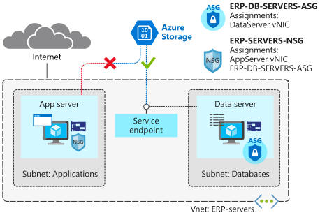

As the solution architect, you're planning to move sensitive engineering diagram files into Azure Storage. The files must only be accessible from computers inside the corporate network. You want to create a virtual network service endpoint for Azure Storage to secure the connectivity to your storage accounts.

In this unit, you'll create a service endpoint and use network rules to restrict access to Azure Storage. You'll create a virtual network service endpoint for Azure Storage on the **Databases** subnet. You'll then verify that your **DataServer** VM can access Azure Storage. Lastly, you'll check that the **AppServer** VM, which is on a different subnet, can't access storage.



## Add rules to the network security group

Ensure that communications with Azure Storage pass through the service endpoint. Add outbound rules to allow access to the Storage service, but deny all other internet traffic.

1. To create an outbound rule to allow access to Storage, run the following command in Cloud Shell:

    ```azurecli
    az network nsg rule create \
        --resource-group $rg \
        --nsg-name ERP-SERVERS-NSG \
        --name Allow_Storage \
        --priority 190 \
        --direction Outbound \
        --source-address-prefixes "VirtualNetwork" \
        --source-port-ranges '*' \
        --destination-address-prefixes "Storage" \
        --destination-port-ranges '*' \
        --access Allow \
        --protocol '*' \
        --description "Allow access to Azure Storage"
    ```

1. To create an outbound rule to deny all internet access, run the following command in Cloud Shell:

    ```azurecli
    az network nsg rule create \
        --resource-group $rg \
        --nsg-name ERP-SERVERS-NSG \
        --name Deny_Internet \
        --priority 200 \
        --direction Outbound \
        --source-address-prefixes "VirtualNetwork" \
        --source-port-ranges '*' \
        --destination-address-prefixes "Internet" \
        --destination-port-ranges '*' \
        --access Deny \
        --protocol '*' \
        --description "Deny access to Internet."
    ```

You should now have the following rules in ERP-SERVERS-NSG:

| Rule name     | Direction | Priority | Purpose                                 |
|---------------|-----------|----------|-----------------------------------------|
| AllowSSHRule  | Inbound   | 100      | Allow inbound SSH                       |
| httpRule      | Inbound   | 150      | Deny from DataServer to AppServer on 80 |
| Allow_Storage | Outbound  | 190      | Allow access to Azure Storage           |
| Deny_Internet | Outbound  | 200      | Deny access to Internet from VNet       |

At this point, both **AppServer** and **DataServer** have access to the Azure Storage service.

## Configure storage account and file share

In this step, you'll create a new storage account, then add an Azure file share to this account. This share is where you'll store your engineering diagrams.

1. To create a storage account for engineering documents, run the following command in Cloud Shell:

    ```bash
    STORAGEACCT=$(az storage account create \
                    --resource-group $rg \
                    --name engineeringdocs$RANDOM \
                    --sku Standard_LRS \
                    --query "name" | tr -d '"')
    ```

1. To store the primary key for your storage in a variable, run the following command in Cloud Shell:

    ```bash
    STORAGEKEY=$(az storage account keys list \
                    --resource-group $rg \
                    --account-name $STORAGEACCT \
                    --query "[0].value" | tr -d '"')
    ```

1. To create an Azure file share called **erp-data-share**, run the following command in Cloud Shell:

    ```azurecli
    az storage share create \
        --account-name $STORAGEACCT \
        --account-key $STORAGEKEY \
        --name "erp-data-share"
    ```

## Enable the service endpoint

You now need to configure the storage account to be accessible only from database servers, by assigning the storage endpoint to the **Databases** subnet. You then need to add a security rule to the storage account.

1. To assign the **Microsoft.Storage** endpoint to the subnet, run the following command in Cloud Shell:

    ```azurecli
    az network vnet subnet update \
        --vnet-name ERP-servers \
        --resource-group $rg \
        --name Databases \
        --service-endpoints Microsoft.Storage
    ```

1. To deny all access, change the default action to `Deny` by running the following command in Cloud Shell. After network access is denied, the storage account is not accessible from any network.

    ```azurecli
    az storage account update \
        --resource-group $rg \
        --name $STORAGEACCT \
        --default-action Deny
    ```

1. To restrict access to the storage account, run the following command in Cloud Shell. By default, storage accounts are open to accept all traffic. You want only traffic from the **Databases** subnet to be able to access the storage.

    ```azurecli
    az storage account network-rule add \
        --resource-group $rg \
        --account-name $STORAGEACCT \
        --vnet-name ERP-servers \
        --subnet Databases
    ```

## Test access to storage resources

In this step, you'll connect to both of your servers, and verify that only **DataServer** has access to the Azure file share on the storage account.

1. To save the public IP addresses of **AppServer** and **DataServer** to variables, run the following command in Cloud Shell:

    ```bash
    APPSERVERIP="$(az vm list-ip-addresses \
                        --resource-group $rg \
                        --name AppServer \
                        --query "[].virtualMachine.network.publicIpAddresses[*].ipAddress" \
                        --output tsv)"

    DATASERVERIP="$(az vm list-ip-addresses \
                        --resource-group $rg \
                        --name DataServer \
                        --query "[].virtualMachine.network.publicIpAddresses[*].ipAddress" \
                        --output tsv)"
    ```

1. To connect to your **AppServer** VM, and attempt to mount the Azure file share, run the following command in Cloud Shell:

    ```bash
    ssh -t azureuser@$APPSERVERIP \
        "mkdir azureshare; \
        sudo mount -t cifs //$STORAGEACCT.file.core.windows.net/erp-data-share azureshare \
        -o vers=3.0,username=$STORAGEACCT,password=$STORAGEKEY,dir_mode=0777,file_mode=0777,sec=ntlmssp; findmnt \
        -t cifs; exit; bash"
    ```

1. Enter the password you used when you created the VM.

1. The response should include a `mount error` message. This connection isn't allowed, because there is no service endpoint for the storage account on the **Applications** subnet.

1. To connect to your **DataServer** VM and attempt to mount the Azure file share, run the following command in Cloud Shell:

    ```bash
    ssh -t azureuser@$DATASERVERIP \
        "mkdir azureshare; \
        sudo mount -t cifs //$STORAGEACCT.file.core.windows.net/erp-data-share azureshare \
        -o vers=3.0,username=$STORAGEACCT,password=$STORAGEKEY,dir_mode=0777,file_mode=0777,sec=ntlmssp;findmnt \
        -t cifs; exit; bash"
    ```

1. Enter the password you used when you created the VM.

1. The mount should be successful, and the response should include details of the mount point. This is allowed because you created the service endpoint for the storage account on the **Databases** subnet.

By using the storage service endpoint on the **Databases** subnet, you've now verified that **DataServer** can access storage. You've also verified that **AppServer** can't access storage. This is because this server is on a different subnet, and doesn't have access to the virtual network service endpoint.
