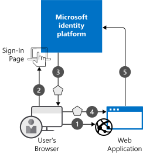

There are many options for securing identities in your application. Selecting the right technology for your application will help ensure that your application is secure, while maintaining a great experience for your users.

At your transportation company, your drivers have identities in Microsoft 365. You want to understand how you can use those identities to authenticate them in your scheduling app. You want to provide secure access to your application without requiring the drivers to manage extra user accounts and credentials.

Let's look at the standards and services that you can use for authentication.

## What is Azure Active Directory?

Azure Active Directory (Azure AD) is Microsoft's cloud-based identity and access management service. It simplifies authentication for developers by providing identity as a service. It supports industry-standard protocols such as OAuth 2.0 and OpenID Connect.

Azure AD allows users to sign in and view resources. And it has features to help secure your identities, such as Identity Protection and multi-factor authentication.

Microsoft services such as Azure and Microsoft 365 use Azure AD to store and manage users. Whenever Microsoft 365 needs to verify a user, for example, Azure AD performs all identity and access management.

## Authentication in Azure Active Directory

Users authenticate in two stages:

1. The identity provider verifies the identity of users who exist in the directory. Upon successful authentication, tokens are issued that contain information related to the successful authentication.
1. The user passes those tokens to the application. The application must validate the user’s security tokens to ensure that authentication was successful.

Let’s consider a basic scenario where identity is required: a user in a web browser needs to authenticate to a web application. Consider the following diagram for this scenario:

1. The user requests a secured resource, in this case a web application.
1. The web application redirects the request to the identity provider that requests and checks the user's authentication credentials.
1. If the user sends correct credentials, the provider returns a security token to the user and redirects the user to the resource they originally requested.
1. The user sends the security token to the web application.
1. The web application uses the token to verify that the identity provider has performed the authentication.

After this process of authentication, in which the user is positively identified, the web application must authorize the user's access to resources. Authorization is the process by which the web application checks whether the user is permitted to access the requested resource.

This communication flow is built upon the industry-standard protocols of OAuth 2.0 and OpenID Connect.

## OAuth 2.0

OAuth 2.0 is the industry-standard protocol for authorization. It provides specific authorization flows for web, desktop, and mobile applications. This specification was primarily designed to enable users to authorize an application to access data in another application.

Imagine you have an application that stores contact information. You want to allow users with LinkedIn accounts to import their LinkedIn contact information into your application. With OAuth, you can enable this server-to-server communication. Users can authorize your application to access contact information, without needing to share passwords between applications.

OAuth works well for authorization of server-to-server communications, but it doesn't include standards or specifications for authentication. As applications continued to grow their sharing of data and account information between them, the need for a standard framework for single-sign on became evident. This led to the development of OpenID Connect.

## OpenID Connect

OpenID Connect is an authentication layer that's built on top of OAuth 2.0. It includes identity verification methods that are missing from OAuth 2.0. OpenID Connect gives you an access token plus an ID token, which you can send to an application to prove your identity.

The ID token is a JSON Web Token (JWT) and contains information about the authenticated user. The identity provider signs the token, so that applications can verify the authentication by using the provider's public key.

JSON Web Token is an open international standard that defines how applications can exchange data securely as digitally signed messages. The content of each token is not encrypted, but the message is signed with the private key of the identity provider. By checking the signature with the corresponding public key, applications can prove that the token is issued by the identity provider and has not been tampered with.

This diagram shows how the client application, the application server, and the identity provider communicate in an OpenID Connect authentication request. The client might be a mobile app or a desktop application. In this case, it's a web browser. The application server is usually a web server that hosts webpages or a web API. The identity provider in the middle is Azure AD.

When the web browser goes to the web application, the web server needs the user to be authenticated. It redirects the browser to Azure AD and provides its own client ID, which has been registered in Azure AD. When the user has successfully authenticated against Azure AD, the provider redirects the browser to the URI on the web server.

When you implement OpenID Connect, you must obtain a client ID for your application by creating an application registration in Azure AD. You then copy the client ID into the application's configuration files. In the application registration, you will also include the URI of the web application so that Azure AD can redirect the client successfully.
