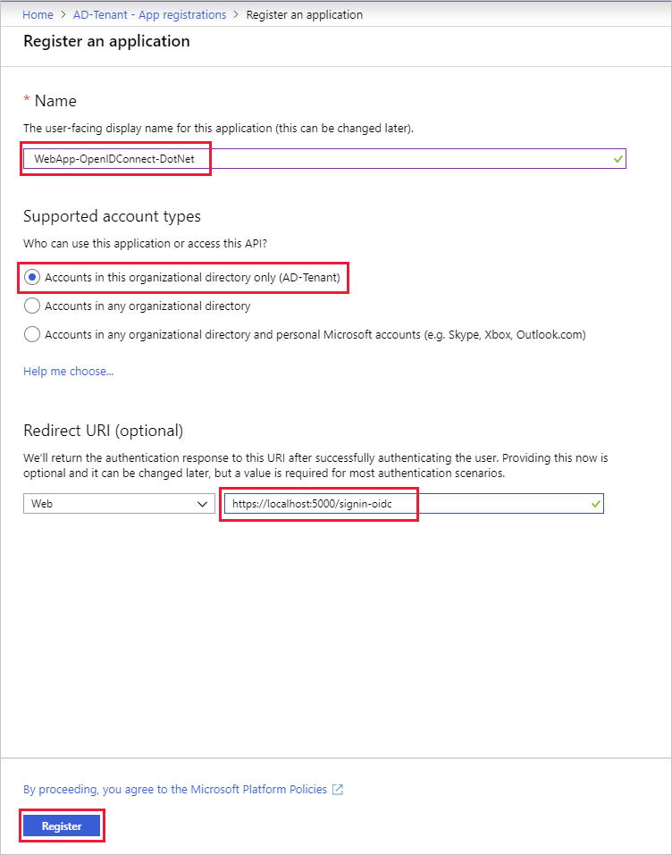
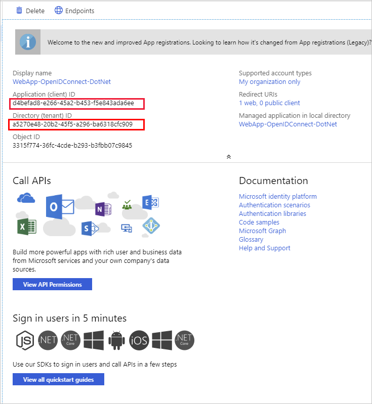

To use Azure Active Directory (Azure AD) as an authentication provider for your application, you must register that application in Azure AD. Suppose you want to use Azure AD as the authentication provider for your scheduling application. You have an ASP.NET Core web app, and you want to configure Azure AD as the identity provider.

Here, you'll create and configure an application registration in your subscription.

## Create an Azure AD tenant

To start, you'll use the Azure portal to create a new Azure AD tenant.

1. Open a browser and sign into the [Azure portal](https://portal.azure.com?azure-portal=true).
1. From the resource menu or from the **Home** page, select **Create a resource**. The **Create a resource** page appears.
1. In the Create a Resource menu, select **Identity**, and then, in the *Search services and marketplace* search box, search for and select **Azure Active Directory**. The **Azure Active Directory** pane appears.
1. Select **Create**. The **Create tenant** pane appears.
1. On the **Basics** tab, enter the following values for each setting:

    | Setting | Value |
    | --- | --- |
    | **Tenant type** |
    | Select a tenant type | Azure Active Directory |

1. Select **Next : Configuration**.
1. On the **Configuration** tab, enter the following values for each setting:

    | Setting | Value |
    | --- | --- |
    | **Directory details** |
    | Organization name | This is a friendly name for your tenant. For this exercise, enter *Learn Module Azure AD Tenant*. |
    | Initial domain name | Enter a unique name for your tenant. |
    | Country or region | Select your preferred region. |

1. Select **Next: Review + create**, and after validation passes, select **Create**. The **Help us prove you're not a robot** pane appears.
1. Address the query and select **Submit**.  
1. When tenant creation is complete, select the **Learn Module Azure AD Tenant** link. The **Overview** page for your  **Learn Module Azure AD Tenant** Azure Active Directory appears.

## Register an application

Next, let's create a new registration in the Azure AD tenant for the web app. By registering the app, we mark the app as trusted by the tenant, and specify critical configuration values.

1. In the Azure Active Directory menu, under **Manage**, select **App registrations**. The **App registrations** pane appears.
1. In the command bar, select **New registration**. The **Register an application** page appears.
1. Enter the following values for each setting, and then Select **Register**.

    | Setting | Value |
    | --- | --- |
    | Name | WebApp-OpenIDConnect-DotNet |
    | **Supported account types** |
    | Who can use this application or access this API? | Accounts in this organizational directory only (Learn Module Azure AD Tenant only - Single tenant) |
    | **Redirect URI (optional)** |
    | Web | `https://localhost:5000/signin-oidc` |

    

   The URL `https://localhost:5000/signin-oidc` is a placeholder that you'll change after you've deployed your application.

   The **WebApp-OpenIDConnect-DotNet** pane appears.

1. Hover over the **Application (client) ID** value and copy to a secure location. Do the same for **Directory (tenant) ID** value. Save these values for later. You'll need these to complete the configuration file in the next exercise.

    

You've now configured the Azure AD tenant and performed the initial application registration to enable your application to communicate with your Azure AD tenant.
