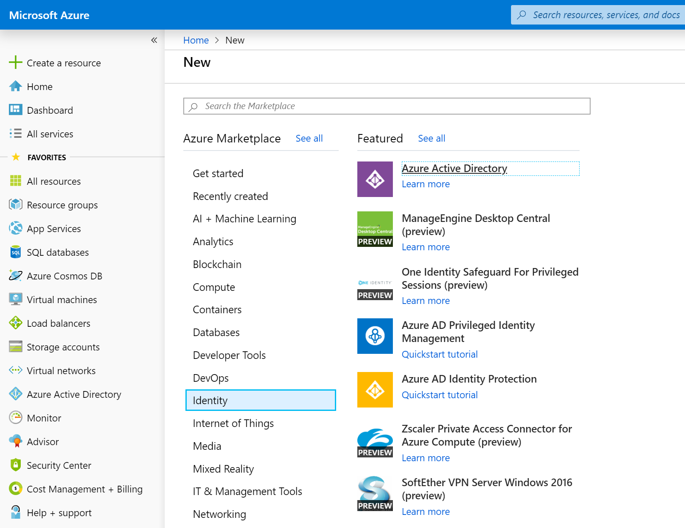
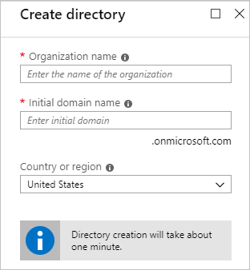

To use Azure Active Directory (Azure AD) as an authentication provider for your application, you must register that application in Azure AD. Suppose you want to use Azure AD as the authentication provider for your scheduling application. You have an ASP.NET Core web app, and you want to configure Azure AD as the identity provider.

Here, you'll create and configure an application registration.

## Create an Azure AD tenant

To start, you'll use the Azure portal to create a new Azure AD tenant.

1. Go to the [Azure portal](https://portal.azure.com/learn.docs.microsoft.com?azure-portal=true).

1. On the Azure portal menu or from the **Home** page, select **Create a resource**.

1. Select the **Identity** category, and then select **Azure Active Directory**.

    

1. Fill in the **Create directory** page with these values, and then select **Create**:

    | Box | Value |
    | --- | --- |
    | **Organization Name** | This is a friendly name for your tenant. For this exercise, use **Learn Module AAD Tenant**. |
    | **Initial domain name** | Enter a unique name for your tenant. |
    | **Country or region** | Select your preferred region. |

    

1. When directory creation is complete, select **The directory you just created** to manage your new directory.

## Register an application

Next, let's create a new registration in the Azure AD tenant for the web app. By registering the app, we mark the app as trusted by the tenant and specify critical configuration values.

1. On the **Azure Active Directory** page, under **Manage**, select **App registrations**.

1. In the **App registrations** pane, select **New registration**.

1. Fill in the **Create** page with these values, and then select **Register**. The URL `https://localhost:5000/signin-oidc` is a placeholder that you'll change after you've deployed your application.

    | Box | Value |
    | --- | --- |
    | Name | WebApp-OpenIDConnect-DotNet |
    | Supported account types | Accounts in this organizational directory only (Learn Module AAD Tenant) |
    | Redirect URI | `https://localhost:5000/signin-oidc` |

    

1. On the next page, note the **Application (client) ID** and **Directory(tenant) ID** values and record them for later. You'll need these to complete the configuration file for this project.

    

You've now configured the Azure AD tenant and performed the initial application registration to enable your application to communicate with your Azure AD tenant.
