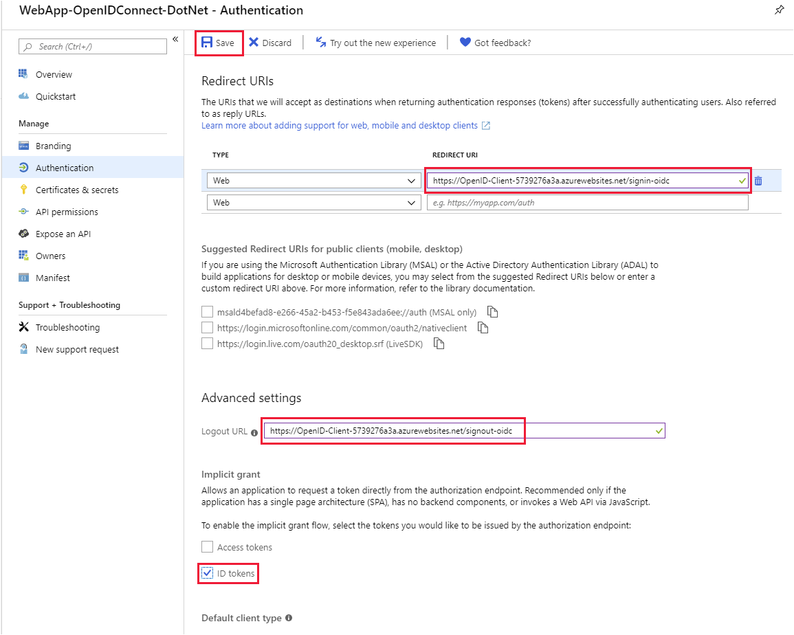
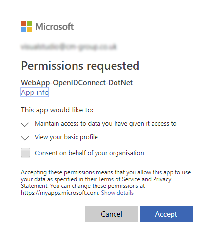

You can use the Azure CLI to deploy and test an application that uses OpenID Connect.

You previously registered the application in Azure Active Directory (Azure AD). You can now deploy and run the application and see if the authentication works.

In this exercise, you'll configure an application to authenticate users against your Azure AD tenant and deploy the web app.

## Configure and deploy the application that uses OpenID Connect to authenticate users

1. Run the following command in Azure Cloud Shell to clone the repo that contains the source for our app.

    ```bash
    git clone https://github.com/MicrosoftDocs/mslearn-secure-app-with-oidc-and-azure-ad.git
    ```

1. Move to the `mslearn-secure-app-with-oidc-and-azure-ad/app` folder.

    ```bash
    cd ~/mslearn-secure-app-with-oidc-and-azure-ad/app
    ```

1. Update the `appsettings.json` file to specify the configuration details to enable the application to communicate with Azure AD. Open this file in the code editor.

    ```bash
    code appsettings.json
    ```

1. Update the following fields as follows:

    |   |   |
    | - | - |
    | `<domain-name>` | Your Azure AD tenant name |
    | `<TenantID-GUID>` | The directory (tenant) ID that you noted in the previous exercise |
    | `<ClientID-GUID>` | The application (client) ID that you noted in the previous exercise |

    Your completed file will look similar to this:

    ```json
    {
      "AzureAd": {
        "Instance": "https://login.microsoftonline.com/",
        "Domain": "youraadtenant.onmicrosoft.com",
        "TenantId": "fa66e1ef-a41b-3bae-898d-842ab314cd78",
        "ClientId": "168a0d47-596a-4f92-a153-0408634caf9d",
        "CallbackPath": "/signin-oidc"
      },
      "Logging": {
        "LogLevel": {
          "Default": "Warning"
        }
      },
      "AllowedHosts": "*"
    }
    ```

1. Select **Ctrl+S** to save the file and **Ctrl+Q** to close the code editor.

1. Run the following command to build and deploy the initial web app.

    ```azurecli
    az webapp up \
        --resource-group <rgn>[Sandbox resource group]</rgn> \
        --location centralus \
        --sku F1 \
        --name educationapp-$RANDOM
    ```

1. Copy the URL from the command output. You'll need this address to configure the app registration.

## Configure the app registration

Now let's configure the app registration to authorize the URL of the web service:

1. In the [Azure portal](https://portal.azure.com/learn.docs.microsoft.com?azure-portal=true), select your user name in the upper-right corner, and then select **Switch directory**. Choose the **Learn Module AAD Tenant** directory that you created earlier. Sign in if you're prompted.

1. In the left pane, select **Azure Active Directory**.

1. Under **Manage**, select **App registrations**. Then select the **WebApp-OpenIDConnect-DotNet** registration that you created in the previous exercise.

1. Select **Authentication**.

1. Paste the URL from the Cloud Shell output in the previous section into the **Redirect URIs** area, and append the suffix `/signin-oidc`. Ensure that the URL uses HTTPS.

1. Delete the redirect URI `https://localhost:5000/signin-oidc`.

1. Paste the same URL into the **Logout URL** field, and append the suffix `/signout-oidc`.

1. Under **Implicit grant**, select **ID tokens**.

1. Select **Save**.

    

## Test the application

1. Open a new browser window and go to the web application's base URL.

1. When you're prompted, sign in. You'll be authenticated against your Azure AD tenant. The web app also requests some permissions, and you'll be prompted for your consent.

    

1. Select **Accept**. The web app then appears. The title bar includes your authenticated username, indicating that you've been successfully logged in with the identity in the Learn Module AAD Tenant directory.

You've now created both the application registration and the web app itself. You've configured these objects with the information that they need to locate each other.

Now that the web app is configured to authenticate against Azure AD, you can use that directory to manage all the user accounts that can access your application. The same accounts that grant users access to services like Microsoft 365 can now be used to access your app. Users have to remember only one set of credentials for both systems. Administrators have less work to do because each user has only one account.
