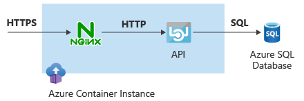

In your customer's current API, the traffic to the application API runs unencrypted. Your customer wants the application to use HTTPS instead of HTTP. You could update the application code to support HTTPS, but you don't have access to the original application.

An alternative is to use a *sidecar* container that enhances the application with the required SSL functionality without having to modify the application code. In this unit, you deploy a container group where one of the containers does secure socket layer (SSL) encryption and decryption, and the other container provides the actual application API functionality.

The sidecar pattern is a powerful concept in container-based architectures that lets you decompose application functionality into different container images that run together in the same container group. Sidecar containers can use different container images from the application container, even from different image repositories.

Containers in the same container group share some properties, such as the underlying network stack. In an Azure Container Instances container group, each container can take over part of the functionality the application requires.

> [!NOTE]
> The concept of container group is equivalent to *pods* in Kubernetes.

To offload secure socket layer (SSL) functionality, you use NGINX, an open-source web server, as a reverse proxy in front of the web application. Encrypted traffic enters the Azure Container Instances container group in the NGINX container, and NGINX hands over the decrypted traffic to the actual application container.



## Create NGINX configuration

Create a digital certificate for data encryption, and then create a file that contains the NGINX configuration. You don't need to understand every detail of the configuration file, but the following aspects are important:

- The `proxy_pass` property points to `http://127.0.0.1:8080`, the location of the application container. The NGINX and application containers inside the container group share the same network namespace, so they can communicate with each other by using the `localhost` or `127.0.0.1` address.
- The certificate file and key are read from the */etc/nginx/* directory, so you have to insert the generated certificate files into that directory later in this unit.
- The sidecar container listens to TCP port 443.

1. In Cloud Shell in the Azure portal, run the following code to get the digital certificate for data encryption. In this unit, you use a self-signed certificate, but in production you'd use a certificate generated by a certificate authority (CA).

    ```bash
    # Create self-signed certs
    openssl req -new -newkey rsa:2048 -nodes -keyout ssl.key -out ssl.csr -subj "/C=US/ST=WA/L=Redmond/O=AppDev/OU=IT/CN=contoso.com"
    openssl x509 -req -days 365 -in ssl.csr -signkey ssl.key -out ssl.crt
    ```

1. Run the following code to create the NGINX configuration file:

    ```bash
    # Create nginx.conf for SSL
    nginx_config_file=/tmp/nginx.conf
    cat <<EOF > $nginx_config_file
    user nginx;
    worker_processes auto;
    events {
      worker_connections 1024;
    }
    pid        /var/run/nginx.pid;
    http {
        server {
            listen [::]:443 ssl;
            listen 443 ssl;
            server_name localhost;
            ssl_protocols              TLSv1.2;
            ssl_ciphers                ECDHE-RSA-AES128-GCM-SHA256:ECDHE-ECDSA-AES128-GCM-SHA256:ECDHE-RSA-AES256-GCM-SHA384:ECDHE-ECDSA-AES256-GCM-SHA384:DHE-RSA-AES128-GCM-SHA256:DHE-DSS-AES128-GCM-SHA256:kEDH+AESGCM:ECDHE-RSA-AES128-SHA256:ECDHE-ECDSA-AES128-SHA256:ECDHE-RSA-AES128-SHA:ECDHE-ECDSA-AES128-SHA:ECDHE-RSA-AES256-SHA384:ECDHE-ECDSA-AES256-SHA384:ECDHE-RSA-AES256-SHA:ECDHE-ECDSA-AES256-SHA:DHE-RSA-AES128-SHA256:DHE-RSA-AES128-SHA:DHE-DSS-AES128-SHA256:DHE-RSA-AES256-SHA256:DHE-DSS-AES256-SHA:DHE-RSA-AES256-SHA:AES128-GCM-SHA256:AES256-GCM-SHA384:ECDHE-RSA-RC4-SHA:ECDHE-ECDSA-RC4-SHA:AES128:AES256:RC4-SHA:HIGH:!aNULL:!eNULL:!EXPORT:!DES:!3DES:!MD5:!PSK;
            ssl_prefer_server_ciphers  on;
            ssl_session_cache    shared:SSL:10m; # a 1mb cache can hold about 4000 sessions, so you can hold 40000 sessions
            ssl_session_timeout  24h;
            keepalive_timeout 75; # up from 75 secs default
            add_header Strict-Transport-Security 'max-age=31536000; includeSubDomains';
            ssl_certificate      /etc/nginx/ssl.crt;
            ssl_certificate_key  /etc/nginx/ssl.key;
            location / {
                proxy_pass http://127.0.0.1:8080 ;
                proxy_set_header Connection "";
                proxy_set_header Host \$host;
                proxy_set_header X-Real-IP \$remote_addr;
                proxy_set_header X-Forwarded-For \$remote_addr;
                proxy_buffer_size          128k;
                proxy_buffers              4 256k;
                proxy_busy_buffers_size    256k;
            }
        }
    }
    EOF
    ```

1. Run the following code to collect the files you want to pass on to the NGINX sidecar container in base64-encoded variables:

    ```bash
    # Encode to Base64
    nginx_conf=$(cat $nginx_config_file | base64)
    ssl_crt=$(cat ssl.crt | base64)
    ssl_key=$(cat ssl.key | base64)
    ```

## Deploy container group with NGINX sidecar

Complex configurations such as sidecars require using YAML instead of Azure CLI. Use YAML to define the container group.

1. Get the `networkProfile` ID. You can either copy the profile ID from the YAML generated in the previous unit, or look it up by using the `az network profile list` command:

    ```bash
    # Get network profile ID
    nw_profile_id=$(az network profile list -g $rg --query '[0].id' -o tsv) && echo $nw_profile_id
    ```

1. Create a YAML file that specifies the properties for the sidecar container by combining all the information you stored in variables. Be aware of the following points:

    - The SQL password passes as a secure environment variable, so it's not exposed after creating the container instance.
    - The NGINX container mounts the config volume in the */etc/nginx/* directory, where it expects to find the certificates. The volume contents are specified as secrets, which is why you base64-encoded the variables earlier.
    - The NGINX container exposes port 443, and the application container exposes port 8080. However, the container group only exposes port 443, making the application reachable only via the NGINX sidecar container.

    ```bash
    # Create YAML
    aci_yaml_file=/tmp/aci_ssl.yaml
    cat <<EOF > $aci_yaml_file
    apiVersion: 2019-12-01
    location: westus
    name: $aci_name
    properties:
      networkProfile:
        id: $nw_profile_id
      containers:
      - name: nginx
        properties:
          image: nginx
          ports:
          - port: 443
            protocol: TCP
          resources:
            requests:
              cpu: 1.0
              memoryInGB: 1.5
          volumeMounts:
          - name: nginx-config
            mountPath: /etc/nginx
      - name: sqlapi
        properties:
          image: erjosito/sqlapi:1.0
          environmentVariables:
          - name: SQL_SERVER_USERNAME
            value: $sql_username
          - name: SQL_SERVER_PASSWORD
            secureValue: $sql_password
          - name: SQL_SERVER_FQDN
            value: $sql_server_fqdn
          ports:
          - port: 8080
            protocol: TCP
          resources:
            requests:
              cpu: 1.0
              memoryInGB: 1
      volumes:
      - secret:
          ssl.crt: "$ssl_crt"
          ssl.key: "$ssl_key"
          nginx.conf: "$nginx_conf"
        name: nginx-config
      ipAddress:
        ports:
        - port: 443
          protocol: TCP
        type: Private
      osType: Linux
    tags: null
    type: Microsoft.ContainerInstance/containerGroups
    EOF
    ```

1. After you create the YAML file with all the required configuration, run the following Azure CLI command to create the container instance:

    ```azurecli
    # Deploy ACI
    az container create -g $rg --file $aci_yaml_file
    ```

1. To test the configuration, extract the private IP address of the container instance and access it via HTTPS from the test VM. Use the flag `-k` with `curl` so it disables certificate validation, because this unit uses a self-signed certificate.

    ```bash
    # Test
    aci_ip=$(az container show -n $aci_name -g $rg --query 'ipAddress.ip' -o tsv) && echo $aci_ip
    ssh -n -o BatchMode=yes -o StrictHostKeyChecking=no $vm_pip "curl -ks https://$aci_ip/api/healthcheck"
    ```

    The `api/healthcheck` endpoint of the API should respond with `OK`.

