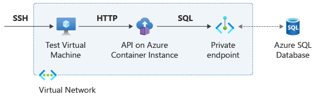

You can normally access Azure platform-as-a-service (PaaS) services that have a public endpoint by using a public IP address over the internet. Many Azure services also support creating private endpoints, where the Azure service is only reachable from within a specific virtual network.

The Azure SQL database behind your customer's API is exposed with a public IP address. The database is protected by Azure SQL firewall rules so that only the Azure Container Instances container can access it. However, for increased security, you can further restrict communication to use only private IP addressing between the API and the database.

In this unit, you use Azure Private Link to create a private endpoint for the application's Azure SQL database, and make sure that the container can reach the endpoint. The Domain Name System (DNS) plays a critical role in the required functionality, because the container hosting the application has to resolve the Azure SQL Fully Qualified Domain Name (FQDN) to its private IP instead of its public IP.

The following diagram shows an overview of the network connections for this scenario:



## Create the private endpoint

Create a new subnet in the virtual network, and create an Azure SQL Database private endpoint in that subnet.

1. In Cloud Shell in the Azure portal, run the following code to create the endpoint:

   ```azurecli
   # Create new subnet for the SQL private endpoint
   sql_subnet_name=sql
   sql_subnet_prefix=192.168.3.0/24
   az network vnet subnet create --resource-group $rg --vnet-name $vnet_name \
       --name $sql_subnet_name --address-prefix $sql_subnet_prefix \
       --disable-private-endpoint-network-policies true
   # SQL Server private endpoint
   sql_endpoint_name=sqlep
   sql_server_id=$(az sql server show --name $sql_server_name --resource-group $rg --output tsv --query id)
   az network private-endpoint create --name $sql_endpoint_name --resource-group $rg \
       --vnet-name $vnet_name --subnet $sql_subnet_name \
       --private-connection-resource-id $sql_server_id --group-id sqlServer \
       --connection-name sqlConnection
   ```

1. Azure represents private endpoints as Network Interface Cards (NICs). Verify the IP address assigned to the private endpoint by using the `az network nic` command.

   ```bash
   # Get endpoint's private IP address
   sql_nic_id=$(az network private-endpoint show --name $sql_endpoint_name \
       --resource-group $rg --query 'networkInterfaces[0].id' -o tsv)
   sql_endpoint_ip=$(az network nic show --ids $sql_nic_id \
       --query 'ipConfigurations[0].privateIpAddress' -o tsv) && echo $sql_endpoint_ip
   ssh -n -o BatchMode=yes -o StrictHostKeyChecking=no $vm_pip "nslookup ${sql_server_name}.database.windows.net"
   ```

## Create a private DNS zone

In the results of the preceding `nslookup` command, you can see that the FQDN of the Azure SQL database still resolves to its public IP address inside the virtual network. To force the resources in the virtual network to use the private IP address of the Azure SQL database, you can create a private DNS zone.

Azure SQL databases with configured private links use the intermediate domain `privatelink.database.windows.net`. You create a private zone for this domain that has an A-record for the IP address of the Azure SQL private endpoint.

1. Run the following `az network private-endpoint dns-zone-group create` command to connect the private endpoint with the private DNS zone and automatically create the A-record with the correct IP address.

   ```azurecli
   # Create Azure DNS private zone and record
   dns_zone_name=privatelink.database.windows.net
   az network private-dns zone create --name $dns_zone_name --resource-group $rg 
   az network private-dns link vnet create --resource-group $rg --zone-name $dns_zone_name \
       --name myDnsLink --virtual-network $vnet_name --registration-enabled false
   az network private-endpoint dns-zone-group create --endpoint-name $sql_endpoint_name \
       --resource-group $rg --name zonegroup --zone-name zone1 --private-dns-zone $dns_zone_name
   ssh -n -o BatchMode=yes -o StrictHostKeyChecking=no $vm_pip "nslookup ${sql_server_name}.database.windows.net"
   ```

   The virtual machine (VM) in the virtual network should now resolve the FQDN for the Azure SQL database to the private IP address of the private endpoint.

   > [!NOTE]
   > If you deleted the container instances from the previous units, you could recreate them by using the same YAML files as before. Nothing has changed for the container instances, because they still access the database by using the same FQDN.

1. Use the `api/healthcheck` endpoint to verify that the container instance is up and running. Verify the correct name resolution to a private IP address with the `api/dns` endpoint, and verify database reachability with the `api/sqlversion` and `api/sqlsrcip` endpoints.

   ```bash
   # Test
   aci_ip=$(az container show --name $aci_name --resource-group $rg \
       --query 'ipAddress.ip' --output tsv) && echo $aci_ip
   ssh -n -o BatchMode=yes -o StrictHostKeyChecking=no $vm_pip "curl -ks https://$aci_ip/api/healthcheck"
   ssh -n -o BatchMode=yes -o StrictHostKeyChecking=no $vm_pip "curl -ks https://$aci_ip/api/dns?fqdn=${sql_server_name}.database.windows.net"
   ssh -n -o BatchMode=yes -o StrictHostKeyChecking=no $vm_pip "curl -ks https://$aci_ip/api/sqlversion"
   ssh -n -o BatchMode=yes -o StrictHostKeyChecking=no $vm_pip "curl -ks https://$aci_ip/api/sqlsrcip"
   ```

   The output of the preceding commands shows that the Azure SQL API now sees the container instance using its private IP address.

> [!NOTE]
> Some Azure services automatically disable their public endpoint when there's a private endpoint, but not all. In Azure SQL Database, the public endpoint is still active even after you configure the private endpoint. You need to configure the Azure SQL firewall settings further to disable database access over the internet. Since the firewall is only used to protect the public endpoint, you don't have to change the firewall rules for this exercise.

## Clean up resources

Delete the container instances by deleting their Azure resource group before you proceed to the next unit.

```azurecli
# Clean up unit 5
az container delete --name $aci_name --resource-group $rg --yes
```

