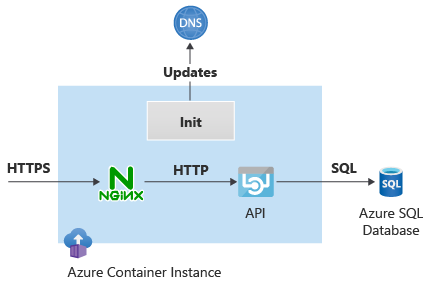

Sometimes you need to do certain tasks before an application starts. For example, you might need to configure certain services to accept inbound connectivity from the container, or inject secrets from Azure Key Vault into a volume. You can implement these prerequisite validation or initialization tasks in Initialization (init) containers.

Init containers are an example of the sidecar pattern you used in a previous unit, but init containers run before any other container in the container group starts. The actual application containers in the application group only start after any defined init containers successfully complete their tasks. Azure Container Instances init containers are the same concept as Kubernetes init containers.

Your customer wants to reach their API by using a Fully Qualified Domain Name (FQDN) instead of an IP address. They also want to make sure that the FQDN doesn't change if they recreate the container. You can use an init container to provide this functionality. In this unit, you use an init container to update the Domain Name System (DNS) so customers can always access the API by using a domain name instead of an IP address.

The following diagram shows the topology of the Container Instances init container:



The init container retrieves the IP address allocated to the application container and updates the DNS entry that API clients use to reach the container. The init container and the application container share the same network stack, so the IP address visible to the init container is the same one that the application container uses.

## Create the initialization script and DNS zone

First, you create an Azure service principal that the init container uses to retrieve the application's IP address and update the DNS. In this example, you assign the service principal **Contributor** access for simplicity. In production environments, you might want to be more restrictive.

1. In Azure Cloud Shell in the Azure portal, run the following code to crate the service principal:

    ```bash
    # Create SP
    scope=$(az group show -n $rg --query id -o tsv)
    new_sp=$(az ad sp create-for-rbac --scopes $scope --role Contributor --name acilab -o json)
    sp_appid=$(echo $new_sp | jq -r '.appId') && echo $sp_appid
    sp_tenant=$(echo $new_sp | jq -r '.tenant') && echo $sp_tenant
    sp_password=$(echo $new_sp | jq -r '.password')
    ```
    
1. Create the Azure private DNS zone for application clients to access the container instance, and associate the zone to the virtual network.

    ```azurecli
    # Create Azure DNS private zone and records
    dns_zone_name=contoso.com
    az network private-dns zone create -n $dns_zone_name -g $rg 
    az network private-dns link vnet create -g $rg -z $dns_zone_name -n contoso --virtual-network $vnet_name --registration-enabled false
    ```
    
    >[!NOTE]
    > This DNS zone is different from the DNS zone you created in the previous unit, which the container instance used to access Azure SQL Database.

1. There are many ways to inject a script into an init container. In this case, you use an Azure Files share to store the script. Run the following code to create the initialization script, create an Azure Files share, and upload the script into the share.

    ```azurecli
    # Create script for init container
    storage_account_name="acilab$RANDOM"
    az storage account create -n $storage_account_name -g $rg --sku Standard_LRS --kind StorageV2
    storage_account_key=$(az storage account keys list --account-name $storage_account_name -g $rg --query '[0].value' -o tsv)
    az storage share create --account-name $storage_account_name --account-key $storage_account_key --name initscript
    init_script_filename=init.sh
    init_script_path=/tmp/
    cat <<EOF > ${init_script_path}${init_script_filename}
    echo "Logging into Azure..."
    az login --service-principal -u \$SP_APPID -p \$SP_PASSWORD --tenant \$SP_TENANT
    echo "Finding out IP address..."
    my_private_ip=\$(az container show -n \$ACI_NAME -g \$RG --query 'ipAddress.ip' -o tsv) && echo \$my_private_ip
    echo "Creating DNS record..."
    az network private-dns record-set a create -n \$HOSTNAME -z \$DNS_ZONE_NAME -g \$RG
    az network private-dns record-set a add-record --record-set-name \$HOSTNAME -z \$DNS_ZONE_NAME -g \$RG -a \$my_private_ip
    EOF
    az storage file upload --account-name $storage_account_name --account-key $storage_account_key -s initscript --source ${init_script_path}${init_script_filename}
    ```
    
    The initialization script uses Azure CLI to run the commands that find out the IP address of the container instance and create an A-record in the private DNS zone. The script authenticates by using the service principal application ID and secret that it expects to find as environment variables.

## Deploy the container group with init container

You can now create a YAML file that builds on the ones you used in previous units. Note these items in the following YAML code:

- There's now a `initContainers` section.
- The `initContainer` uses the `microsoft/azure-cli:latest` image, which already has Azure CLI installed.
- The init container runs a script stored in the */mnt/init/* folder, which is mounted from an Azure Files volume.
- The resource group, container instance name, and service principal credentials are passed as environment variables.
- The service principal secret is passed as a secure environment variable.
- The rest of the container YAML definitions are unchanged from the previous units.
    
1. Create the YAML file by running the following code:

    ```bash
    # Create YAML
    aci_yaml_file=/tmp/acilab.yaml
    cat <<EOF > $aci_yaml_file
    apiVersion: 2019-12-01
    location: westus
    name: $aci_name
    properties:
      networkProfile:
        id: $nw_profile_id
      initContainers:
      - name: azcli
        properties:
          image: microsoft/azure-cli:latest
          command:
          - "/bin/sh"
          - "-c"
          - "/mnt/init/$init_script_filename"
          environmentVariables:
          - name: RG
            value: $rg
          - name: SP_APPID
            value: $sp_appid
          - name: SP_PASSWORD
            secureValue: $sp_password
          - name: SP_TENANT
            value: $sp_tenant
          - name: DNS_ZONE_NAME
            value: $dns_zone_name
          - name: HOSTNAME
            value: $aci_name
          - name: ACI_NAME
            value: $aci_name
          volumeMounts:
          - name: initscript
            mountPath: /mnt/init/
      containers:
      - name: nginx
        properties:
          image: nginx
          ports:
          - port: 443
            protocol: TCP
          resources:
            requests:
              cpu: 1.0
              memoryInGB: 1.5
          volumeMounts:
          - name: nginx-config
            mountPath: /etc/nginx
      - name: sqlapi
        properties:
          image: erjosito/sqlapi:1.0
          environmentVariables:
          - name: SQL_SERVER_FQDN
            value: $sql_server_fqdn
          - name: SQL_SERVER_USERNAME
            value: $sql_username
          - name: SQL_SERVER_PASSWORD
            secureValue: $sql_password
          ports:
          - port: 8080
            protocol: TCP
          resources:
            requests:
              cpu: 1.0
              memoryInGB: 1
          volumeMounts:
      volumes:
      - secret:
          ssl.crt: "$ssl_crt"
          ssl.key: "$ssl_key"
          nginx.conf: "$nginx_conf"
        name: nginx-config
      - name: initscript
        azureFile:
          readOnly: false
          shareName: initscript
          storageAccountName: $storage_account_name
          storageAccountKey: $storage_account_key
      ipAddress:
        ports:
        - port: 443
          protocol: TCP
        type: Private
      osType: Linux
    tags: null
    type: Microsoft.ContainerInstance/containerGroups
    EOF
    ```
    
1. Verify the generated YAML file to check that variable substitution worked correctly.

    ```azurecli
    # Check YAML file
    more $aci_yaml_file
    ```
    
1. Create the container instances. These instances take a while longer to create because the init container runs before the application and NGINX containers start.

    ```azurecli
    # Deploy ACI
    az container create -g $rg --file $aci_yaml_file
    ```
    
1. Use the SQL API endpoints to test that the container is reachable. You use the domain name to access the container, not its IP address.

    ```azurecli
    # Test
    aci_fqdn=${aci_name}.${dns_zone_name} && echo $aci_fqdn
    ssh -n -o BatchMode=yes -o StrictHostKeyChecking=no $vm_pip "nslookup $aci_fqdn"
    ssh -n -o BatchMode=yes -o StrictHostKeyChecking=no $vm_pip "curl -ks https://$aci_fqdn/api/healthcheck"
    ssh -n -o BatchMode=yes -o StrictHostKeyChecking=no $vm_pip "curl -ks https://$aci_fqdn/api/sqlversion"
    ssh -n -o BatchMode=yes -o StrictHostKeyChecking=no $vm_pip "curl -ks https://$aci_fqdn/api/sqlsrcip"
    ```
    
1. You can inspect the individual Container Instances logs for each container. For example, run the following code to access the init container logs:

    ```azurecli
    # Init container logs
    az container logs -n $aci_name -g $rg --container-name azcli
    ```
    
1. To avoid continued charges, delete the Azure resource group to clean up all the resources you created for this unit and module.

    ```azurecli
    # Clean up module
    az group delete -n $rg -y --no-wait
    ```

