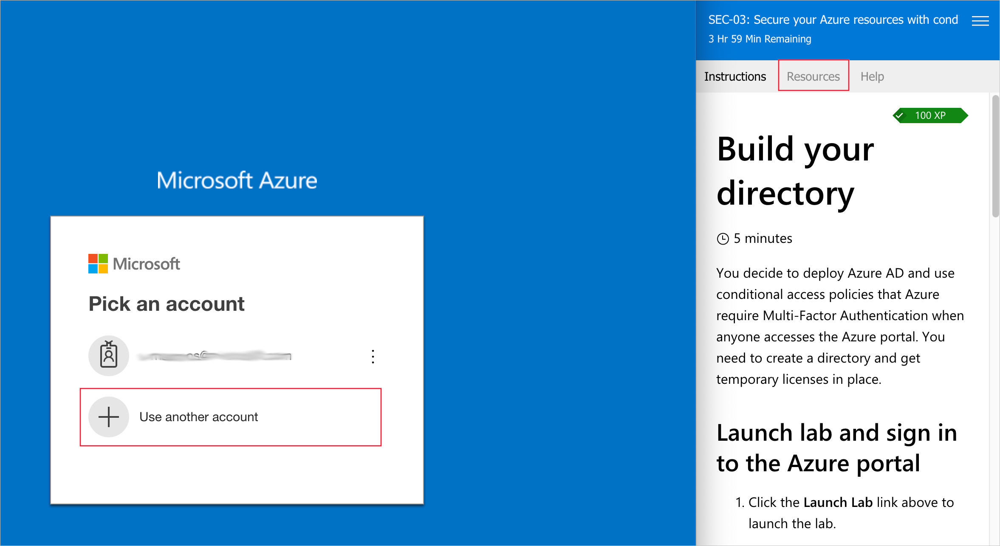
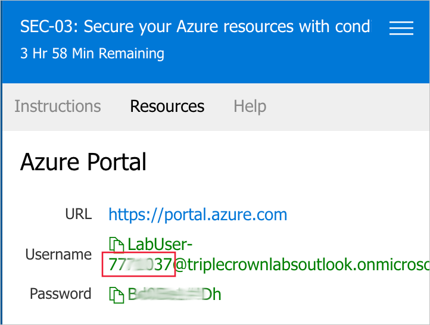
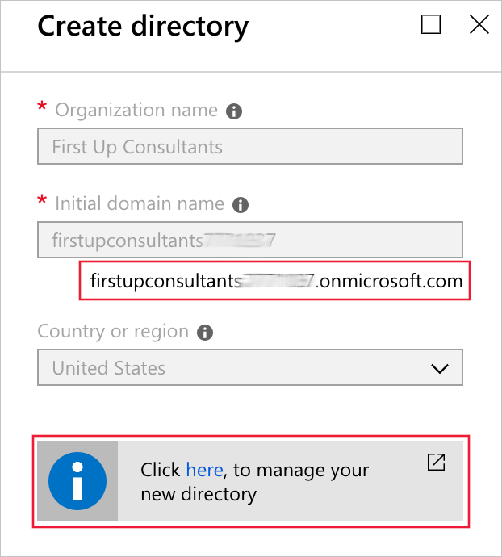
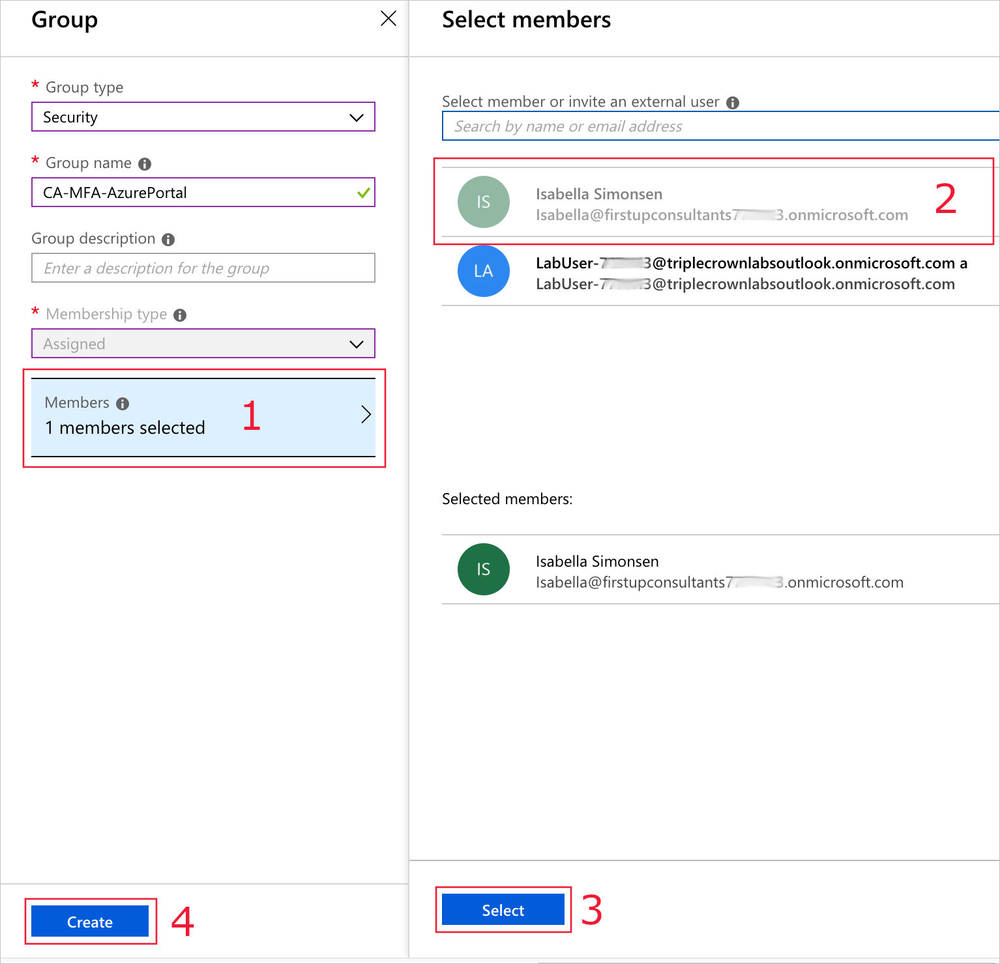

You decide to deploy Azure AD and use conditional access policies that Azure require Multi-Factor Authentication when anyone accesses the Azure portal. You need to create a directory and get temporary licenses in place.

## Launch lab and sign in to the Azure portal

1. Click the link above to launch the lab.

> [!NOTE]
> After launching the lab, the username and password you need to sign in with is located on the **Resources** tab next to the instructions.

Make a note of the number at the end of the username, as shown below. You will need that number later in this exercise.

If at any time during this lab when you want to start over, you can exit the Lab Sandbox and create a fresh one with the link above.

## Create a directory

You will create a new Active Directory for First Up Consultants in the Sandbox Portal, where you can test without fear of impacting production users. If you'd prefer doing this exercise on your own Azure account and subscription, log into the [Azure portal](https://portal.azure.com?azure-portal=true) now. Be advised that doing so may impact your existing account and subscription billing. Choose this option only if you are certain of the implications. We recommend using the Lab Sandbox environment.

1. In the left navigation pane, click **Create a resource** > **Identity** > **Azure Active Directory**.

1. In the **Create directory** blade, provide the following values for the **Organization name** and **Initial domain name**:

   1. Organization Name: `First Up Consultants`.
   2. Initial Domain Name: `firstupconsultants<XXXXXXX>` where <XXXXXXX> is the number you previously made a note of that appears after the username, as shown in the screenshot above.

1. Wait for the directory to be created. Make a note of the full domain name, as shown below. Click the link to switch to the new directory.

## Get trial licenses

To use features like conditional access and Multi-Factor Authentication, you will need at least a trial license. The following steps walk you through how to enable a trial license:

1. In the Azure AD **Overview** pane, click the **Start a free trial** link.

1. Under the item **Azure AD Premium P2**, click **Free trial**, and then click **Activate**.

## Create a test user

We're going to need to test this out with a user. Isabella Simonsen (another member of your team) has volunteered to help you out. She will need an account in the directory, so we will go through the steps to create her account.

1. Browse to **Azure Active Directory** > **Users**.

1. Click **New user**.

1. Create a user named **Isabella Simonsen** with a user name of:

   `Isabella@firstupconsultants<XXXXXXX>.onmicrosoft.com`

   Match the domain after the @ with the domain you created and noted in the *Create a directory* section above.

1. Check the box to **Show Password** for the user. Make a note of the password so you can use it later when testing.

1. Click **Create**.

## Create a pilot group

We will be assigning the policy that we create to a group of users, but we need to create a group for this policy. The following steps help you create a security group for the pilot deployment.

1. Browse to **Azure Active Directory** > **Groups**.

1. Click **New group**.

1. Group type **Security**.

1. Group name **CA-MFA-AzurePortal**.

1. Membership type **Assigned** and click the Members link (labeled "1" in the diagram below).

1. Select the user that we created in the previous step (labeled "2" in the diagram below) and choose **Select** (labeled "3).

1. Click **Create** (labeled "4" in the diagram below).

In this unit, you learned how to create a trial licensed directory, a test user, and a pilot group in the Azure portal.