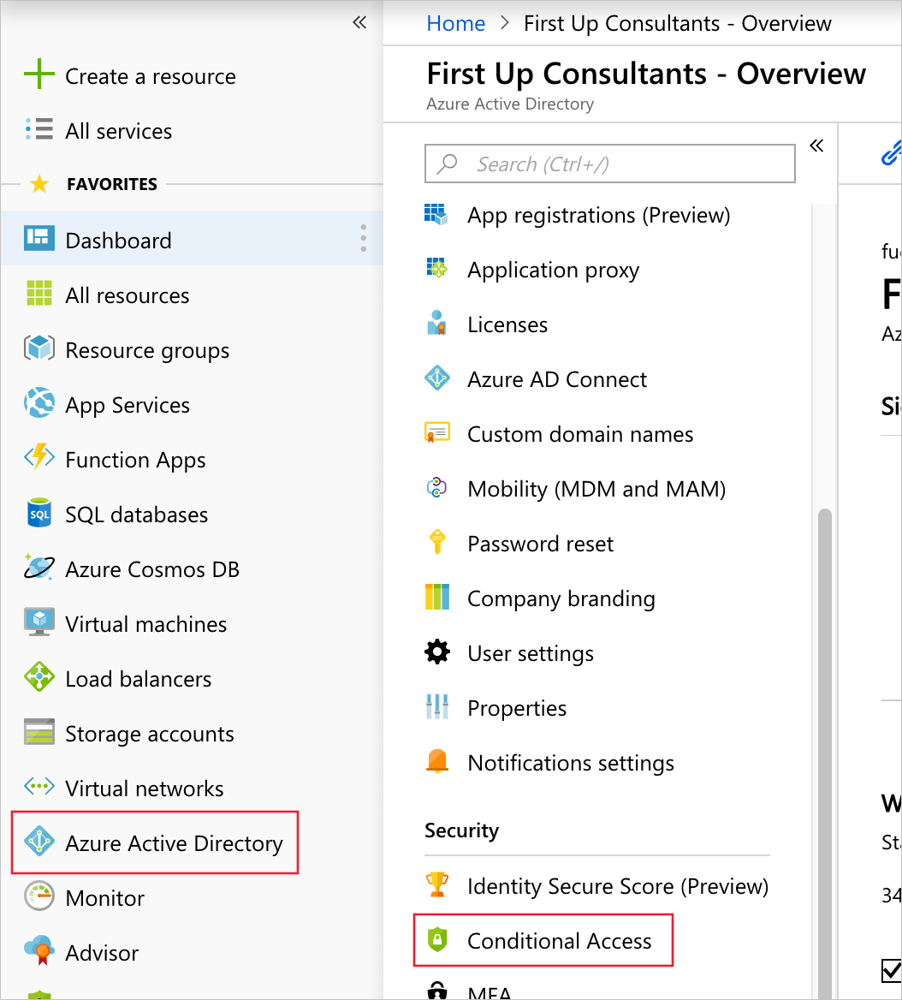

In the previous exercise, we enabled trial licenses, created a directory, created a user, and created a group to test our solution. In this unit, we will create our conditional access rule to require Azure Multi-Factor Authentication for the Azure portal.

## Enable conditional access-based Multi-Factor Authentication

Conditional access allows administrators to configure when they do or do not want something to happen. They can use multiple rules in parallel to grant or deny access to resources. Here's the rule that we need to create:

**When accessing the Azure portal - Require multi-factor authentication**

The steps that follow will walk you through the process to create a conditional access rule to require users to perform multi-factor authentication when they access the Azure portal.

1. Browse to **Azure Active Directory**, and in the resulting blade locate and select **Conditional access** in the **Security** subsection.

1. Click **New policy**. This will open a new blade for creating the new policy.

1. Name the policy **Require MFA for Azure portal**.

1. Under **Assignments** select **Users and groups** to open the next blade.

1. Click **Select users and groups** and then **Select** below it. This will open the selection blade.

1. Select the group that we created in the previous unit, **CA-MFA-AzurePortal**, then click the **Select** button at the bottom. This will close the selection blade.

1. Click the **Done** button to complete this step and close the blade. You should once again see the new policy blade you opened in the second step above.

1. Under **Assignments** select **Cloud apps** to open the next blade.

1. Click **Select apps** and then **Select** below it. This will open the selection blade.

1. Select **Microsoft Azure Management**, and then the **Select** button at the bottom. This will close the selection blade.

1. Click the **Done** button to complete this step and close the blade. You should once again see the new policy blade you opened in the second step above.

1. Under **Access controls** select **Grant** to open the next blade.

1. Click **Grant access** and then **Require multi-factor authentication**. Click the **Select** button to complete this step and close the blade. You should once again see the new policy blade you opened in the second step above.

1. Set **Enable policy** to **On**.

1. Click **Create**. If the **Create** button is not enabled, review the previous steps to ensure you've completed them all correctly.

In this unit, you learned how to create a conditional access rule for a previously defined group and/or user(s). The rule requires Multi-Factor Authentication when accessing the Azure portal.