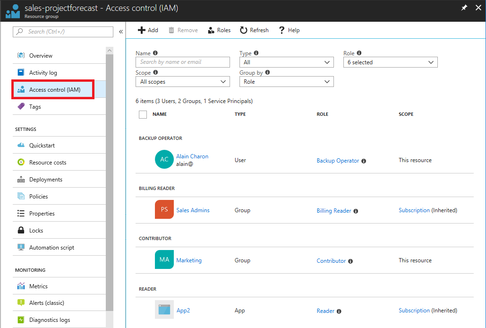
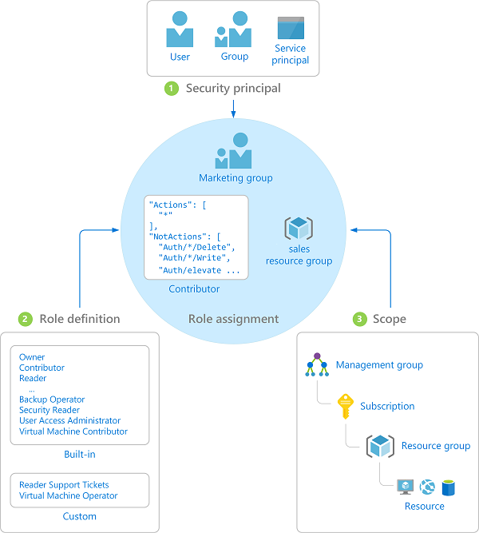

## Motivation

Suppose you need to manage access to resources in Azure for the developer, engineering, and marketing teams. You’ve started to receive access requests and you need to quickly come up to speed on how access management for resources works in Azure.

In this unit, you learn:

> [!div class="checklist"]
> * What RBAC looks like in the Azure portal
> * How RBAC enables you to control access to Azure resources
> * What a role is
> * The three elements that make up a role assignment

## What is RBAC?

Role-based access control (RBAC) is an authorization system built on [Azure Resource Manager](/azure/azure-resource-manager/resource-group-overview) that provides fine-grained access management of resources in Azure. Azure has lots of resources, but a few examples include virtual machines, websites, networks, and storage.

## What can I do with RBAC?

Here are some examples of what you can do with RBAC:

- Allow one user to manage virtual machines in a subscription and another user to manage virtual networks
- Allow a DBA group to manage SQL databases in a subscription
- Allow a user to manage all resources in a resource group, such as virtual machines, websites, and subnets
- Allow an application to access all resources in a resource group

## What does RBAC look like in the Azure portal?

In several areas in the Azure portal, you'll see a blade named **Access control (IAM)**, also known as identity and access management. On this blade, you can see who has access in that area and their role. Using this same blade, you can grant or remove access.

The following shows an example of the Access control (IAM) blade for a resource group. In this example, Alain Charon has the Backup Operator role on this resource group.

## How does RBAC work?

The way you control access to resources using RBAC is to create role assignments. This is a key concept to understand – it’s how permissions are enforced. To create a role assignment, you need three elements: a security principal, a role definition, and a scope. You can think of these elements as who, what, and where.

### 1. Security principal (who)

A *security principal* is just a fancy name for a user, group, or application that you want to grant access to.

### 2. Role definition (what can they do)

A *role definition* is a collection of permissions. It's sometimes just called a role. A role definition lists the permissions that can be performed, such as read, write, and delete. Roles can be high-level, like Owner, or specific, like Virtual Machine Contributor.

Azure includes several [built-in roles](/azure/role-based-access-control/built-in-roles) that you can use. The following lists four fundamental built-in roles.

- [Owner](/azure/role-based-access-control/built-in-roles#owner) - Has full access to all resources including the right to delegate access to others.
- [Contributor](/azure/role-based-access-control/built-in-roles#contributor) - Can create and manage all types of Azure resources but can’t grant access to others.
- [Reader](/azure/role-based-access-control/built-in-roles#reader) - Can view existing Azure resources.
- [User Access Administrator](/azure/role-based-access-control/built-in-roles#user-access-administrator) - Lets you manage user access to Azure resources.

If the built-in roles don't meet the specific needs of your organization, you can create your own [custom roles](/azure/role-based-access-control/custom-roles).

### 3. Scope (where)

*Scope* is where the access applies to. This is helpful if you want to make someone a Website Contributor, but only for one resource group.

In Azure, you can specify a scope at multiple levels: management group, subscription, resource group, or resource. Scopes are structured in a parent-child relationship. When you grant access at a parent scope, those permissions are inherited to the child scopes. For example, if you assign the Contributor role to a group at the subscription scope, that role is inherited to all resource groups and resources in the subscription.

### Role assignment

Once you have determined the who, what, and where, you can combine those elements to grant access. A *role assignment* is the process of binding a role to a security principal at a particular scope for the purpose of granting access. To grant access you create a role assignment. To revoke access, you remove a role assignment.

The following example shows how the Marketing group has been granted the Contributor role at the sales resource group scope.

## RBAC is allow only with no deny

Currently, RBAC is an allow-only model with no deny. What this means is that when you are assigned a role, RBAC allows you to perform certain actions, such as read, write, or delete. RBAC does not explicitly deny access. So, if one role assignment grants you read permissions to a resource group and different role assignment grants you write permissions to the same resource group, you will have write permissions on that resource group.

RBAC has something called `NotActions` permissions. `NotActions` is not a deny rule – it is simply a convenient way to create a set of allowed permissions when specific permissions need to be excluded.

## RBAC is being extended to data permissions (Preview)

Using RBAC, you can specify management permissions in Azure. Here are some examples of management permissions in Azure:

- Manage access to a storage account
- Create, update, or delete a blob container
- Delete a resource group and all of its resources

Management access is not inherited to the data. Previously, RBAC was not used for data permissions. Authorization for data permissions varied across services. The same RBAC authorization model used for management permissions is being extended to data permissions (currently in preview). Here are some data permissions that can now be controlled using RBAC:

- Read a list of blobs in a container
- Write a storage blob in a container
- Delete a message in a queue

## Other roles in Azure

As you are working with Azure, you might encounter other roles, such as Global Administrator, Account Administrator, and several others. Many of these other roles are used for Azure Active Directory administration, such as creating users, resetting passwords, managing user licenses, and managing domains. There's more information that you can read if you want to learn the details, but the important thing to remember is that RBAC roles are used to manage access to Azure resources.

## Summary

In this unit, you learned the basics of how RBAC works. Now that you have the RBAC fundamentals out of the way, you can get your hands dirty by starting to use RBAC. The easiest way to get started is to use the Azure portal. The rest of this module has you perform hands-on exercises related to RBAC.
