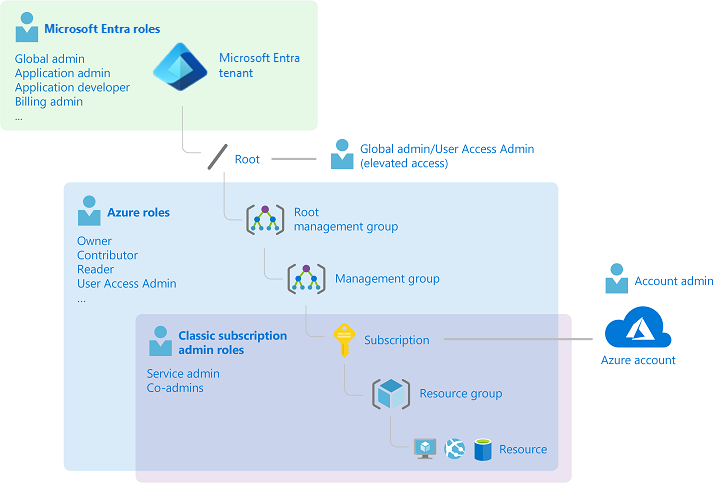
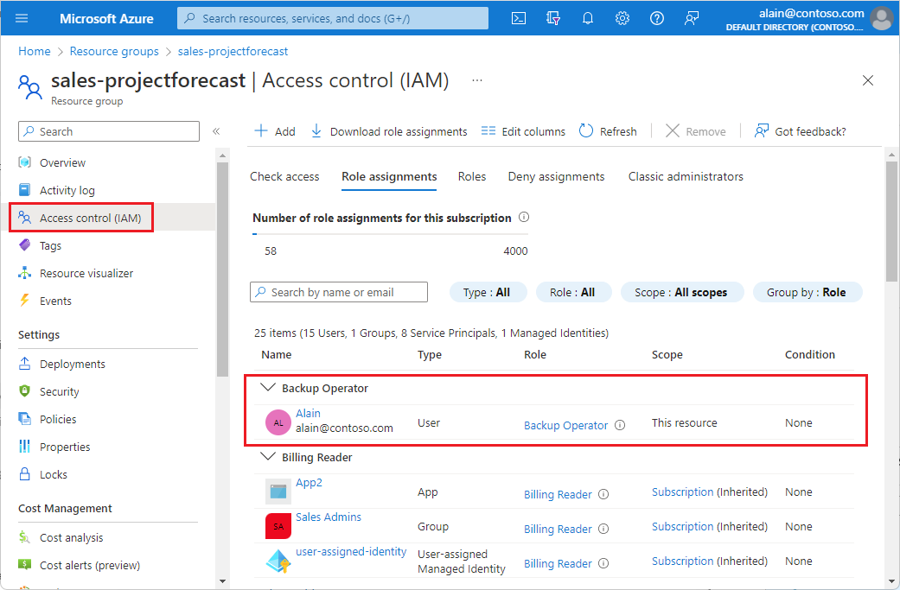
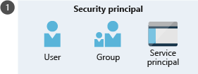
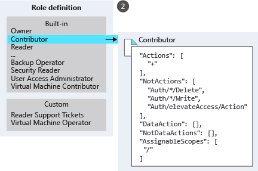
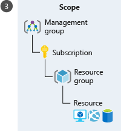

When it comes to identity and access, most organizations that are considering using the public cloud are concerned about two things:

1. Ensuring that when people leave the organization, they lose access to resources in the cloud.
1. Striking the right balance between autonomy and central governance; for example, giving project teams the ability to create and manage virtual machines in the cloud while centrally controlling the networks those VMs use to communicate with other resources.

Azure Active Directory (Azure AD) and Azure role-based access control (Azure RBAC) work together to make it simple to carry out these goals.

## Azure subscriptions

First, remember that each Azure subscription is associated with a single Azure AD directory. Users, groups, and applications in that directory can manage resources in the Azure subscription. The subscriptions use Azure AD for single sign-on (SSO) and access management. You can extend your on-premises Active Directory to the cloud by using **Azure AD Connect**. This feature allows your employees to manage their Azure subscriptions by using their existing work identities. When you disable an on-premises Active Directory account, it automatically loses access to all Azure subscriptions connected with Azure AD.

## What's Azure RBAC?

Azure role-based access control (Azure RBAC) is an authorization system built on Azure Resource Manager that provides fine-grained access management for resources in Azure. With Azure RBAC, you can grant the exact access that users need to do their jobs. For example, you can use Azure RBAC to let one employee manage virtual machines in a subscription while another manages SQL databases within the same subscription.

The following video describes Azure RBAC in detail:

> [!VIDEO https://www.microsoft.com/videoplayer/embed/RE2yEvk]

You can grant access by assigning the appropriate Azure role to users, groups, and applications at a certain scope. The scope of a role assignment can be a management group, subscription, a resource group, or a single resource. A role assigned at a parent scope also grants access to the child scopes contained within it. For example, a user with access to a resource group can manage all the resources it contains, like websites, virtual machines, and subnets. The Azure role that you assign dictates what resources the user, group, or application can manage within that scope.

The following diagram depicts how the classic subscription administrator roles, Azure roles, and Azure AD roles are related at a high level. Roles assigned at a higher scope, like an entire subscription, are inherited by child scopes, like service instances.

In the preceding diagram, a subscription is associated with only one Azure AD tenant. Also note that a resource group can have multiple resources, but it's associated with only one subscription. Although it's not obvious from the diagram, a resource can be bound to only one resource group.

## What can I do with Azure RBAC?

Azure RBAC allows you to grant access to Azure resources that you control. Suppose you need to manage access to resources in Azure for the development, engineering, and marketing teams. You’ve started to receive access requests, and you need to quickly learn how access management works for Azure resources.

Here are some scenarios you can implement with Azure RBAC:

- Allow one user to manage virtual machines in a subscription and another user to manage virtual networks
- Allow a database administrator group to manage SQL databases in a subscription
- Allow a user to manage all resources in a resource group, such as virtual machines, websites, and subnets
- Allow an application to access all resources in a resource group

## Azure RBAC in the Azure portal

In several areas in the Azure portal, you'll see a pane named **Access control (IAM)**, also known as *identity and access management*. On this pane, you can see who has access to that area and their role. Using this same pane, you can grant or remove access.

The following shows an example of the Access control (IAM) pane for a resource group. In this example, Alain has been assigned the Backup Operator role for this resource group.

## How does Azure RBAC work?

You can control access to resources using Azure RBAC by creating role assignments, which control how permissions are enforced. To create a role assignment, you need three elements: a security principal, a role definition, and a scope. You can think of these elements as "who," "what," and "where."

### 1. Security principal (who)

A *security principal* is just a fancy name for a user, group, or application to which you want to grant access.

### 2. Role definition (what you can do)

A *role definition* is a collection of permissions. It's sometimes just called a role. A role definition lists the permissions the role can perform, such as read, write, and delete. Roles can be high-level, like Owner, or specific, like Virtual Machine Contributor.

Azure includes several built-in roles that you can use. The following lists four fundamental built-in roles:

- **Owner**: Has full access to all resources, including the right to delegate access to others
- **Contributor**: Can create and manage all types of Azure resources, but can’t grant access to others
- **Reader**: Can view existing Azure resources
- **User Access Administrator**: Lets you manage user access to Azure resources

If the built-in roles don't meet the specific needs of your organization, you can create your own custom roles.

### 3. Scope (where)

*Scope* is the level where the access applies. This is helpful if you want to make someone a Website Contributor, but only for one resource group.

In Azure, you can specify a scope at multiple levels: management group, subscription, resource group, or resource. Scopes are structured in a parent-child relationship. When you grant access at a parent scope, those permissions are inherited by the child scopes. For example, if you assign the Contributor role to a group at the subscription scope, that role is inherited by all resource groups and resources in the subscription.

### Role assignment

Once you have determined the who, what, and where, you can combine those elements to grant access. A *role assignment* is the process of binding a role to a security principal at a particular scope for the purpose of granting access. To grant access, you'll create a role assignment. To revoke access, you'll remove a role assignment.

The following example shows how the Marketing group has been assigned the Contributor role at the sales resource group scope.

## Azure RBAC is an allow model

Azure RBAC is an *allow* model. This means that when you're assigned a role, Azure RBAC allows you to perform certain actions, such as read, write, or delete. So, if one role assignment grants you read permissions to a resource group and a different role assignment grants you write permissions to the same resource group, you'll have read and write permissions on that resource group.

Azure RBAC has something called `NotActions` permissions. You can use `NotActions` to create a set of not allowed permissions. The access a role grants—the *effective permissions*—is computed by subtracting the `NotActions` operations from the `Actions` operations. For example, the [Contributor](/azure/role-based-access-control/built-in-roles#contributor) role has both `Actions` and `NotActions`. The wildcard (*) in `Actions` indicates that it can perform all operations on the control plane. You'd then subtract the following operations in `NotActions` to compute the effective permissions:

- Delete roles and role assignments
- Create roles and role assignments
- Grant the caller User Access Administrator access at the tenant scope
- Create or update any blueprint artifacts
- Delete any blueprint artifacts
