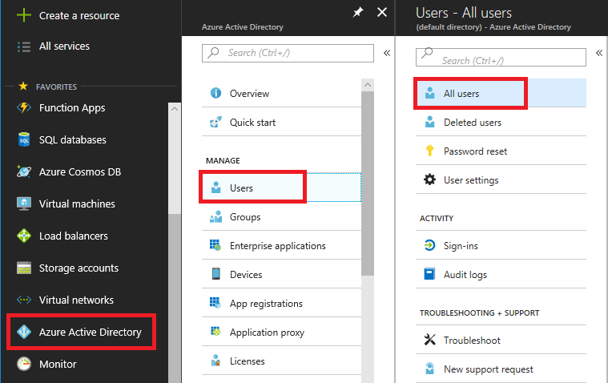
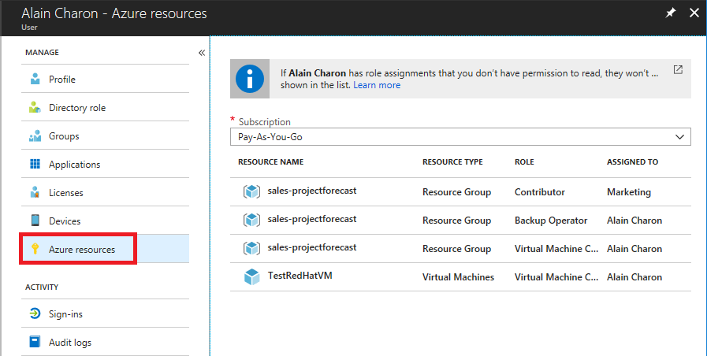
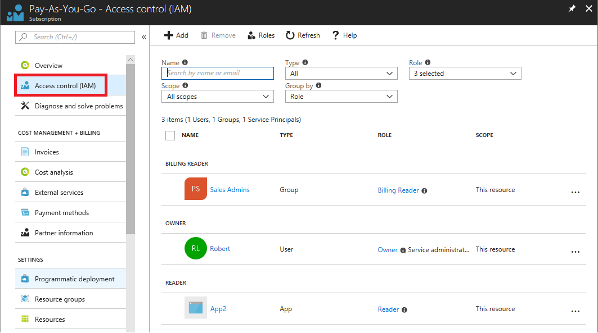
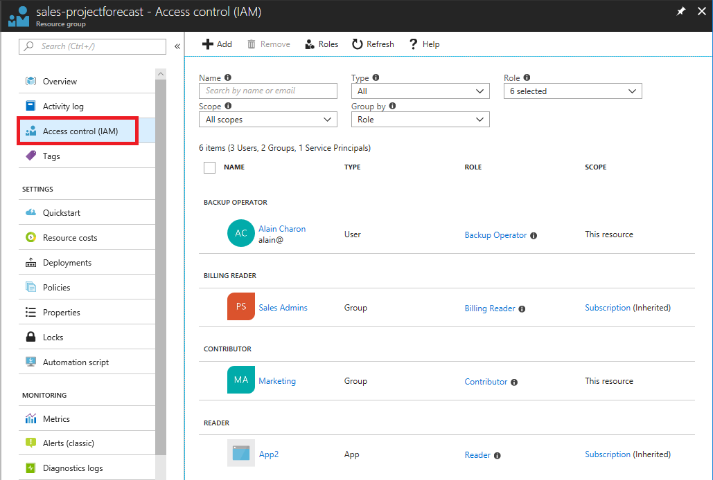

## Exercise

At First Up Consultants, you've been granted access to the Azure subscription for the marketing team. You want to get familiar with the Azure portal and see what roles are currently assigned.

In this unit, you learn how to:

> [!div class="checklist"]
> * List role assignments for yourself
> * List role assignments at different scopes
> * List the roles you can use

This unit does not make any changes, so you are safe to explore the Azure portal without any fear of causing an issue.

## Prerequisites

- Access to an Azure subscription

## List role assignments for yourself

Follow these steps to see what roles are currently assigned to you.

1. Sign in to the [Azure portal](https://portal.azure.com/).

1. In the navigation list, click **Azure Active Directory**.

1. Click **Users** to open **All users**.

    

1. Click your name in the list.

1. In the **Manage** section, click **Azure resources**.

    

    On the Azure resources blade, you can see the role assignments for yourself and the selected subscription. Your list will look different.

## List role assignments for a subscription

Follow these steps to see what roles are assigned at the subscription scope.

1. In the Azure portal, click **All services** and then **Subscriptions**.

1. Click your subscription.

1. Click **Access control (IAM)**.

    On the Access control (IAM) blade, you can see who has access to this subscription and their role.

    

## List role assignments for a resource group

If you have resource groups, follow these steps to see what roles are assigned at the resource group scope.

1. In the navigation list, click **Resource groups**.

1. Click a resource group and then click **Access control (IAM)**.

   On the Access control (IAM) blade you can see who has access to this resource group. Notice that some roles are scoped to **This resource** while others are **(Inherited)** from another scope. Access is either assigned specifically to the resource group or inherited from an assignment to the parent subscription.

   

## List roles

As you learned in the previous unit, a role is a collection of permissions. Azure has over 70 [built-in roles](/azure/role-based-access-control/built-in-roles) that you can use in your role assignments. Follow these steps to list the roles.

1. In the Azure portal, click **All services** and then **Subscriptions**.

1. Click your subscription.

1. Click **Access control (IAM)**.

1. Click **Roles** to see a list of all the built-in and custom roles.

   

   You can see the number of users and groups that are assigned to each role.

   

## Summary

In this unit, you learned how to list the role assignments for yourself in the Azure portal. You also learned how to list the role assignments at different scopes. In the next unit, you look take the next step and use RBAC to grant access to a user.
