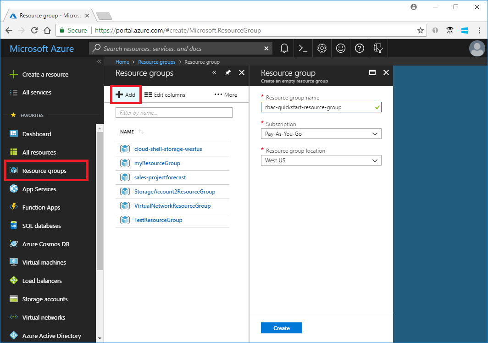
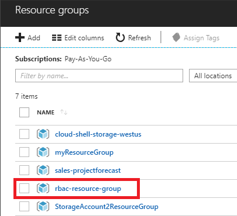
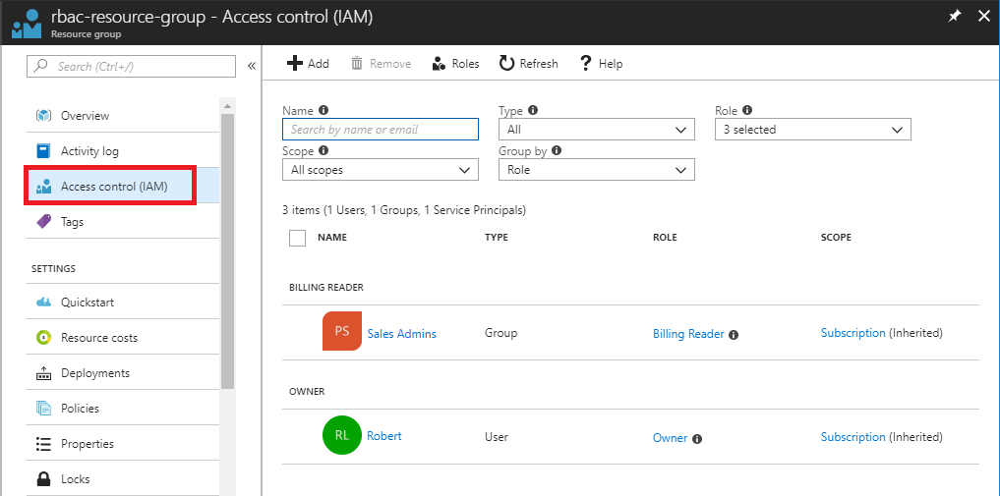
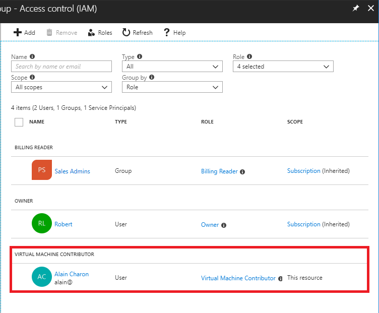
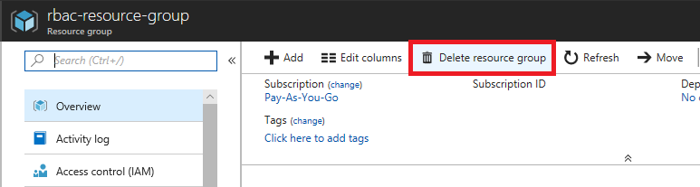

## Exercise: Grant access using RBAC and the Azure portal

Your co-worker named Alain at First Up Consultants needs the ability to create and manage virtual machines for a project he is working on. Your manager has asked that you handle this request. Using the best practice to grant users the least privilege to get their work done, you decide to create a new resource group and assign Alain the Virtual Machine Contributor role.

In this exercise, you learn how to:

> [!div class="checklist"]
> * Grant access to user at a resource group scope
> * Remove access from a user

## Prerequisites

- Permissions to assign roles, such as Owner or User Access Administrator
- Another user or yourself

## Create a resource group

Follow these steps to create a new resource group named rbac-quickstart-resource-group.

1. Sign in to the [Azure portal](https://portal.azure.com/).

1. In the navigation list, click **Resource groups**.

1. Click **Add** to open the **Resource group** blade.

   

1. For **Resource group name**, enter **rbac-quickstart-resource-group**.

1. Select a subscription and a location.

1. Click **Create** to create the resource group.

1. Click **Refresh** to refresh the list of resource groups.

   The new resource group appears in your resource groups list.

   

## Grant access

In RBAC, to grant access, you create a role assignment. Follow these steps to assign the Virtual Machine Contributor role to user at the resource group scope.

1. In the list of **Resource groups**, click the new **rbac-quickstart-resource-group** resource group.

1. Click **Access control (IAM)** to see the current list of role assignments.

   

1. Click **Add** to open the **Add permissions** pane.

   If you don't have permissions to assign roles, you won't see the **Add** option.

   

1. In the **Role** drop-down list, select **Virtual Machine Contributor**.

1. In the **Select** list, select yourself or another user.

1. Click **Save** to create the role assignment.

   After a few moments, the user is assigned the Virtual Machine Contributor role at the rbac-quickstart-resource-group resource group scope.

   

## Remove access

In RBAC, to remove access, you remove a role assignment.

1. In the list of role assignments, add a checkmark next to user with the Virtual Machine Contributor role.

1. Click **Remove**.

   

1. In the remove role assignment message that appears, click **Yes**.

## Clean up

1. In the navigation list, click **Resource groups**.

1. Click **rbac-quickstart-resource-group** to open the resource group.

1. Click **Delete resource group** to delete the resource group.

   

1. On the **Are you sure you want to delete** blade, type the resource group name: **rbac-quickstart-resource-group**.

1. Click **Delete** to delete the resource group.

## Summary

In this exercise, you learned how to grant a user access to create and manage virtual machines in a resource group using the Azure portal. In the next exercise, you look at how to create a custom role and define your own permissions.
