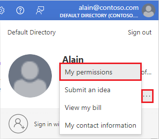
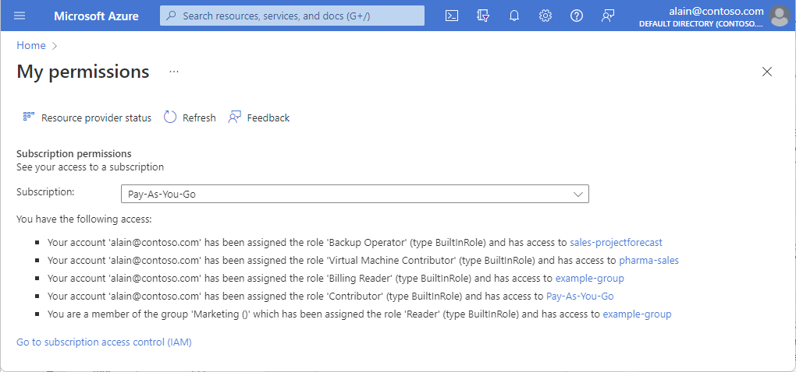
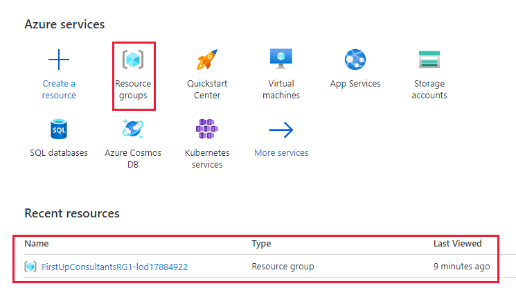
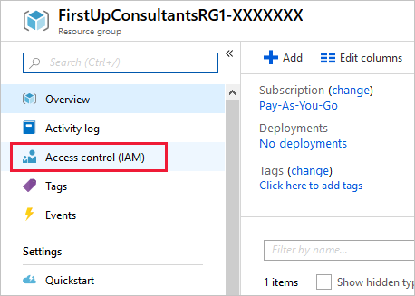
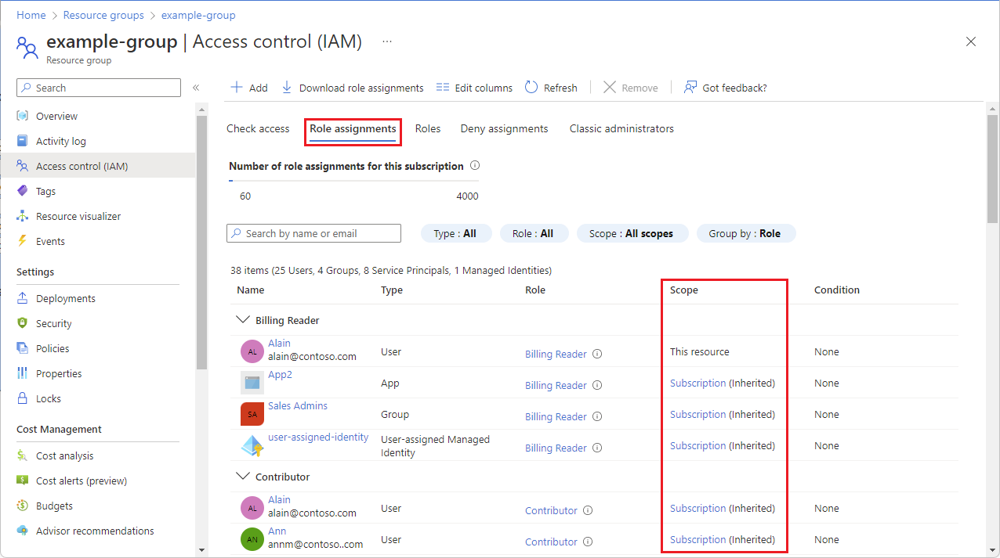
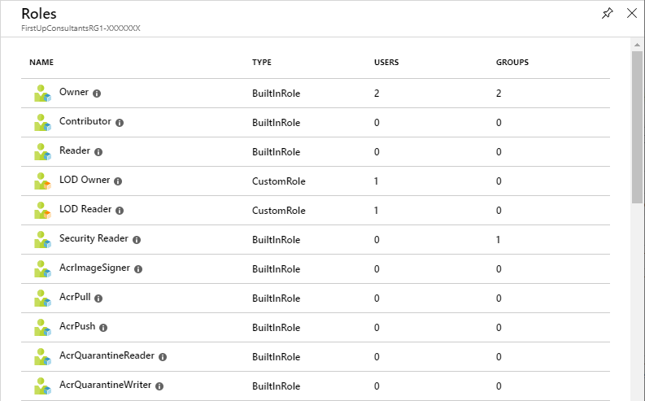

> [!NOTE]
> After launching the lab, the username and password you need is located on the **Resources** tab next to the instructions.

At First Up Consultants, you've been granted access to a resource group for the marketing team. You want to familiarize yourself with the Azure portal and see what roles are currently assigned.

## List role assignments for yourself

Follow these steps to see what roles are currently assigned to you.

1. In the upper-right corner of the Azure portal, click your username to open the menu.

1. Make sure you are signed in as **LabAdmin-_XXXXXXX_**. If not, sign out and sign in using the username and password on the **Resources** tab.

1. Click the ellipsis (**...**) to see more links.

    

1. Click **My permissions** to open the My permissions pane.

    

    On the My permissions pane, you can see the roles that you have been assigned and the scope. Your list will look different.

## List role assignments for a resource group

Follow these steps to see what roles are assigned at the resource group scope.

1. In the navigation list, click **Resource groups**.

   

1. Find and click the resource group named **FirstUpConsultantsRG1-_XXXXXXX_**.

1. Click **Access control (IAM)**.

   

1. Click the **Role assignments** tab.

    You can see who has access to this resource group. Notice that some roles are scoped to **This resource** while others are **(Inherited)** from a parent scope.

   

## List roles

As you learned in the previous unit, a role is a collection of permissions. Azure has over 70 built-in roles that you can use in your role assignments. Follow this step to list the roles.

- At the top of the pane, click the **Roles** tab to see a list of all the built-in and custom roles.

   You can see the number of users and groups that are assigned to each role.

   

In this unit, you learned how to list the role assignments for yourself in the Azure portal. You also learned how to list the role assignments for a resource group.