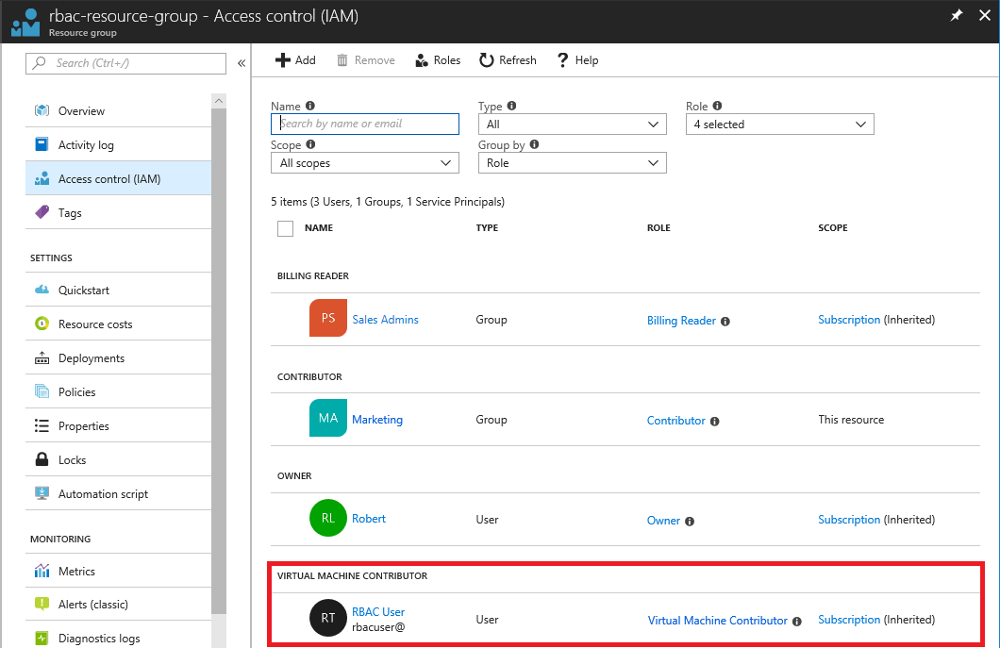

## Exercise

Using the **Access control (IAM)** blade in the Azure portal has been working fine, but you are getting several permission requests each day. To keep up with the access management tasks, you decide to use PowerShell to help automate some of the steps.

In this unit, you learn how to:

> [!div class="checklist"]
> * Grant access to user at a resource group scope using PowerShell
> * List access access to user at a resource group scope using PowerShell
> * Remove access from a user using PowerShell

## Prerequisites

- Permissions to assign roles, such as [Owner](/azure/role-based-access-control/built-in-roles#owner) or [User Access Administrator](/azure/role-based-access-control/built-in-roles#user-access-administrator)
- Permissions to create users in Azure Active Directory (or have an existing user)

## Sign in to Azure PowerShell

Sign in to [Azure PowerShell](/powershell/azure/authenticate-azureps).

## Create a user

To assign a role, you need a user, group, or service principal. If you don't already have a test user, follow these steps to create a user.

1. In PowerShell, create a password that complies with your password complexity requirements.

    ```azurepowershell-interactive
    $SecureStringPassword = ConvertTo-SecureString -String "password" -AsPlainText -Force
    ```

1. Create a new user for your domain using the [New-AzureRmADUser](/powershell/module/azurerm.resources/new-azurermaduser) command.

    ```azurepowershell-interactive
    New-AzureRmADUser -DisplayName "RBAC User" -MailNickname "rbacuser" `
      -UserPrincipalName "rbacuser@<your domain>" -Password $SecureStringPassword
    ```
    
    ```Output
    PS Azure:\> New-AzureRmADUser -DisplayName "RBAC User" -MailNickname "rbacuser" `
      -UserPrincipalName "rbacuser@firstupconsultants.com" -Password $SecureStringPassword

    UserPrincipalName               DisplayName Id                                   Type
    -----------------               ----------- --                                   ----
    rbacuser@firstupconsultants.com RBAC User   11111111-1111-1111-1111-111111111111 User
    ```

## Create a resource group

You use a resource group to show how to assign a role at a resource group scope. Follow these steps to create a new resource group named rbac-resource-group.

1. Get a list of region locations using the [Get-AzureRmLocation](/powershell/module/azurerm.resources/get-azurermlocation) command.

   ```azurepowershell-interactive
   Get-AzureRmLocation | select Location
   ```

1. Select a location near you and assign it to a variable.

   ```azurepowershell-interactive
   $location = "westus"
   ```

1. Create a new resource group using the [New-AzureRmResourceGroup](/powershell/module/azurerm.resources/new-azurermresourcegroup) command.

   ```azurepowershell-interactive
   New-AzureRmResourceGroup -Name "rbac-resource-group" -Location $location
   ```

   ```Output
   ResourceGroupName : rbac-resource-group
   Location          : westus
   ProvisioningState : Succeeded
   Tags              :
   ResourceId        : /subscriptions/00000000-0000-0000-0000-000000000000/resourceGroups/rbac-resource-group
   ```

## Grant access

To grant access for the user, you use the [New-AzureRmRoleAssignment](/powershell/module/azurerm.resources/new-azurermroleassignment) command to assign a role. You must specify the security principal, role definition, and scope.

1. Assign the [Virtual Machine Contributor](/azure/role-based-access-control/built-in-roles#virtual-machine-contributor) role to the user at the resource group scope.

    ```azurepowershell-interactive
    New-AzureRmRoleAssignment -SignInName rbacuser@<your domain> `
      -RoleDefinitionName "Virtual Machine Contributor" `
      -ResourceGroupName "rbac-resource-group"
    ```

    ```Output
    PS Azure:\> New-AzureRmRoleAssignment -SignInName rbacuser@firstupconsultants.com `
      -RoleDefinitionName "Virtual Machine Contributor" `
      -ResourceGroupName "rbac-resource-group"

    RoleAssignmentId   : /subscriptions/00000000-0000-0000-0000-000000000000/resourceGroups/rbac-resource-group/providers/Microsoft.Authorization/roleAssignments/33333333-3333-3333-3333-333333333333
    Scope              : /subscriptions/00000000-0000-0000-0000-000000000000/resourceGroups/rbac-resource-group
    DisplayName        : RBAC User
    SignInName         : rbacuser@firstupconsultants.com
    RoleDefinitionName : Virtual Machine Contributor
    RoleDefinitionId   : b24988ac-6180-42a0-ab88-20f7382dd24c
    ObjectId           : 11111111-1111-1111-1111-111111111111
    ObjectType         : User
    CanDelegate        : False
    ```

## List access

1. To verify the access for the resource group, use the [Get-AzureRmRoleAssignment](/powershell/module/azurerm.resources/get-azurermroleassignment) command to list the role assignments.

    ```azurepowershell-interactive
    Get-AzureRmRoleAssignment -SignInName rbacuser@<your domain> -ResourceGroupName "rbac-resource-group"
    ```

    ```Output
    PS Azure:\> Get-AzureRmRoleAssignment -SignInName rbacuser@firstupconsultants.com -ResourceGroupName "rbac-resource-group"

    RoleAssignmentId   : /subscriptions/00000000-0000-0000-0000-000000000000/resourceGroups/rbac-resource-group/providers/Microsoft.Authorization/roleAssignments/33333333-3333-3333-3333-333333333333
    Scope              : /subscriptions/00000000-0000-0000-0000-000000000000/resourceGroups/rbac-resource-group
    DisplayName        : RBAC User
    SignInName         : rbacuser@firstupconsultants.com
    RoleDefinitionName : Virtual Machine Contributor
    RoleDefinitionId   : b24988ac-6180-42a0-ab88-20f7382dd24c
    ObjectId           : 11111111-1111-1111-1111-111111111111
    ObjectType         : User
    CanDelegate        : False
    ```

    In the output, you can see that the Virtual Machine Contributor role have been assigned to the RBAC User. The Virtual Machine Contributor role is at the rbac-resource-group scope.

    This is how the role assignment looks in the Azure portal on the **Access control (IAM)** blade for the resource group.

    

## Remove access

To remove access for users, groups, and applications, use [Remove-AzureRmRoleAssignment](/powershell/module/azurerm.resources/remove-azurermroleassignment) to remove a role assignment.

1. Use the following command to remove the Virtual Machine Contributor role assignment for the user at the resource group scope.

    ```azurepowershell-interactive
    Remove-AzureRmRoleAssignment -SignInName rbacuser@<your domain> `
      -RoleDefinitionName "Virtual Machine Contributor" `
      -ResourceGroupName "rbac-resource-group"
    ```

    ```Output
    PS Azure:\> Remove-AzureRmRoleAssignment -SignInName rbacuser@firstupconsultants.com `
      -RoleDefinitionName "Virtual Machine Contributor" `
      -ResourceGroupName "rbac-resource-group"
    ```

## Clean up

To clean up the resources created by this unit, delete the resource group and the user.

1. Delete the resource group using the [Remove-AzureRmResourceGroup](/powershell/module/azurerm.resources/remove-azurermresourcegroup) command.

    ```azurepowershell-interactive
    Remove-AzureRmResourceGroup -Name "rbac-resource-group"
    ```

    ```Output
    Confirm
    Are you sure you want to remove resource group 'rbac-resource-group'
    [Y] Yes  [N] No  [S] Suspend  [?] Help (default is "Y"):
    ```
    
1. When asked to confirm, type **Y**. It will take a several seconds to delete.

1. Delete the user using the [Remove-AzureRmADUser](/powershell/module/azurerm.resources/remove-azurermaduser) command.

    ```azurepowershell-interactive
    Remove-AzureRmADUser -UserPrincipalName "rbacuser@<your domain>"
    ```

    ```Output
    Confirm
    Are you sure you want to remove user with upn or object id 'rbacuser@<your domain>'.
    [Y] Yes  [N] No  [S] Suspend  [?] Help (default is "Y"):
    ```

1. When asked to confirm, type **Y**.

## Summary

In this unit, you learned how to grant a user access to create and manage virtual machines in a resource group using Azure PowerShell. In the next unit, you look at how to create a custom role and define your own permissions.
