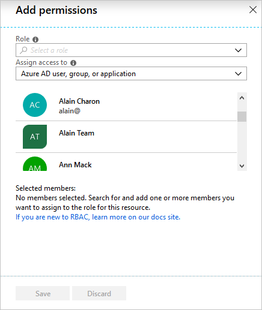
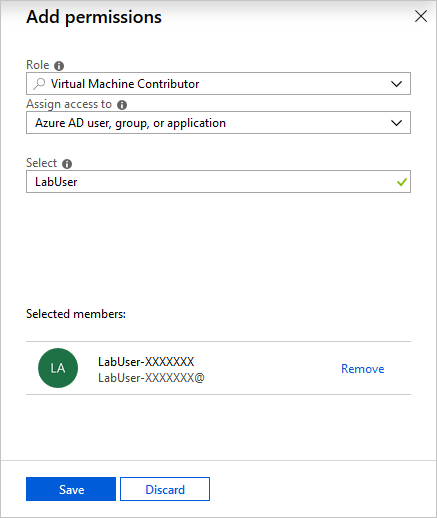

A co-worker named Alain at First Up Consultants needs the ability to create and manage virtual machines for a project he is working on. Your manager has asked that you handle this request. Using the best practice to grant users the least privileges to get their work done, you decide to assign Alain the Virtual Machine Contributor role for a resource group.

## Grant access

Follow these steps to assign the Virtual Machine Contributor role to a user at the resource group scope.

1. In the navigation list, click **Resource groups**.

1. Find and click the **FirstUpConsultantsRG1-_XXXXXXX_** resource group.

1. Click **Access control (IAM)** to see the current list of role assignments.

   

1. At the top, click **Add** to open the **Add permissions** pane.

   

1. In the **Role** drop-down list, select **Virtual Machine Contributor**.

1. In the **Select** list, select **LabUser-_XXXXXXX_**.

    You can find the username on the **Resources** tab next to the instructions.

   

1. Click **Save** to create the role assignment.

   After a few moments, the **LabUser-_XXXXXXX_** user is assigned the Virtual Machine Contributor role at the **FirstUpConsultantsRG1-_XXXXXXX_** resource group scope. The user can now create and manage virtual machines just within this resource group.

   

## Remove access

In RBAC, to remove access, you remove a role assignment.

1. In the list of role assignments, select the **LabUser-_XXXXXXX_** user with the Virtual Machine Contributor role.

1. Click **Remove**.

   

1. In the **Remove role assignments** message that appears, click **Yes**.

In this unit, you learned how to grant a user access to create and manage virtual machines in a resource group using the Azure portal.