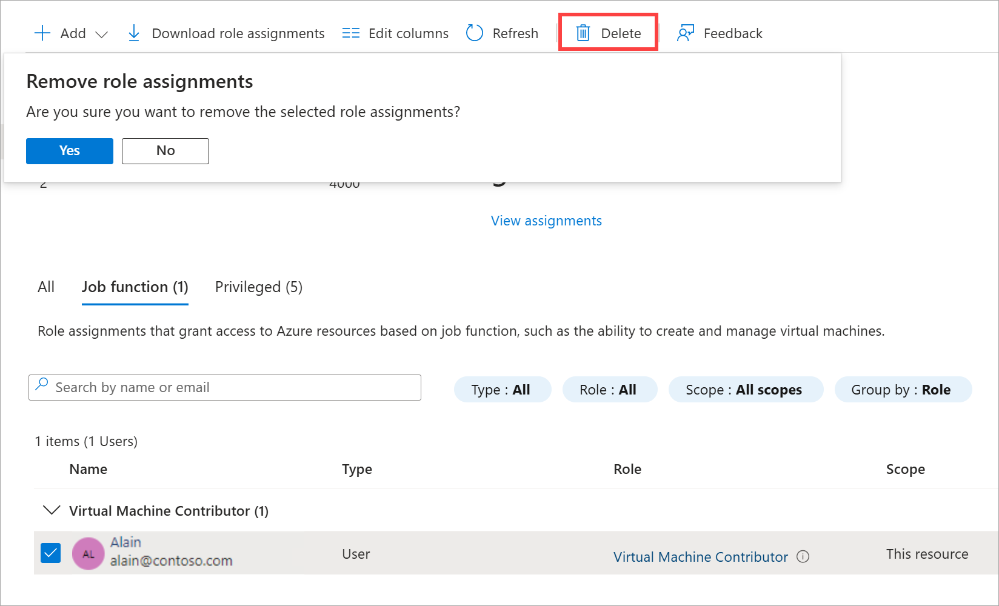

A co-worker named Alain at First Up Consultants needs permission to create and manage virtual machines for a project he is working on. Your manager has asked that you handle this request. Using the best practice to grant users the least privileges to get their work done, you decide to assign Alain the Virtual Machine Contributor role for a resource group.

## Grant access

Follow this procedure to assign the Virtual Machine Contributor role to a user at the resource group scope.

1. In the Azure portal under Navigate, select **Resource groups**.

1. Select **FirstUpConsultantsRG1-_XXXXXXX_** resource group.

1. Select **Access control (IAM)**.

1. Select the **Role assignments** tab to view the current list of role assignments.

   

1. At the top, click **Add role assignment**.

   

1. On the **Role** tab, search for and select **Virtual Machine Contributor**.
1. Select **Next**.
1. On the **Members** tab, select **+ Select members**.

    :::image type="content" source="../media/5-select-members-option.png" alt-text="Screenshot of the add role assignment page that shows the select members option.":::

1. Search for and select the appropriate **LabUser-_XXXXXXX_** name. Find the exact username to use on the **Resources** tab next to the instructions.
1. Select **Next**.
1. Select **Review + assign**.

   After a few moments, the **LabUser-_XXXXXXX_** user is assigned the Virtual Machine Contributor role at the **FirstUpConsultantsRG1-_XXXXXXX_** resource group scope. The user can now create and manage virtual machines just within this resource group.

   

## Remove access

In Azure RBAC, to remove access, you remove a role assignment.

1. In the list of role assignments, select the **LabUser-_XXXXXXX_** user with the Virtual Machine Contributor role.

1. Click **Remove**.

   

1. In the **Remove role assignments** message that appears, click **Yes**.

In this unit, you learned how to grant a user access to create and manage virtual machines in a resource group using the Azure portal.